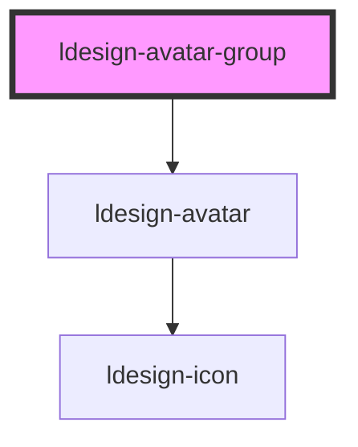

# ldesign-avatar

头像组件，支持图片、图标与文字三种形态，内置文本自动缩放、徽标、组合展示、状态指示器等能力。

> 完整使用文档见 packages/webcomponent/docs/components/avatar.md
> 查看优化详情见 [CHANGELOG.md](./CHANGELOG.md)

## ✨ 最新优化 (2025-10-11)

- ✅ **修复徽标裁剪问题** - 徽标不会再被父容器裁剪
- 🎨 **精细化样式** - 更协调的尺寸、字体和动画效果
- 🟢 **状态指示器** - 显示用户在线状态（online/offline/busy/away）
- 🖼️ **边框装饰** - 支持自定义边框颜色和宽度
- 👆 **可点击效果** - 悬浮时的提升和阴影动画
- ⏳ **加载状态** - 带旋转动画的加载指示器
- 📍 **徽标定位** - 支持四个角落的徽标位置和偏移

## 基本用法

```html path=null start=null
<!-- 基础头像 -->
<ldesign-avatar src="https://i.pravatar.cc/100?img=1"></ldesign-avatar>
<ldesign-avatar icon="user"></ldesign-avatar>
<ldesign-avatar text="U" background="#fa8c16"></ldesign-avatar>

<!-- 带状态指示器 -->
<ldesign-avatar src="avatar.jpg" status="online"></ldesign-avatar>

<!-- 可点击效果 -->
<ldesign-avatar src="avatar.jpg" clickable="true" badge-value="5"></ldesign-avatar>

<!-- 边框装饰 -->
<ldesign-avatar src="avatar.jpg" border="true" border-color="#1890ff"></ldesign-avatar>

<!-- 加载状态 -->
<ldesign-avatar src="avatar.jpg" loading="true"></ldesign-avatar>
```

查看完整示例请打开 [demo.html](./demo.html)

<!-- Auto Generated Below -->


## Overview

Avatar.Group 头像组合
- 支持溢出显示 +N
- 支持统一 size/shape
- 支持重叠间距（gap）

## Properties

| Property      | Attribute      | Description           | Type                                                   | Default     |
| ------------- | -------------- | --------------------- | ------------------------------------------------------ | ----------- |
| `borderColor` | `border-color` | 边框颜色（用于实现“描边”效果以区分重叠） | `string`                                               | `'#fff'`    |
| `gap`         | `gap`          | 重叠间距（正值，单位px），默认 8    | `number`                                               | `8`         |
| `max`         | `max`          | 展示的最大头像数；超出后折叠为 +N    | `number`                                               | `undefined` |
| `shape`       | `shape`        | 统一形状（未在子项显式指定时生效）     | `"circle" \| "square"`                                 | `undefined` |
| `size`        | `size`         | 统一尺寸（未在子项显式指定时生效）     | `"large" \| "medium" \| "middle" \| "small" \| number` | `undefined` |


## Dependencies

### Depends on

- [ldesign-avatar](.)

### Graph


----------------------------------------------

*Built with [StencilJS](https://stenciljs.com/)*
