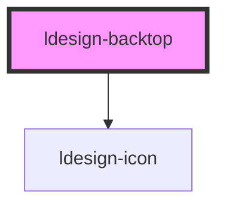

# ldesign-backtop

<!-- Auto Generated Below -->

## Overview

BackTop 返回顶部组件
- 支持窗口根滚动回到顶部
- 支持指定容器内部滚动回到顶部（通过 target 选择器）
- 支持设置滚动动画速度（px/s）

## Properties

| Property           | Attribute           | Description                                                             | Type     | Default     |
| ------------------ | ------------------- | ----------------------------------------------------------------------- | -------- | ----------- |
| `speed`            | `speed`             | 滚动动画速度（像素/秒）。值越大，速度越快。  最终动画时长 = 当前滚动距离 / speed  当 speed <= 0 时，将立即跳到顶部 | `number` | `1200`      |
| `target`           | `target`            | 指定滚动容器（CSS 选择器）。不传则使用 window 例如：'#scrollable' 或 '.scroll-area'          | `string` | `undefined` |
| `visibilityHeight` | `visibility-height` | 出现的滚动阈值（px）。当滚动距离超过该值时显示返回顶部按钮                                          | `number` | `200`       |

## Dependencies

### Depends on

- [ldesign-icon](../icon)

### Graph

----------------------------------------------

*Built with [StencilJS](https://stenciljs.com/)*
