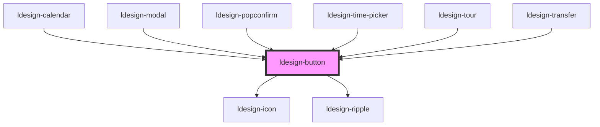

# ldesign-button

基于 Ant Design 按钮组件架构重构的 Web Component 按钮组件，提供多种类型、尺寸和状态的按钮。

## 特性

- 🎨 支持多种按钮类型：主按钮、默认按钮、虚线按钮、文本按钮、链接按钮
- 📏 三种尺寸可选：大、中、小
- 🏭 多种形状：默认、圆形、圆角
- ⚠️ 危险状态支持
- 👻 幽灵按钮模式
- ♿ 完善的无障碍支持
- 🌐 支持图标和加载状态

## 使用示例

### 基础用法

```html path=null start=null
<!-- 主按钮 -->
<ldesign-button type="primary">主按钮</ldesign-button>

<!-- 默认按钮 -->
<ldesign-button>默认按钮</ldesign-button>

<!-- 虚线按钮 -->
<ldesign-button type="dashed">虚线按钮</ldesign-button>

<!-- 文本按钮 -->
<ldesign-button type="text">文本按钮</ldesign-button>

<!-- 链接按钮 -->
<ldesign-button type="link">链接按钮</ldesign-button>
```

### 按钮尺寸

```html path=null start=null
<ldesign-button type="primary" size="large">大按钮</ldesign-button>
<ldesign-button type="primary" size="middle">中按钮</ldesign-button>
<ldesign-button type="primary" size="small">小按钮</ldesign-button>
```

### 按钮形状

```html path=null start=null
<!-- 圆形按钮 -->
<ldesign-button type="primary" shape="circle" icon="search"></ldesign-button>

<!-- 圆角按钮 -->
<ldesign-button type="primary" shape="round">圆角按钮</ldesign-button>
```

### 图标按钮

```html path=null start=null
<!-- 左侧图标 -->
<ldesign-button type="primary" icon="search">搜索</ldesign-button>

<!-- 右侧图标 -->
<ldesign-button icon="arrow-right" icon-position="end">下一步</ldesign-button>

<!-- 纯图标按钮 -->
<ldesign-button type="primary" shape="circle" icon="search"></ldesign-button>
```

### 加载状态

```html path=null start=null
<!-- 基本加载 -->
<ldesign-button type="primary" loading="true">加载中</ldesign-button>

<!-- 延迟加载 -->
<ldesign-button type="primary" loading='{ "delay": 1000 }'>点击后1秒显示加载</ldesign-button>
```

### 危险按钮

```html path=null start=null
<ldesign-button type="primary" danger="true">删除</ldesign-button>
<ldesign-button danger="true">删除</ldesign-button>
<ldesign-button type="text" danger="true">删除</ldesign-button>
<ldesign-button type="link" danger="true">删除</ldesign-button>
```

### 幽灵按钮

```html path=null start=null
<!-- 适合深色背景 -->
<div style="background: #333; padding: 20px;">
  <ldesign-button type="primary" ghost="true">主按钮</ldesign-button>
  <ldesign-button ghost="true">默认按钮</ldesign-button>
  <ldesign-button type="dashed" ghost="true">虚线按铮</ldesign-button>
</div>
```

### 块级按钮

```html path=null start=null
<ldesign-button type="primary" block="true">块级按钮</ldesign-button>
```

### 禁用状态

```html path=null start=null
<ldesign-button type="primary" disabled="true">禁用按钮</ldesign-button>
```

### 链接按钮

```html path=null start=null
<!-- 作为 a 标签使用 -->
<ldesign-button href="https://example.com" target="_blank">打开链接</ldesign-button>
```

<!-- Auto Generated Below -->


## Overview

Button 按钮组件
基于 Ant Design 按钮组件架构重构
提供多种类型、尺寸、状态的按钮

## Properties

| Property                | Attribute                  | Description                     | Type                                                                                                                                                                                   | Default                               |
| ----------------------- | -------------------------- | ------------------------------- | -------------------------------------------------------------------------------------------------------------------------------------------------------------------------------------- | ------------------------------------- |
| `autoInsertSpace`       | `auto-insert-space`        | 是否自动插入空格（仅在子节点为两个中文字符时生效）       | `boolean`                                                                                                                                                                              | `true`                                |
| `block`                 | `block`                    | 是否为块级按钮                         | `boolean`                                                                                                                                                                              | `false`                               |
| `color`                 | `color`                    | 按钮颜色 (v5.21.0+) 设置按钮的颜色         | `"blue" \| "cyan" \| "danger" \| "default" \| "geekblue" \| "gold" \| "green" \| "lime" \| "magenta" \| "orange" \| "pink" \| "primary" \| "purple" \| "red" \| "volcano" \| "yellow"` | `undefined`                           |
| `danger`                | `danger`                   | 是否为危险按钮 (语法糖，当设置 color 时会以后者为准) | `boolean`                                                                                                                                                                              | `false`                               |
| `disabled`              | `disabled`                 | 是否禁用                            | `boolean`                                                                                                                                                                              | `false`                               |
| `ghost`                 | `ghost`                    | 是否为幽灵按钮                         | `boolean`                                                                                                                                                                              | `false`                               |
| `href`                  | `href`                     | 点击跳转的地址（将按钮作为 a 标签）             | `string`                                                                                                                                                                               | `undefined`                           |
| `htmlType`              | `html-type`                | 原生按钮类型                          | `"button" \| "reset" \| "submit"`                                                                                                                                                      | `'button'`                            |
| `icon`                  | `icon`                     | 图标名称                            | `string`                                                                                                                                                                               | `undefined`                           |
| `iconPosition`          | `icon-position`            | 图标位置                            | `"end" \| "start"`                                                                                                                                                                     | `'start'`                             |
| `loading`               | `loading`                  | 是否加载中                           | `boolean`                                                                                                                                                                              | `false`                               |
| `loadingDelay`          | `loading-delay`            | 加载延迟时间（毫秒）                      | `number`                                                                                                                                                                               | `undefined`                           |
| `loadingIcon`           | `loading-icon`             | 自定义加载图标                         | `string`                                                                                                                                                                               | `undefined`                           |
| `ripple`                | `ripple`                   | 是否启用水波纹                         | `boolean`                                                                                                                                                                              | `true`                                |
| `rippleCentered`        | `ripple-centered`          | 是否居中触发                          | `boolean`                                                                                                                                                                              | `false`                               |
| `rippleColor`           | `ripple-color`             | 波纹颜色（默认跟随 currentColor/主题）      | `string`                                                                                                                                                                               | `undefined`                           |
| `rippleDuration`        | `ripple-duration`          | 扩散动画时长                          | `number`                                                                                                                                                                               | `550`                                 |
| `rippleEasing`          | `ripple-easing`            | 缓动                              | `string`                                                                                                                                                                               | `'cubic-bezier(0.22, 0.61, 0.36, 1)'` |
| `rippleFadeOutDuration` | `ripple-fade-out-duration` | 淡出时长                            | `number`                                                                                                                                                                               | `260`                                 |
| `rippleMaxRipples`      | `ripple-max-ripples`       | 最大并发波纹数                         | `number`                                                                                                                                                                               | `6`                                   |
| `rippleOpacity`         | `ripple-opacity`           | 波纹不透明度                          | `number`                                                                                                                                                                               | `0.2`                                 |
| `rippleTrigger`         | `ripple-trigger`           | 触发方式                            | `"click" \| "mousedown" \| "pointerdown"`                                                                                                                                              | `'pointerdown'`                       |
| `rippleUnbounded`       | `ripple-unbounded`         | 是否不裁剪边界                         | `boolean`                                                                                                                                                                              | `false`                               |
| `shape`                 | `shape`                    | 按钮形状                            | `"circle" \| "default" \| "rectangle" \| "round" \| "square"`                                                                                                                          | `'default'`                           |
| `size`                  | `size`                     | 按钮尺寸                            | `"large" \| "middle" \| "small"`                                                                                                                                                       | `'middle'`                            |
| `target`                | `target`                   | 相当于 a 链接的 target 属性             | `string`                                                                                                                                                                               | `undefined`                           |
| `type`                  | `type`                     | 按钮类型 (语法糖，推荐使用 variant 和 color) | `"danger" \| "dashed" \| "default" \| "gradient" \| "link" \| "outline" \| "primary" \| "secondary" \| "success" \| "text" \| "warning"`                                               | `'default'`                           |
| `variant`               | `variant`                  | 按钮变体 (v5.21.0+) 设置按钮的样式变体       | `"dashed" \| "filled" \| "link" \| "outlined" \| "solid" \| "text"`                                                                                                                    | `undefined`                           |


## Events

| Event          | Description | Type                      |
| -------------- | ----------- | ------------------------- |
| `ldesignClick` | 点击事件        | `CustomEvent<MouseEvent>` |


## Dependencies

### Used by

 - [ldesign-calendar](../calendar)
 - [ldesign-modal](../modal)
 - [ldesign-popconfirm](../popconfirm)
 - [ldesign-time-picker](../time-picker)
 - [ldesign-tour](../tour)
 - [ldesign-transfer](../transfer)

### Depends on

- [ldesign-icon](../icon)
- [ldesign-ripple](../ripple)

### Graph


----------------------------------------------

*Built with [StencilJS](https://stenciljs.com/)*
