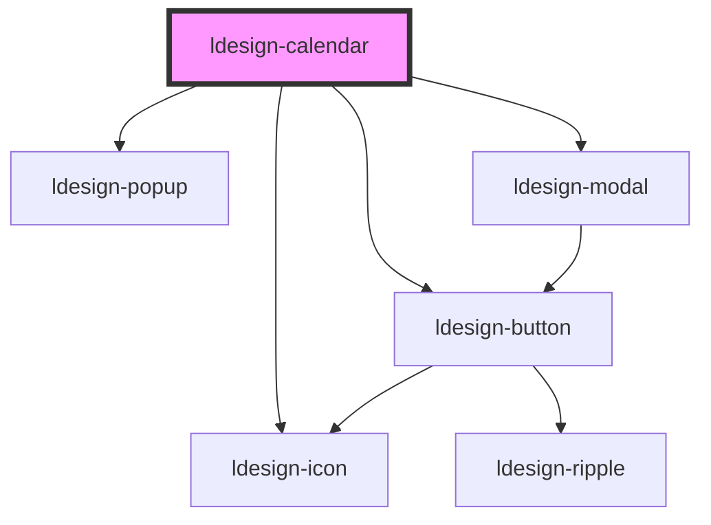

# ldesign-calendar

<!-- Auto Generated Below -->

## Properties

| Property              | Attribute                | Description                                                              | Type                                               | Default        |
| --------------------- | ------------------------ | ------------------------------------------------------------------------ | -------------------------------------------------- | -------------- |
| `allowCrossWeek`      | `allow-cross-week`       |                                                                          | `boolean`                                          | `true`         |
| `allowMonthCrossWeek` | `allow-month-cross-week` |                                                                          | `boolean`                                          | `true`         |
| `defaultValue`        | `default-value`          |                                                                          | `string`                                           | `undefined`    |
| `disabledDate`        | `disabled-date`          |                                                                          | `(d: Date) => boolean`                             | `undefined`    |
| `draggableEvents`     | `draggable-events`       |                                                                          | `boolean`                                          | `false`        |
| `enableCrud`          | `enable-crud`            | 是否启用内置的CRUD功能                                                            | `boolean`                                          | `true`         |
| `eventCreateHandler`  | `event-create-handler`   | 自定义新增处理器                                                                 | `(detail: any) => boolean \| Promise<boolean>`     | `undefined`    |
| `eventDeleteHandler`  | `event-delete-handler`   | 自定义删除处理器                                                                 | `(event: CalEvent) => boolean \| Promise<boolean>` | `undefined`    |
| `eventEditHandler`    | `event-edit-handler`     | 自定义编辑处理器                                                                 | `(event: CalEvent) => boolean \| Promise<boolean>` | `undefined`    |
| `events`              | `events`                 | 事件数据（JSON 字符串），例如：[{"date":"2025-09-27","title":"发布","color":"#1677ff"}] | `string`                                           | `undefined`    |
| `eventsData`          | `events-data`            | 事件数据（JS 设置），与 events 二选一，前者用于 attribute，后者用于 property                    | `CalEvent[]`                                       | `undefined`    |
| `firstDayOfWeek`      | `first-day-of-week`      |                                                                          | `0 \| 1 \| 2 \| 3 \| 4 \| 5 \| 6`                  | `1`            |
| `format`              | `format`                 |                                                                          | `string`                                           | `'YYYY-MM-DD'` |
| `hourEnd`             | `hour-end`               |                                                                          | `number`                                           | `20`           |
| `hourStart`           | `hour-start`             | 时间轴起止与步长（周/日视图）                                                          | `number`                                           | `8`            |
| `lunarFormatter`      | `lunar-formatter`        | 自定义农历格式化（优先级高于内置），返回文本，例如 “初九” 或 “正月初一”                                  | `(d: Date) => string`                              | `undefined`    |
| `maxAllDayRows`       | `max-all-day-rows`       |                                                                          | `number`                                           | `3`            |
| `maxDate`             | `max-date`               |                                                                          | `string`                                           | `undefined`    |
| `maxDuration`         | `max-duration`           |                                                                          | `number`                                           | `undefined`    |
| `maxEventsPerCell`    | `max-events-per-cell`    | 单元格最多展示的事件条数                                                             | `number`                                           | `3`            |
| `minDate`             | `min-date`               |                                                                          | `string`                                           | `undefined`    |
| `minDuration`         | `min-duration`           |                                                                          | `number`                                           | `15`           |
| `resizableEvents`     | `resizable-events`       |                                                                          | `boolean`                                          | `false`        |
| `showAllDay`          | `show-all-day`           |                                                                          | `boolean`                                          | `true`         |
| `showLunar`           | `show-lunar`             | 是否显示农历（默认关闭）。若浏览器支持 Intl Chinese Calendar，将自动使用内置格式化                     | `boolean`                                          | `false`        |
| `showWeekNumbers`     | `show-week-numbers`      |                                                                          | `boolean`                                          | `false`        |
| `snapToGrid`          | `snap-to-grid`           |                                                                          | `boolean`                                          | `true`         |
| `stepMinutes`         | `step-minutes`           |                                                                          | `number`                                           | `30`           |
| `value`               | `value`                  |                                                                          | `string`                                           | `undefined`    |
| `view`                | `view`                   | 视图：月/周/日/年                                                               | `"day" \| "month" \| "week" \| "year"`             | `'month'`      |

## Events

| Event                | Description | Type                                                                                                                                   |
| -------------------- | ----------- | -------------------------------------------------------------------------------------------------------------------------------------- |
| `ldesignChange`      |             | `CustomEvent<string>`                                                                                                                  |
| `ldesignEventClick`  |             | `CustomEvent<{ event: any; }>`                                                                                                         |
| `ldesignEventCreate` |             | `CustomEvent<{ date?: string; start?: string; end?: string; allDay?: boolean; x?: number; y?: number; }>`                              |
| `ldesignEventDelete` |             | `CustomEvent<{ event: any; }>`                                                                                                         |
| `ldesignEventDrop`   |             | `CustomEvent<{ id?: string; title: string; oldStart?: string; oldEnd?: string; newStart: string; newEnd: string; allDay?: boolean; }>` |
| `ldesignEventEdit`   |             | `CustomEvent<{ event: any; }>`                                                                                                         |
| `ldesignEventResize` |             | `CustomEvent<{ id?: string; title: string; oldStart?: string; oldEnd?: string; newStart: string; newEnd: string; }>`                   |

## Dependencies

### Depends on

- [ldesign-icon](../icon)
- [ldesign-popup](../popup)
- [ldesign-modal](../modal)
- [ldesign-button](../button)

### Graph

----------------------------------------------

*Built with [StencilJS](https://stenciljs.com/)*
