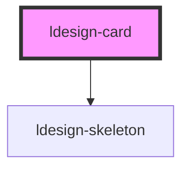

# ldesign-card

<!-- Auto Generated Below -->

## Overview

Card 卡片组件
通用卡片容器

## Properties

| Property      | Attribute      | Description | Type                             | Default     |
| ------------- | -------------- | ----------- | -------------------------------- | ----------- |
| `bodyStyle`   | `body-style`   | 主体样式        | `string`                         | `undefined` |
| `bordered`    | `bordered`     | 是否显示边框      | `boolean`                        | `true`      |
| `headerStyle` | `header-style` | 头部样式        | `string`                         | `undefined` |
| `hoverable`   | `hoverable`    | 是否可悬浮       | `boolean`                        | `false`     |
| `loading`     | `loading`      | 是否加载中       | `boolean`                        | `false`     |
| `shadow`      | `shadow`       | 卡片阴影        | `"always" \| "hover" \| "never"` | `'hover'`   |
| `size`        | `size`         | 卡片尺寸        | `"large" \| "medium" \| "small"` | `'medium'`  |
| `title`       | `title`        | 卡片标题        | `string`                         | `undefined` |

## Dependencies

### Depends on

- [ldesign-skeleton](../skeleton)

### Graph

----------------------------------------------

*Built with [StencilJS](https://stenciljs.com/)*
