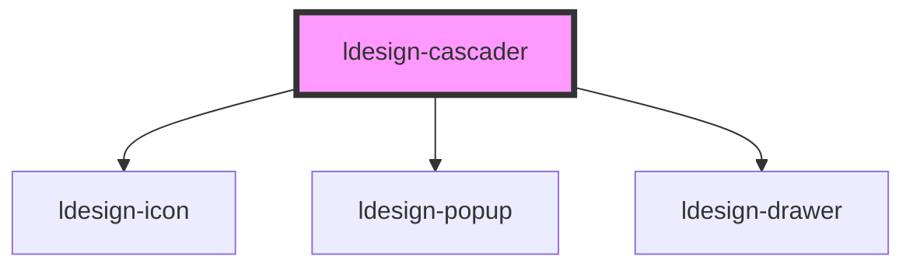

# ldesign-cascader

<!-- Auto Generated Below -->

## Overview

ldesign-cascader
- PC: 多层级 popup (每层独立弹出)
- Mobile: drawer (auto by viewport width; can be forced by overlay prop)

## Properties

| Property          | Attribute          | Description            | Type                                                                                                                                                                 | Default                       |
| ----------------- | ------------------ | ---------------------- | -------------------------------------------------------------------------------------------------------------------------------------------------------------------- | ----------------------------- |
| `breakpoints`     | --                 |                        | `{ xs: number; sm: number; md: number; lg: number; }`                                                                                                                | `undefined`                   |
| `changeOnSelect`  | `change-on-select` | 点击非叶子是否直接触发变更（默认仅叶子触发） | `boolean`                                                                                                                                                            | `false`                       |
| `clearable`       | `clearable`        |                        | `boolean`                                                                                                                                                            | `false`                       |
| `closeOnSelect`   | `close-on-select`  | 选择后是否自动关闭（手动触发模式除外）    | `boolean`                                                                                                                                                            | `true`                        |
| `defaultValue`    | --                 |                        | `string[]`                                                                                                                                                           | `undefined`                   |
| `disabled`        | `disabled`         |                        | `boolean`                                                                                                                                                            | `false`                       |
| `drawerPlacement` | `drawer-placement` |                        | `"bottom" \| "left" \| "right" \| "top"`                                                                                                                             | `'bottom'`                    |
| `drawerSize`      | `drawer-size`      |                        | `number \| string`                                                                                                                                                   | `undefined`                   |
| `drawerTitle`     | `drawer-title`     |                        | `string`                                                                                                                                                             | `'请选择'`                       |
| `listMaxHeight`   | `list-max-height`  | 列表最大高度（列会滚动）           | `number`                                                                                                                                                             | `280`                         |
| `options`         | `options`          |                        | `CascaderOption[] \| string`                                                                                                                                         | `[]`                          |
| `overlay`         | `overlay`          |                        | `"auto" \| "drawer" \| "popup"`                                                                                                                                      | `'auto'`                      |
| `panelWidth`      | `panel-width`      | 面板宽度（popup 模式下可用）      | `number \| string`                                                                                                                                                   | `undefined`                   |
| `placeholder`     | `placeholder`      |                        | `string`                                                                                                                                                             | `'请选择'`                       |
| `placement`       | `placement`        |                        | `"bottom" \| "bottom-end" \| "bottom-start" \| "left" \| "left-end" \| "left-start" \| "right" \| "right-end" \| "right-start" \| "top" \| "top-end" \| "top-start"` | `'bottom-start' as Placement` |
| `separator`       | `separator`        |                        | `string`                                                                                                                                                             | `' / '`                       |
| `trigger`         | `trigger`          |                        | `"click" \| "manual"`                                                                                                                                                | `'click'`                     |
| `value`           | --                 |                        | `string[]`                                                                                                                                                           | `undefined`                   |
| `visible`         | `visible`          |                        | `boolean`                                                                                                                                                            | `false`                       |

## Events

| Event                  | Description | Type                                                           |
| ---------------------- | ----------- | -------------------------------------------------------------- |
| `ldesignChange`        |             | `CustomEvent<{ value: string[]; options: CascaderOption[]; }>` |
| `ldesignVisibleChange` |             | `CustomEvent<boolean>`                                         |

## Dependencies

### Depends on

- [ldesign-icon](../icon)
- [ldesign-popup](../popup)
- [ldesign-drawer](../drawer)

### Graph

----------------------------------------------

*Built with [StencilJS](https://stenciljs.com/)*
