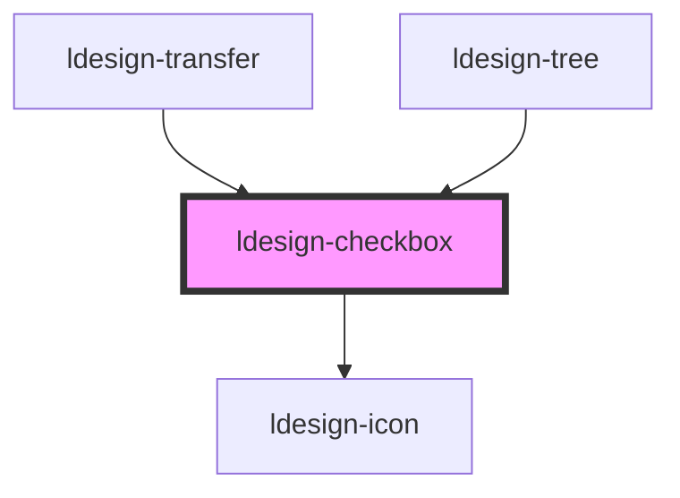

# ldesign-checkbox

<!-- Auto Generated Below -->

## Overview

Checkbox 复选框组件
在一组备选项中进行多选

## Properties

| Property         | Attribute         | Description         | Type                                                      | Default     |
| ---------------- | ----------------- | ------------------- | --------------------------------------------------------- | ----------- |
| `border`         | `border`          | 是否显示边框（兼容旧 API）     | `boolean`                                                 | `false`     |
| `button`         | `button`          | 是否为按钮样式（兼容旧 API）    | `boolean`                                                 | `false`     |
| `checked`        | `checked`         | 是否选中                | `boolean`                                                 | `false`     |
| `disabled`       | `disabled`        | 是否禁用                | `boolean`                                                 | `false`     |
| `indeterminate`  | `indeterminate`   | 设置半选状态，只负责样式控制      | `boolean`                                                 | `false`     |
| `labelPlacement` | `label-placement` | 标签位置                | `"left" \| "right"`                                       | `'right'`   |
| `name`           | `name`            | 原生表单 name，用于表单提交/分组 | `string`                                                  | `undefined` |
| `shape`          | `shape`           | 形状                  | `"round" \| "square"`                                     | `'square'`  |
| `size`           | `size`            | 多选框的尺寸              | `"large" \| "medium" \| "middle" \| "small"`              | `'medium'`  |
| `status`         | `status`          | 外观主题颜色              | `"brand" \| "danger" \| "info" \| "success" \| "warning"` | `'brand'`   |
| `value`          | `value`           | 选中状态的值              | `number \| string`                                        | `undefined` |
| `variant`        | `variant`         | 外观变体                | `"button" \| "default" \| "filled" \| "outline"`          | `'default'` |

## Events

| Event           | Description  | Type                   |
| --------------- | ------------ | ---------------------- |
| `ldesignChange` | 当绑定值变化时触发的事件 | `CustomEvent<boolean>` |

## Dependencies

### Used by

 - [ldesign-transfer](../transfer)
 - [ldesign-tree](../tree)

### Depends on

- [ldesign-icon](../icon)

### Graph

----------------------------------------------

*Built with [StencilJS](https://stenciljs.com/)*
