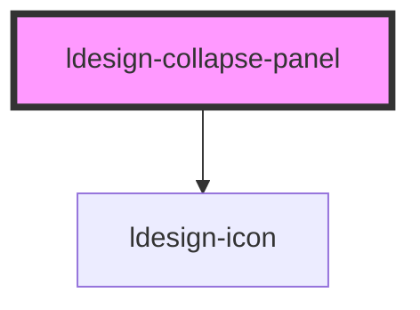

# ldesign-collapse-panel

<!-- Auto Generated Below -->

## Overview

CollapsePanel 折叠面板项

## Properties

| Property              | Attribute               | Description               | Type                                                                     | Default           |
| --------------------- | ----------------------- | ------------------------- | ------------------------------------------------------------------------ | ----------------- |
| `active`              | `active`                | 激活状态（由父级控制）               | `boolean`                                                                | `false`           |
| `animationDelay`      | `animation-delay`       | 动画延迟                      | `number`                                                                 | `0`               |
| `animationDuration`   | `animation-duration`    | 动画持续时间（毫秒）                | `number`                                                                 | `200`             |
| `animationEasing`     | `animation-easing`      | 动画缓动函数                    | `string`                                                                 | `'ease'`          |
| `animationPreset`     | `animation-preset`      | 动画曲线预设                    | `"bounce" \| "default" \| "sharp" \| "smooth" \| "spring"`               | `'default'`       |
| `collapsedIcon`       | `collapsed-icon`        | 自定义折叠图标                   | `string`                                                                 | `undefined`       |
| `contentAnimation`    | `content-animation`     | 内容动画类型                    | `"fade" \| "none" \| "scale" \| "slide" \| "slide-fade"`                 | `'fade'`          |
| `contentFadeDelay`    | `content-fade-delay`    | 内容淡入延迟                    | `number`                                                                 | `100`             |
| `contentPadding`      | `content-padding`       | 内容内边距                     | `string`                                                                 | `undefined`       |
| `destroyOnClose`      | `destroy-on-close`      | 收起后是否销毁内容（优先级高于 lazy）     | `boolean`                                                                | `false`           |
| `disabled`            | `disabled`              | 禁用                        | `boolean`                                                                | `false`           |
| `emptyText`           | `empty-text`            | 空状态文本                     | `string`                                                                 | `undefined`       |
| `expandIcon`          | `expand-icon`           | 展开图标名称（默认 chevron-right）  | `string`                                                                 | `'chevron-right'` |
| `expandIconPlacement` | `expand-icon-placement` | 图标位置（由父级传入，也可单独覆盖）        | `"left" \| "right"`                                                      | `'left'`          |
| `expandedIcon`        | `expanded-icon`         | 自定义展开图标                   | `string`                                                                 | `undefined`       |
| `extra`               | `extra`                 | 右侧附加区（可用 slot="extra" 覆盖） | `string`                                                                 | `undefined`       |
| `header`              | `header`                | 头部文本（可用 slot="header" 覆盖） | `string`                                                                 | `undefined`       |
| `headerBackground`    | `header-background`     | 头部背景色                     | `string`                                                                 | `undefined`       |
| `iconRotation`        | `icon-rotation`         | 图标旋转角度                    | `number`                                                                 | `90`              |
| `lazy`                | `lazy`                  | 首次激活才渲染内容（懒渲染）            | `boolean`                                                                | `false`           |
| `loading`             | `loading`               | 是否加载中                     | `boolean`                                                                | `false`           |
| `name`                | `name`                  | 面板唯一标识（由父级匹配）             | `string`                                                                 | `undefined`       |
| `nestingLevel`        | `nesting-level`         | 嵌套层级                      | `number`                                                                 | `0`               |
| `reverseIconRotation` | `reverse-icon-rotation` | 是否反向旋转图标                  | `boolean`                                                                | `false`           |
| `showDivider`         | `show-divider`          | 是否显示分隔线                   | `boolean`                                                                | `true`            |
| `showExpandIcon`      | `show-expand-icon`      | 是否显示展开图标                  | `boolean`                                                                | `true`            |
| `size`                | `size`                  | 尺寸变体                      | `"large" \| "medium" \| "small"`                                         | `'medium'`        |
| `sortable`            | `sortable`              | 是否可排序（由父级传入）              | `boolean`                                                                | `false`           |
| `theme`               | `theme`                 | 主题颜色                      | `"danger" \| "default" \| "info" \| "primary" \| "success" \| "warning"` | `'default'`       |

## Events

| Event                       | Description | Type                                               |
| --------------------------- | ----------- | -------------------------------------------------- |
| `ldesignCollapseItemToggle` | 冒泡给父级，用于切换  | `CustomEvent<{ name: string; }>`                   |
| `ldesignPanelDragEnd`       |             | `CustomEvent<{ event: DragEvent; }>`               |
| `ldesignPanelDragLeave`     |             | `CustomEvent<{ name: string; event: DragEvent; }>` |
| `ldesignPanelDragOver`      |             | `CustomEvent<{ name: string; event: DragEvent; }>` |
| `ldesignPanelDragStart`     | 拖拽事件        | `CustomEvent<{ name: string; event: DragEvent; }>` |
| `ldesignPanelDrop`          |             | `CustomEvent<{ name: string; event: DragEvent; }>` |

## Dependencies

### Depends on

- [ldesign-icon](../icon)

### Graph

----------------------------------------------

*Built with [StencilJS](https://stenciljs.com/)*
