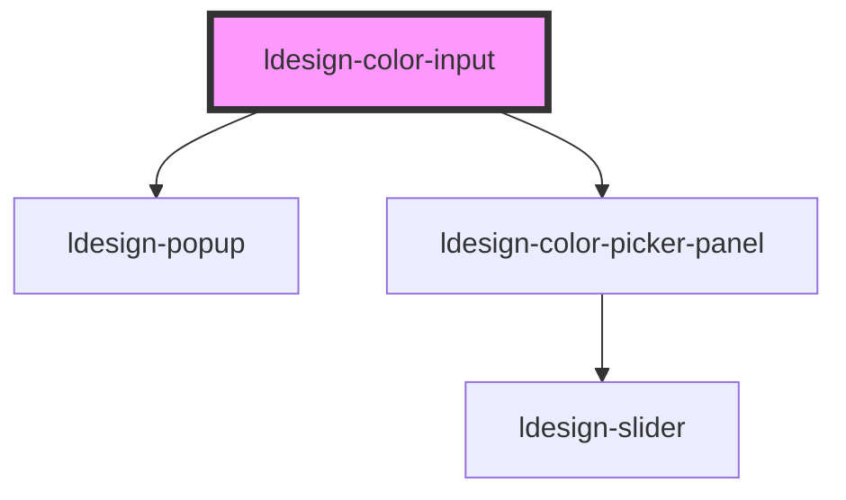

# ldesign-color-input

<!-- Auto Generated Below -->

## Overview

ColorInput 颜色输入（内置 Popup + ColorPicker）
- 点击触发显示颜色选择面板
- 支持透明度/预设/最近使用

## Properties

| Property       | Attribute        | Description                 | Type                                                                                                                                                                 | Default          |
| -------------- | ---------------- | --------------------------- | -------------------------------------------------------------------------------------------------------------------------------------------------------------------- | ---------------- |
| `clearable`    | `clearable`      | 是否可清空                       | `boolean`                                                                                                                                                            | `true`           |
| `disabled`     | `disabled`       | 是否禁用                        | `boolean`                                                                                                                                                            | `false`          |
| `format`       | `format`         | 显示/输出格式                     | `"hex" \| "hsl" \| "hsv" \| "rgb"`                                                                                                                                   | `'hex'`          |
| `hideOnSelect` | `hide-on-select` | 选择后是否自动关闭弹层                 | `boolean`                                                                                                                                                            | `true`           |
| `placeholder`  | `placeholder`    | 输入占位符                       | `string`                                                                                                                                                             | `''`             |
| `placement`    | `placement`      | 弹出位置                        | `"bottom" \| "bottom-end" \| "bottom-start" \| "left" \| "left-end" \| "left-start" \| "right" \| "right-end" \| "right-start" \| "top" \| "top-end" \| "top-start"` | `'bottom-start'` |
| `presets`      | `presets`        | 预设颜色                        | `string[]`                                                                                                                                                           | `[]`             |
| `recentMax`    | `recent-max`     | 最近颜色最大条数                    | `number`                                                                                                                                                             | `12`             |
| `showAlpha`    | `show-alpha`     | 是否显示透明度                     | `boolean`                                                                                                                                                            | `true`           |
| `showHistory`  | `show-history`   | 是否显示最近使用                    | `boolean`                                                                                                                                                            | `true`           |
| `showPreset`   | `show-preset`    | 是否显示系统预设                    | `boolean`                                                                                                                                                            | `true`           |
| `size`         | `size`           | 尺寸                          | `"large" \| "medium" \| "middle" \| "small"`                                                                                                                         | `'medium'`       |
| `value`        | `value`          | 当前颜色字符串（与 ColorPicker 格式一致） | `string`                                                                                                                                                             | `'#1677ff'`      |

## Events

| Event           | Description | Type                  |
| --------------- | ----------- | --------------------- |
| `ldesignChange` | 确认变更        | `CustomEvent<string>` |
| `ldesignInput`  | 实时更新        | `CustomEvent<string>` |

## Shadow Parts

| Part        | Description |
| ----------- | ----------- |
| `"trigger"` |             |

## Dependencies

### Depends on

- [ldesign-popup](../popup)
- [ldesign-color-picker-panel](../color-picker-panel)

### Graph

----------------------------------------------

*Built with [StencilJS](https://stenciljs.com/)*
