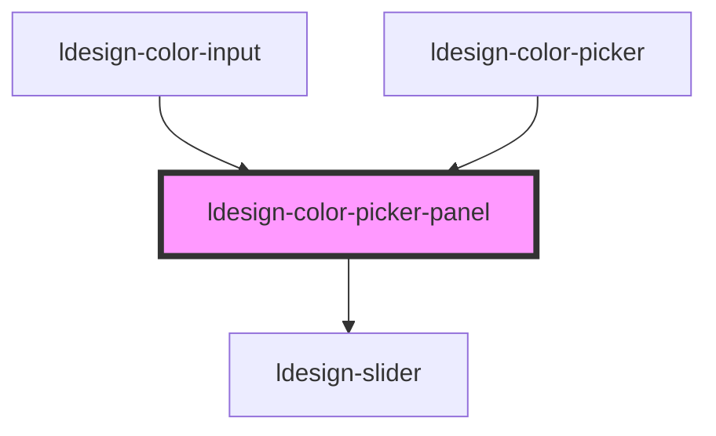

# ldesign-color-picker-panel


## 使用示例：径向渐变（Radial Gradient）

- 仅启用径向渐变面板：

```html path=null start=null
<ldesign-color-picker-panel modes="gradient" gradient-types="radial"></ldesign-color-picker-panel>
```

- 同时启用线性与径向，并显示切换按钮（默认不显示）：

```html path=null start=null
<ldesign-color-picker-panel
  modes="gradient"
  gradient-types="both"
  show-gradient-type-tabs
></ldesign-color-picker-panel>
```

- 径向交互说明：
  - 在“中心平面”中拖拽蓝点可调整中心（X/Y，百分比）。
  - 形状可在“圆形/椭圆”之间切换。
  - 色标条支持点击新增、拖拽位置、键盘微调（左右箭头；Shift=10%）。
  - 生成值形如：`radial-gradient(circle at 50% 50%, rgba(... ) 0%, rgba(... ) 100%)`。


<!-- Auto Generated Below -->


## Overview

ColorPicker Panel 纯面板
- 不包含 Popup/触发器，仅渲染颜色选择面板
- 适合内嵌在任意容器，宽度默认铺满容器

## Properties

| Property               | Attribute                 | Description                                             | Type                                         | Default                                                                                                                                                                                                                                                                                 |
| ---------------------- | ------------------------- | ------------------------------------------------------- | -------------------------------------------- | --------------------------------------------------------------------------------------------------------------------------------------------------------------------------------------------------------------------------------------------------------------------------------------- |
| `disabled`             | `disabled`                | 是否禁用（禁用交互）                                              | `boolean`                                    | `false`                                                                                                                                                                                                                                                                                 |
| `format`               | `format`                  | 默认显示格式                                                  | `"hex" \| "hsl" \| "hsv" \| "rgb"`           | `'hex'`                                                                                                                                                                                                                                                                                 |
| `gradientTypes`        | `gradient-types`          | 渐变类型：线性/径向/两者（仅在 activeMode=gradient 时生效）               | `"both" \| "linear" \| "radial"`             | `'both'`                                                                                                                                                                                                                                                                                |
| `minStopGap`           | `min-stop-gap`            | 渐变色标之间的最小间距（百分比，避免重叠），默认 1                              | `number`                                     | `1`                                                                                                                                                                                                                                                                                     |
| `modes`                | `modes`                   | 面板模式：单色 \| 渐变 \| 两者                                     | `"both" \| "gradient" \| "solid"`            | `'both'`                                                                                                                                                                                                                                                                                |
| `presets`              | --                        | 预设颜色                                                    | `string[]`                                   | `[     '#ff4d4f', '#ff7a45', '#ffa940', '#ffc53d', '#ffec3d', '#bae637', '#73d13d', '#36cfc9', '#40a9ff', '#597ef7', '#9254de', '#f759ab',     '#d4380d', '#d46b08', '#d48806', '#ad8b00', '#5b8c00', '#08979c', '#096dd9', '#1d39c4', '#531dab', '#c41d7f', '#8c8c8c', '#595959',   ]` |
| `recentMax`            | `recent-max`              | 最近使用最多条数                                                | `number`                                     | `12`                                                                                                                                                                                                                                                                                    |
| `showAlpha`            | `show-alpha`              | 是否显示透明度                                                 | `boolean`                                    | `true`                                                                                                                                                                                                                                                                                  |
| `showGradientTypeTabs` | `show-gradient-type-tabs` | 是否在渐变面板中显示“线性/径向”切换按钮（默认不显示）                            | `boolean`                                    | `false`                                                                                                                                                                                                                                                                                 |
| `showHistory`          | `show-history`            | 是否显示最近使用（无数据时自动隐藏）                                      | `boolean`                                    | `true`                                                                                                                                                                                                                                                                                  |
| `showPreset`           | `show-preset`             | 是否显示系统预设                                                | `boolean`                                    | `true`                                                                                                                                                                                                                                                                                  |
| `showRadialSidebar`    | `show-radial-sidebar`     | 在渐变-径向模式下，于右侧显示径向面板（中心拖拽与参数）                            | `boolean`                                    | `false`                                                                                                                                                                                                                                                                                 |
| `size`                 | `size`                    | 尺寸（影响整体间距）                                              | `"large" \| "medium" \| "middle" \| "small"` | `'medium'`                                                                                                                                                                                                                                                                              |
| `ui`                   | `ui`                      | UI 模式：simple 为精简界面，仅保留必要控件；pro 为完整界面                    | `"pro" \| "simple"`                          | `'pro'`                                                                                                                                                                                                                                                                                 |
| `value`                | `value`                   | 当前颜色（默认 hex），支持 #RRGGBB/#RRGGBBAA、rgb/rgba、hsl/hsla、hsv | `string`                                     | `'#3498db'`                                                                                                                                                                                                                                                                             |


## Events

| Event           | Description | Type                  |
| --------------- | ----------- | --------------------- |
| `ldesignChange` |             | `CustomEvent<string>` |
| `ldesignInput`  |             | `CustomEvent<string>` |


## Dependencies

### Used by

 - [ldesign-color-input](../color-input)
 - [ldesign-color-picker](../color-picker)

### Depends on

- [ldesign-slider](../slider)

### Graph


----------------------------------------------

*Built with [StencilJS](https://stenciljs.com/)*
