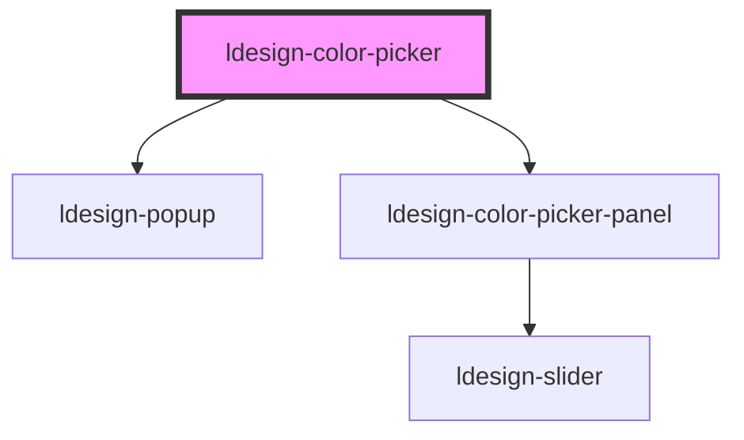

# ldesign-color-picker


## 使用示例：径向渐变（Radial Gradient）

- 在弹层里使用径向渐变面板：

```html path=null start=null
<ldesign-color-picker modes="gradient" gradient-types="radial"></ldesign-color-picker>
```

- 需要显示“线性/径向”切换按钮时（默认隐藏）：

```html path=null start=null
<ldesign-color-picker
  modes="gradient"
  gradient-types="both"
  show-gradient-type-tabs
></ldesign-color-picker>
```

> 备注：`show-gradient-type-tabs` 为面板属性，已在包装组件中透传。


<!-- Auto Generated Below -->


## Overview

ColorPicker 颜色选择器
- 支持 SV 色板 + Hue 滑条 + 可选 Alpha
- 支持 HEX/RGB/HSL/HSV 输入与预设/历史颜色

## Properties

| Property        | Attribute        | Description                                   | Type                                                                                                                                                                 | Default          |
| --------------- | ---------------- | --------------------------------------------- | -------------------------------------------------------------------------------------------------------------------------------------------------------------------- | ---------------- |
| `cancelText`    | `cancel-text`    |                                               | `string`                                                                                                                                                             | `'取消'`           |
| `confirmText`   | `confirm-text`   | 自定义按钮文案                                       | `string`                                                                                                                                                             | `'确定'`           |
| `customTrigger` | `custom-trigger` | 使用具名插槽自定义触发器（slot="trigger"）；为 true 时不渲染默认触发器 | `boolean`                                                                                                                                                            | `false`          |
| `disabled`      | `disabled`       |                                               | `boolean`                                                                                                                                                            | `false`          |
| `format`        | `format`         |                                               | `"hex" \| "hsl" \| "hsv" \| "rgb"`                                                                                                                                   | `'hex'`          |
| `gradientTypes` | `gradient-types` | 渐变类型：'linear' \| 'radial' \| 'both'（传递给面板）    | `"both" \| "linear" \| "radial"`                                                                                                                                     | `'both'`         |
| `hideOnSelect`  | `hide-on-select` | 选择后是否自动关闭弹层                                   | `boolean`                                                                                                                                                            | `true`           |
| `minStopGap`    | `min-stop-gap`   | 渐变色标之间的最小间距（百分比，避免重叠），默认 1（透传给面板）             | `number`                                                                                                                                                             | `1`              |
| `modes`         | `modes`          | 面板模式：'solid' \| 'gradient' \| 'both'          | `"both" \| "gradient" \| "solid"`                                                                                                                                    | `'both'`         |
| `placement`     | `placement`      | 弹出位置                                          | `"bottom" \| "bottom-end" \| "bottom-start" \| "left" \| "left-end" \| "left-start" \| "right" \| "right-end" \| "right-start" \| "top" \| "top-end" \| "top-start"` | `'bottom-start'` |
| `popupWidth`    | `popup-width`    | 设置弹层宽度（数字或 CSS 长度），panel 将铺满此宽度               | `number \| string`                                                                                                                                                   | `undefined`      |
| `presets`       | `presets`        |                                               | `string[]`                                                                                                                                                           | `[]`             |
| `recentMax`     | `recent-max`     |                                               | `number`                                                                                                                                                             | `12`             |
| `showActions`   | `show-actions`   | 是否显示“确定/取消”操作区（默认 false）                      | `boolean`                                                                                                                                                            | `false`          |
| `showAlpha`     | `show-alpha`     |                                               | `boolean`                                                                                                                                                            | `true`           |
| `showHistory`   | `show-history`   |                                               | `boolean`                                                                                                                                                            | `true`           |
| `showPreset`    | `show-preset`    |                                               | `boolean`                                                                                                                                                            | `true`           |
| `size`          | `size`           |                                               | `"large" \| "medium" \| "middle" \| "small"`                                                                                                                         | `'medium'`       |
| `ui`            | `ui`             | 透传面板 UI 模式                                    | `"pro" \| "simple"`                                                                                                                                                  | `'pro'`          |
| `value`         | `value`          |                                               | `string`                                                                                                                                                             | `'#1677ff'`      |


## Events

| Event           | Description | Type                  |
| --------------- | ----------- | --------------------- |
| `ldesignChange` |             | `CustomEvent<string>` |
| `ldesignInput`  |             | `CustomEvent<string>` |


## Dependencies

### Depends on

- [ldesign-popup](../popup)
- [ldesign-color-picker-panel](../color-picker-panel)

### Graph


----------------------------------------------

*Built with [StencilJS](https://stenciljs.com/)*
