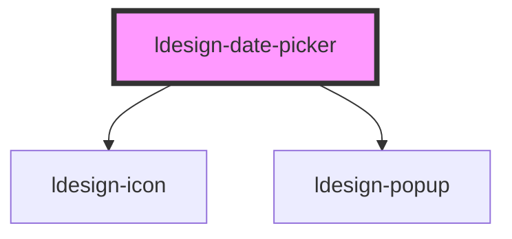

# ldesign-date-picker

以下示例展示如何启用范围选择（range）并在不同模式下使用。范围模式下，value 和 default-value 支持：
- 字符串：使用分隔符将起止值连接（推荐使用 " -> "）。也支持 ","、"~"、"至"、"—"、"–"，以及两侧带空格的连字符 " - "。注意：不支持裸连字符 "-"，以避免与日期格式 YYYY-MM-DD 内部连字符冲突。
- 字符串数组：通过 JS 以属性方式设置，例如 el.value = ['2025-01-01', '2025-01-10']。

事件
- 范围模式下，ldesignChange 的 detail 为 [start, end] 字符串数组，格式与当前 mode/format 对应：
  - date: YYYY-MM-DD
  - datetime: 按 format（默认 YYYY-MM-DD HH:mm:ss）
  - week: YYYY-WW周（例如 2025-13周）
  - month: YYYY-MM
  - quarter: YYYY-QN（例如 2025-Q2）
  - year: YYYY

提示
- date/datetime 范围为双月面板；datetime 下时间面板会绑定到当前活动端（开始或结束）。
- 原生 HTML 中设置函数类型的 disabled-date 需通过 JS 赋值（非 attribute）。

## 范围选择示例

### Date 范围
```html
<ldesign-date-picker range placeholder="请选择日期范围"></ldesign-date-picker>

<!-- 使用字符串作为默认值，分隔符可用 "->"、","、"~"、"至"、"—"、"–"，或两侧带空格的连字符 " - "（不支持裸 "-"） -->
<ldesign-date-picker range default-value="2025-01-01 -> 2025-01-10"></ldesign-date-picker>
```

```html
<!-- 通过 JS 设置数组值，以及监听变更事件 -->
<ldesign-date-picker id="dp-date-range" range></ldesign-date-picker>
<script>
  const el = document.querySelector('#dp-date-range');
  el.value = ['2025-02-01', '2025-02-07'];
  el.addEventListener('ldesignChange', (e) => {
    const [start, end] = e.detail || [];
    console.log('range:', start, '->', end);
  });
</script>
```

### Datetime 范围
```html
<ldesign-date-picker range mode="datetime" format="YYYY-MM-DD HH:mm:ss"></ldesign-date-picker>
```

### Week 范围
```html
<ldesign-date-picker range mode="week" show-week-numbers></ldesign-date-picker>
```

### Month 范围
```html
<ldesign-date-picker range mode="month"></ldesign-date-picker>
```

### Quarter 范围
```html
<ldesign-date-picker range mode="quarter"></ldesign-date-picker>
```

### Year 范围
```html
<ldesign-date-picker range mode="year"></ldesign-date-picker>
```

### 设置函数属性（示例：disabled-date）
```html
<ldesign-date-picker id="dp-disabled-range" range></ldesign-date-picker>
<script>
  const dp = document.querySelector('#dp-disabled-range');
  // 仅允许选择今天及之后
  dp.disabledDate = (d) => d < new Date(new Date().getFullYear(), new Date().getMonth(), new Date().getDate());
</script>
```

<!-- Auto Generated Below -->


## Properties

| Property          | Attribute           | Description | Type                                                 | Default        |
| ----------------- | ------------------- | ----------- | ---------------------------------------------------- | -------------- |
| `clearable`       | `clearable`         |             | `boolean`                                            | `true`         |
| `defaultValue`    | `default-value`     |             | `string`                                             | `undefined`    |
| `disabled`        | `disabled`          |             | `boolean`                                            | `false`        |
| `disabledDate`    | `disabled-date`     |             | `(d: Date) => boolean`                               | `undefined`    |
| `firstDayOfWeek`  | `first-day-of-week` |             | `0 \| 1 \| 2 \| 3 \| 4 \| 5 \| 6`                    | `1`            |
| `format`          | `format`            |             | `string`                                             | `'YYYY-MM-DD'` |
| `maxDate`         | `max-date`          |             | `string`                                             | `undefined`    |
| `minDate`         | `min-date`          |             | `string`                                             | `undefined`    |
| `mode`            | `mode`              |             | `"date" \| "month" \| "quarter" \| "week" \| "year"` | `'date'`       |
| `placeholder`     | `placeholder`       |             | `string`                                             | `'请选择日期'`      |
| `showWeekNumbers` | `show-week-numbers` |             | `boolean`                                            | `false`        |
| `value`           | `value`             |             | `string`                                             | `undefined`    |


## Events

| Event                  | Description | Type                   |
| ---------------------- | ----------- | ---------------------- |
| `ldesignChange`        |             | `CustomEvent<any>`     |
| `ldesignVisibleChange` |             | `CustomEvent<boolean>` |


## Dependencies

### Depends on

- [ldesign-icon](../icon)
- [ldesign-popup](../popup)

### Graph


----------------------------------------------

*Built with [StencilJS](https://stenciljs.com/)*
