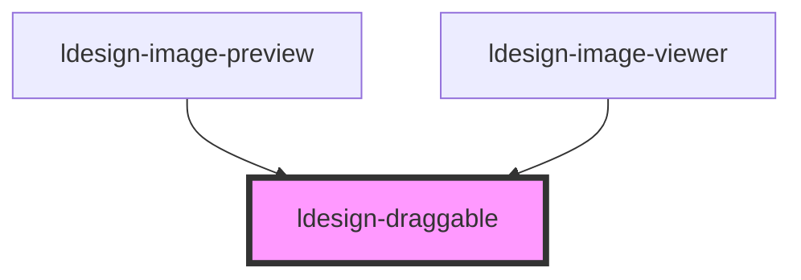

# ldesign-draggable

<!-- Auto Generated Below -->

## Overview

ldesign-draggable
通用可拖拽/缩放/旋转容器（图片优先），支持：
- PC：滚轮缩放、拖拽平移、双击 1x/2x 切换
- 移动端：双指缩放+旋转、单指平移、松手回弹、动量滚动

用法：
1) 直接传入 src 渲染图片
   <ldesign-draggable src="/big.jpg" style="width:100%;height:100%" />
2) 插槽自定义内容（若无 src）：
   <ldesign-draggable style="width:100%;height:100%">
     
   </ldesign-draggable>

## Properties

| Property                | Attribute                  | Description                      | Type                                                                                   | Default          |
| ----------------------- | -------------------------- | -------------------------------- | -------------------------------------------------------------------------------------- | ---------------- |
| `allowDoubleTap`        | `allow-double-tap`         | 是否允许双击/双指双击缩放                    | `boolean`                                                                              | `true`           |
| `alt`                   | `alt`                      |                                  | `string`                                                                               | `undefined`      |
| `boundsElasticity`      | `bounds-elasticity`        | 边界弹性系数                           | `number`                                                                               | `0.15`           |
| `controlsPosition`      | `controls-position`        |                                  | `"bottom-left" \| "bottom-right" \| "top-left" \| "top-right"`                         | `'top-right'`    |
| `disableContextMenu`    | `disable-context-menu`     | 是否禁用右键菜单（避免干扰拖拽）                 | `boolean`                                                                              | `true`           |
| `doubleTapZoom`         | `double-tap-zoom`          | 双击切换到的缩放倍数                       | `number`                                                                               | `2`              |
| `enableGrid`            | `enable-grid`              | 是否启用网格吸附                         | `boolean`                                                                              | `false`          |
| `enableHistory`         | `enable-history`           | 是否启用撤销/重做                        | `boolean`                                                                              | `false`          |
| `enableMomentum`        | `enable-momentum`          | 是否启用动量滚动                         | `boolean`                                                                              | `true`           |
| `enableRotate`          | `enable-rotate`            | 是否允许旋转（移动端双指）                    | `boolean`                                                                              | `true`           |
| `gridSize`              | `grid-size`                | 网格大小（像素）                         | `number`                                                                               | `20`             |
| `initialOffsetX`        | `initial-offset-x`         |                                  | `number`                                                                               | `0`              |
| `initialOffsetY`        | `initial-offset-y`         |                                  | `number`                                                                               | `0`              |
| `initialRotate`         | `initial-rotate`           |                                  | `number`                                                                               | `0`              |
| `initialScale`          | `initial-scale`            | 初始状态                             | `number`                                                                               | `1`              |
| `keyPanFastMultiplier`  | `key-pan-fast-multiplier`  | 按住 Shift 时的平移步长倍率                | `number`                                                                               | `3`              |
| `keyPanStep`            | `key-pan-step`             | 方向键平移基础步长（像素）                    | `number`                                                                               | `40`             |
| `keyboard`              | `keyboard`                 | 是否启用键盘交互（方向键平移、+/- 缩放、R 旋转、0 重置） | `boolean`                                                                              | `true`           |
| `maxHistory`            | `max-history`              | 历史记录最大数量                         | `number`                                                                               | `20`             |
| `maxScale`              | `max-scale`                |                                  | `number`                                                                               | `4`              |
| `minScale`              | `min-scale`                | 最小/最大缩放                          | `number`                                                                               | `0.25`           |
| `minimapPosition`       | `minimap-position`         | 缩略图导航位置                          | `"bottom-left" \| "bottom-right" \| "top-left" \| "top-right"`                         | `'bottom-right'` |
| `presetViews`           | `preset-views`             | 预设视角                             | `{ name: string; scale: number; rotate: number; offsetX: number; offsetY: number; }[]` | `undefined`      |
| `rotateSnapDeg`         | `rotate-snap-deg`          | 旋转吸附角度（度）。大于 0 时在捏合旋转接近该步进的倍数会吸附 | `number`                                                                               | `0`              |
| `rotateSnapEpsilon`     | `rotate-snap-epsilon`      | 旋转吸附阈值（度），仅当与最近倍数的差值不超过该阈值时生效    | `number`                                                                               | `3`              |
| `showControls`          | `show-controls`            |                                  | `boolean`                                                                              | `false`          |
| `showIndicators`        | `show-indicators`          | 是否显示缩放/旋转指示器                     | `boolean`                                                                              | `false`          |
| `showMinimap`           | `show-minimap`             | 是否启用缩略图导航                        | `boolean`                                                                              | `false`          |
| `showPerformance`       | `show-performance`         | 是否显示性能监控                         | `boolean`                                                                              | `false`          |
| `smoothBounds`          | `smooth-bounds`            | 是否启用平滑边界                         | `boolean`                                                                              | `true`           |
| `src`                   | `src`                      | 若提供则内部渲染 img；否则使用默认插槽            | `string`                                                                               | `undefined`      |
| `wheelPan`              | `wheel-pan`                | 允许使用滚轮进行平移（当未触发缩放时）              | `boolean`                                                                              | `true`           |
| `wheelZoom`             | `wheel-zoom`               | PC 滚轮缩放                          | `boolean`                                                                              | `true`           |
| `wheelZoomRequiresCtrl` | `wheel-zoom-requires-ctrl` | 是否需要按住 Ctrl/⌘ 才进行滚轮缩放；否则滚轮优先缩放   | `boolean`                                                                              | `false`          |
| `zoomStep`              | `zoom-step`                | 缩放步进（滚轮/按钮）                      | `number`                                                                               | `0.1`            |

## Events

| Event                    | Description | Type                                                                                |
| ------------------------ | ----------- | ----------------------------------------------------------------------------------- |
| `ldesignGestureEnd`      |             | `CustomEvent<void>`                                                                 |
| `ldesignGestureStart`    |             | `CustomEvent<void>`                                                                 |
| `ldesignHistoryChange`   |             | `CustomEvent<{ canUndo: boolean; canRedo: boolean; }>`                              |
| `ldesignTransformChange` |             | `CustomEvent<{ scale: number; rotate: number; offsetX: number; offsetY: number; }>` |

## Methods

### `fitContain() => Promise<void>`

#### Returns

Type: `Promise<void>`

### `fitCover() => Promise<void>`

#### Returns

Type: `Promise<void>`

### `getState() => Promise<{ scale: number; rotate: number; offsetX: number; offsetY: number; }>`

#### Returns

Type: `Promise<{ scale: number; rotate: number; offsetX: number; offsetY: number; }>`

### `getTransformString() => Promise<string>`

#### Returns

Type: `Promise<string>`

### `goToPresetView(index: number) => Promise<void>`

#### Parameters

| Name    | Type     | Description |
| ------- | -------- | ----------- |
| `index` | `number` |             |

#### Returns

Type: `Promise<void>`

### `panBy(dx: number, dy: number, clamp?: boolean) => Promise<void>`

#### Parameters

| Name    | Type      | Description |
| ------- | --------- | ----------- |
| `dx`    | `number`  |             |
| `dy`    | `number`  |             |
| `clamp` | `boolean` |             |

#### Returns

Type: `Promise<void>`

### `panTo(x: number, y: number, clamp?: boolean) => Promise<void>`

#### Parameters

| Name    | Type      | Description |
| ------- | --------- | ----------- |
| `x`     | `number`  |             |
| `y`     | `number`  |             |
| `clamp` | `boolean` |             |

#### Returns

Type: `Promise<void>`

### `redo() => Promise<void>`

#### Returns

Type: `Promise<void>`

### `reset() => Promise<void>`

#### Returns

Type: `Promise<void>`

### `rotateBy(deltaDeg: number) => Promise<void>`

#### Parameters

| Name       | Type     | Description |
| ---------- | -------- | ----------- |
| `deltaDeg` | `number` |             |

#### Returns

Type: `Promise<void>`

### `setOffsets(x: number, y: number) => Promise<void>`

#### Parameters

| Name | Type     | Description |
| ---- | -------- | ----------- |
| `x`  | `number` |             |
| `y`  | `number` |             |

#### Returns

Type: `Promise<void>`

### `setRotate(deg: number) => Promise<void>`

#### Parameters

| Name  | Type     | Description |
| ----- | -------- | ----------- |
| `deg` | `number` |             |

#### Returns

Type: `Promise<void>`

### `toggleGrid() => Promise<void>`

#### Returns

Type: `Promise<void>`

### `toggleIndicators() => Promise<void>`

#### Returns

Type: `Promise<void>`

### `toggleMinimap() => Promise<void>`

#### Returns

Type: `Promise<void>`

### `undo() => Promise<void>`

#### Returns

Type: `Promise<void>`

### `zoomIn(step?: number) => Promise<void>`

#### Parameters

| Name   | Type     | Description |
| ------ | -------- | ----------- |
| `step` | `number` |             |

#### Returns

Type: `Promise<void>`

### `zoomOut(step?: number) => Promise<void>`

#### Parameters

| Name   | Type     | Description |
| ------ | -------- | ----------- |
| `step` | `number` |             |

#### Returns

Type: `Promise<void>`

### `zoomTo(scale: number, clientX?: number, clientY?: number) => Promise<void>`

#### Parameters

| Name      | Type     | Description |
| --------- | -------- | ----------- |
| `scale`   | `number` |             |
| `clientX` | `number` |             |
| `clientY` | `number` |             |

#### Returns

Type: `Promise<void>`

## Dependencies

### Used by

 - [ldesign-image-preview](../image-preview)
 - [ldesign-image-viewer](../image-viewer)

### Graph

----------------------------------------------

*Built with [StencilJS](https://stenciljs.com/)*
