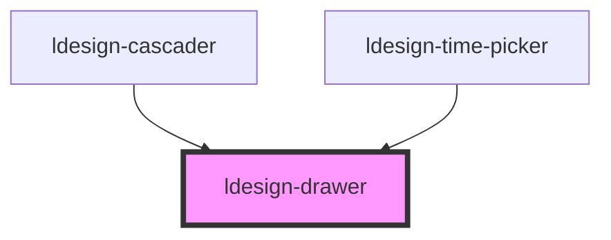

# ldesign-drawer

<!-- Auto Generated Below -->

## Properties

| Property            | Attribute            | Description         | Type                                               | Default         |
| ------------------- | -------------------- | ------------------- | -------------------------------------------------- | --------------- |
| `animation`         | `animation`          | 是否启用动画              | `boolean`                                          | `true`          |
| `animationDuration` | `animation-duration` | 动画持续时间（毫秒）          | `number`                                           | `300`           |
| `animationEasing`   | `animation-easing`   | 动画缓动函数              | `string`                                           | `'ease-in-out'` |
| `animationType`     | `animation-type`     | 动画类型                | `string`                                           | `'slide'`       |
| `ariaLabelText`     | `aria-label-text`    | ARIA 标签             | `string`                                           | `undefined`     |
| `autoFocus`         | `auto-focus`         | 自动聚焦                | `boolean`                                          | `true`          |
| `borderRadius`      | `border-radius`      | 圆角大小                | `string`                                           | `'8px'`         |
| `closable`          | `closable`           | 是否显示关闭按钮            | `boolean`                                          | `true`          |
| `closeOnEsc`        | `close-on-esc`       | 按 ESC 关闭            | `boolean`                                          | `true`          |
| `container`         | `container`          | 容器选择器或元素            | `HTMLElement \| string`                            | `undefined`     |
| `cssContain`        | `css-contain`        | 性能优化：使用 CSS contain | `boolean`                                          | `true`          |
| `customClass`       | `custom-class`       | 自定义类名               | `string`                                           | `''`            |
| `destroyOnClose`    | `destroy-on-close`   | 关闭时销毁               | `boolean`                                          | `false`         |
| `drawerTitle`       | `drawer-title`       | 标题                  | `string`                                           | `undefined`     |
| `focusTrap`         | `focus-trap`         | 焦点捕获                | `boolean`                                          | `true`          |
| `footerAlign`       | `footer-align`       | 底部按钮对齐方式            | `"center" \| "left" \| "right" \| "space-between"` | `'right'`       |
| `footerBorder`      | `footer-border`      | 是否显示底部边框            | `boolean`                                          | `true`          |
| `footerButtons`     | `footer-buttons`     | 底部按钮配置              | `DrawerButton[]`                                   | `[]`            |
| `fullscreen`        | `fullscreen`         | 是否全屏                | `boolean`                                          | `false`         |
| `fullscreenable`    | `fullscreenable`     | 是否可全屏切换             | `boolean`                                          | `false`         |
| `gpuAcceleration`   | `gpu-acceleration`   | 性能优化：GPU 加速         | `boolean`                                          | `true`          |
| `headerBorder`      | `header-border`      | 是否显示头部边框            | `boolean`                                          | `true`          |
| `headerSticky`      | `header-sticky`      | 头部是否吸顶              | `boolean`                                          | `false`         |
| `icon`              | `icon`               | 标题图标                | `string`                                           | `undefined`     |
| `lazyLoad`          | `lazy-load`          | 性能优化：懒加载内容          | `boolean`                                          | `false`         |
| `level`             | `level`              | 抽屉层级                | `"high" \| "modal" \| "normal" \| "top"`           | `'normal'`      |
| `loading`           | `loading`            | 是否显示加载状态            | `boolean`                                          | `false`         |
| `loadingText`       | `loading-text`       | 加载文本                | `string`                                           | `'加载中...'`      |
| `lockScroll`        | `lock-scroll`        | 是否锁定页面滚动            | `boolean`                                          | `true`          |
| `mask`              | `mask`               | 是否显示遮罩              | `boolean`                                          | `true`          |
| `maskClass`         | `mask-class`         | 遮罩样式类名              | `string`                                           | `''`            |
| `maskClosable`      | `mask-closable`      | 点击遮罩是否关闭            | `boolean`                                          | `true`          |
| `maxSize`           | `max-size`           | 最大尺寸                | `number \| string`                                 | `'90%'`         |
| `maximizable`       | `maximizable`        | 是否可最大化              | `boolean`                                          | `false`         |
| `minSize`           | `min-size`           | 最小尺寸                | `number \| string`                                 | `200`           |
| `minimizable`       | `minimizable`        | 是否可最小化              | `boolean`                                          | `false`         |
| `padding`           | `padding`            | 内容内边距               | `boolean \| string`                                | `true`          |
| `placement`         | `placement`          | 抽屉位置                | `"bottom" \| "left" \| "right" \| "top"`           | `'right'`       |
| `resizable`         | `resizable`          | 是否可调整大小             | `boolean`                                          | `false`         |
| `restoreFocus`      | `restore-focus`      | 恢复焦点                | `boolean`                                          | `true`          |
| `rounded`           | `rounded`            | 是否启用圆角              | `boolean`                                          | `true`          |
| `showBack`          | `show-back`          | 是否显示返回按钮            | `boolean`                                          | `false`         |
| `showSizeHint`      | `show-size-hint`     | 是否显示尺寸提示            | `boolean`                                          | `true`          |
| `size`              | `size`               | 抽屉大小                | `number \| string`                                 | `'md'`          |
| `snapPoints`        | `snap-points`        | 吸附点                 | `SnapPoint[]`                                      | `[]`            |
| `snapThreshold`     | `snap-threshold`     | 吸附阈值                | `number`                                           | `30`            |
| `subtitle`          | `subtitle`           | 副标题                 | `string`                                           | `undefined`     |
| `swipeThreshold`    | `swipe-threshold`    | 滑动阈值（0-1）           | `number`                                           | `0.3`           |
| `swipeToClose`      | `swipe-to-close`     | 是否启用滑动关闭            | `boolean`                                          | `false`         |
| `swipeTriggerArea`  | `swipe-trigger-area` | 滑动触发区域              | `"anywhere" \| "edge" \| "handle" \| "header"`     | `'edge'`        |
| `theme`             | `theme`              | 主题                  | `"auto" \| "custom" \| "dark" \| "light"`          | `'light'`       |
| `useTransform`      | `use-transform`      | 性能优化：使用 transform   | `boolean`                                          | `true`          |
| `virtualScroll`     | `virtual-scroll`     | 性能优化：使用虚拟滚动         | `boolean`                                          | `false`         |
| `visible`           | `visible`            | 是否显示抽屉              | `boolean`                                          | `false`         |
| `zIndex`            | `z-index`            | z-index 层级          | `number`                                           | `1000`          |

## Events

| Event               | Description | Type                                                          |
| ------------------- | ----------- | ------------------------------------------------------------- |
| `drawerBeforeClose` | 关闭前触发       | `CustomEvent<{ reason: CloseReason; }>`                       |
| `drawerBeforeOpen`  | 打开前触发       | `CustomEvent<void>`                                           |
| `drawerClose`       | 关闭后触发       | `CustomEvent<{ reason: CloseReason; }>`                       |
| `drawerOpen`        | 打开后触发       | `CustomEvent<void>`                                           |
| `drawerResize`      | 大小变化        | `CustomEvent<{ drawerWidth: number; drawerHeight: number; }>` |
| `drawerStateChange` | 状态变化        | `CustomEvent<{ state: DrawerState; }>`                        |
| `drawerSwipe`       | 滑动进度变化      | `CustomEvent<{ progress: number; }>`                          |

## Methods

### `close(reason?: CloseReason) => Promise<void>`

关闭抽屉

#### Parameters

| Name     | Type                                                            | Description |
| -------- | --------------------------------------------------------------- | ----------- |
| `reason` | `"button" \| "mask" \| "escape" \| "swipe" \| "api" \| "route"` |             |

#### Returns

Type: `Promise<void>`

### `getSize() => Promise<{ drawerWidth: number; drawerHeight: number; }>`

获取当前尺寸

#### Returns

Type: `Promise<{ drawerWidth: number; drawerHeight: number; }>`

### `getState() => Promise<DrawerState>`

获取当前状态

#### Returns

Type: `Promise<DrawerState>`

### `hideLoading() => Promise<void>`

隐藏加载状态

#### Returns

Type: `Promise<void>`

### `maximize() => Promise<void>`

最大化

#### Returns

Type: `Promise<void>`

### `minimize() => Promise<void>`

最小化

#### Returns

Type: `Promise<void>`

### `open() => Promise<void>`

打开抽屉

#### Returns

Type: `Promise<void>`

### `resize(size: number | string) => Promise<void>`

调整大小

#### Parameters

| Name   | Type               | Description |
| ------ | ------------------ | ----------- |
| `size` | `string \| number` |             |

#### Returns

Type: `Promise<void>`

### `restore() => Promise<void>`

恢复

#### Returns

Type: `Promise<void>`

### `showLoading(text?: string) => Promise<void>`

显示加载状态

#### Parameters

| Name   | Type     | Description |
| ------ | -------- | ----------- |
| `text` | `string` |             |

#### Returns

Type: `Promise<void>`

### `snapTo(point: SnapPoint) => Promise<void>`

吸附到指定点

#### Parameters

| Name    | Type        | Description |
| ------- | ----------- | ----------- |
| `point` | `SnapPoint` |             |

#### Returns

Type: `Promise<void>`

### `toggle() => Promise<void>`

切换显示状态

#### Returns

Type: `Promise<void>`

## Slots

| Slot        | Description |
| ----------- | ----------- |
|             | 抽屉主内容区域     |
| `"extra"`   | 头部右侧额外内容    |
| `"footer"`  | 自定义底部内容     |
| `"header"`  | 自定义头部内容     |
| `"loading"` | 自定义加载状态     |

## Dependencies

### Used by

 - [ldesign-cascader](../cascader)
 - [ldesign-time-picker](../time-picker)

### Graph

----------------------------------------------

*Built with [StencilJS](https://stenciljs.com/)*
