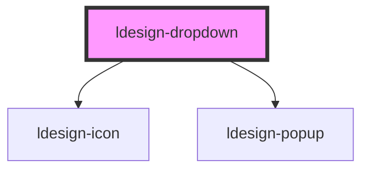

# ldesign-dropdown

跨端 Dropdown 组件（PC 级联 + 移动端单列）。基于 [ldesign-popup](../popup) 实现。

<!-- Auto Generated Below -->

## Overview

Dropdown 下拉菜单（PC 级联 + 移动端单列）
兼容鼠标和触屏，默认根据指针类型自适应（variant=auto）。

## Properties

| Property                    | Attribute                      | Description                            | Type                                                                                                                                                                 | Default          |
| --------------------------- | ------------------------------ | -------------------------------------- | -------------------------------------------------------------------------------------------------------------------------------------------------------------------- | ---------------- |
| `activeColor`               | `active-color`                 | 移动端选中态颜色（文本与对勾）                        | `string`                                                                                                                                                             | `'#F53F3F'`      |
| `appendTo`                  | `append-to`                    | 浮层挂载位置：默认 body，避免在文档容器中被裁剪             | `"body" \| "closest-popup" \| "self"`                                                                                                                                | `'body'`         |
| `arrow`                     | `arrow`                        | 是否显示箭头（默认不显示）                          | `boolean`                                                                                                                                                            | `false`          |
| `closeOnSelect`             | `close-on-select`              | 点击选项后是否自动关闭                            | `boolean`                                                                                                                                                            | `true`           |
| `defaultValue`              | `default-value`                | 默认值（非受控）                               | `string`                                                                                                                                                             | `undefined`      |
| `disabled`                  | `disabled`                     | 是否禁用                                   | `boolean`                                                                                                                                                            | `false`          |
| `fitTriggerWidth`           | `fit-trigger-width`            | 菜单宽度是否跟随触发器宽度（默认否）                     | `boolean`                                                                                                                                                            | `false`          |
| `items`                     | `items`                        | 下拉节点（数组或 JSON 字符串）                     | `DropdownNode[] \| string`                                                                                                                                           | `[]`             |
| `maxHeight`                 | `max-height`                   | 列表最大高度（px）                             | `number`                                                                                                                                                             | `240`            |
| `placeholder`               | `placeholder`                  | 触发器文本（默认触发器显示的固定文案，不随选择变化）             | `string`                                                                                                                                                             | `'请选择'`          |
| `placement`                 | `placement`                    | 出现位置                                   | `"bottom" \| "bottom-end" \| "bottom-start" \| "left" \| "left-end" \| "left-start" \| "right" \| "right-end" \| "right-start" \| "top" \| "top-end" \| "top-start"` | `'bottom-start'` |
| `reflectSelectionOnTrigger` | `reflect-selection-on-trigger` | 是否将选中项同步到默认触发器文本（默认不同步）                | `boolean`                                                                                                                                                            | `false`          |
| `showSelected`              | `show-selected`                | 是否在菜单项上展示选中样式（PC，默认不展示）                | `boolean`                                                                                                                                                            | `false`          |
| `submenuTrigger`            | `submenu-trigger`              | 子菜单的触发方式（hover/click），默认 hover，仅 PC 生效 | `"click" \| "hover"`                                                                                                                                                 | `'hover'`        |
| `theme`                     | `theme`                        | 主题（浅色/深色），透传给 Popup                    | `"dark" \| "light"`                                                                                                                                                  | `'light'`        |
| `trigger`                   | `trigger`                      | 触发方式（PC）                               | `"click" \| "contextmenu" \| "focus" \| "hover" \| "manual"`                                                                                                         | `'click'`        |
| `value`                     | `value`                        | 选中值（受控）                                | `string`                                                                                                                                                             | `undefined`      |
| `variant`                   | `variant`                      | 自适应：'auto' \| 'pc' \| 'mobile'         | `"auto" \| "mobile" \| "pc"`                                                                                                                                         | `'auto'`         |
| `visible`                   | `visible`                      | 外部受控可见性（仅 trigger = 'manual' 生效）       | `boolean`                                                                                                                                                            | `false`          |
| `width`                     | `width`                        | 列表宽度（可选）                               | `number \| string`                                                                                                                                                   | `undefined`      |

## Events

| Event                  | Description | Type                                                |
| ---------------------- | ----------- | --------------------------------------------------- |
| `ldesignChange`        | 选中变化事件      | `CustomEvent<{ key: string; item: DropdownItem; }>` |
| `ldesignVisibleChange` | 对外转发可见性变化   | `CustomEvent<boolean>`                              |

## Dependencies

### Depends on

- [ldesign-icon](../icon)
- [ldesign-popup](../popup)

### Graph

----------------------------------------------

*Built with [StencilJS](https://stenciljs.com/)*
