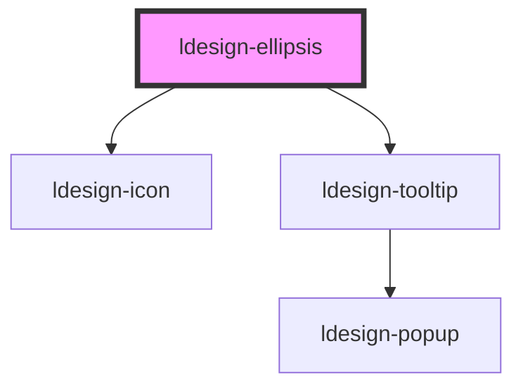

# ldesign-ellipsis

<!-- Auto Generated Below -->

## Overview

ldesign-ellipsis 文本省略/展开组件
- 折叠时按指定行数展示，右下角显示"更多"按钮
- 展开后：若最后一行还有空间，则"收起"出现在最后一行最右侧；否则换到下一行右侧
- 兼容 PC 与移动端，按钮有较大点击热区

## Properties

| Property                   | Attribute                      | Description                                       | Type                                                      | Default     |
| -------------------------- | ------------------------------ | ------------------------------------------------- | --------------------------------------------------------- | ----------- |
| `actionClass`              | `action-class`                 | 自定义按钮 class 和 style                               | `string`                                                  | `undefined` |
| `actionPlacement`          | `action-placement`             | 行为控制：auto（默认）\| inline（强制同行右置）\| newline（强制换行右对齐） | `"auto" \| "inline" \| "newline"`                         | `'auto'`    |
| `actionStyle`              | `action-style`                 |                                                   | `any`                                                     | `undefined` |
| `autoCollapseDelay`        | `auto-collapse-delay`          | 自动折叠延迟（毫秒，0为不自动折叠）                                | `number`                                                  | `0`         |
| `collapseIcon`             | `collapse-icon`                |                                                   | `string`                                                  | `undefined` |
| `collapseOnEscape`         | `collapse-on-escape`           | 展开态允许 ESC 收起                                      | `boolean`                                                 | `false`     |
| `collapseText`             | `collapse-text`                | 收起按钮文案（展开态）                                       | `string`                                                  | `'收起'`      |
| `content`                  | `content`                      | 要展示的文本内容（纯文本）                                     | `string`                                                  | `undefined` |
| `defaultExpanded`          | `default-expanded`             | 是否默认展开                                            | `boolean`                                                 | `false`     |
| `doubleClickToggle`        | `double-click-toggle`          | 双击文本切换展开/收起                                       | `boolean`                                                 | `false`     |
| `enhancedHover`            | `enhanced-hover`               | 按钮悬浮效果增强                                          | `boolean`                                                 | `true`      |
| `expandIcon`               | `expand-icon`                  | 按钮图标（可选）                                          | `string`                                                  | `undefined` |
| `expandText`               | `expand-text`                  | 展开按钮文案（折叠态）                                       | `string`                                                  | `'更多'`      |
| `expanded`                 | `expanded`                     | 当前是否展开（受控模式，可选）                                   | `boolean`                                                 | `undefined` |
| `fadeColors`               | `fade-colors`                  | 渐变遮罩颜色（可自定义多个颜色点）                                 | `string`                                                  | `undefined` |
| `fadeWidth`                | `fade-width`                   | 渐变遮罩宽度（如 40% 或 120）                               | `number \| string`                                        | `'40%'`     |
| `inlineGap`                | `inline-gap`                   | 同行放置时，文本与"收起"的间距（像素）                              | `number`                                                  | `8`         |
| `lines`                    | `lines`                        | 折叠时显示的行数                                          | `number`                                                  | `3`         |
| `linesMap`                 | --                             | 响应式行数，根据屏宽选择不同行数                                  | `{ sm?: number; md?: number; lg?: number; xl?: number; }` | `undefined` |
| `scrollIntoViewOnCollapse` | `scroll-into-view-on-collapse` | 收起时滚动到组件顶部                                        | `boolean`                                                 | `false`     |
| `scrollIntoViewOnExpand`   | `scroll-into-view-on-expand`   | 展开时滚动到组件顶部                                        | `boolean`                                                 | `false`     |
| `showFade`                 | `show-fade`                    | 折叠态是否显示渐变遮罩                                       | `boolean`                                                 | `true`      |
| `tooltipMaxWidth`          | `tooltip-max-width`            | Tooltip 最大宽度                                      | `number`                                                  | `320`       |
| `tooltipOnCollapsed`       | `tooltip-on-collapsed`         | 折叠且溢出时，悬浮显示全文                                     | `boolean`                                                 | `false`     |
| `tooltipPlacement`         | `tooltip-placement`            | Tooltip 位置                                        | `string`                                                  | `'top'`     |
| `transitionDuration`       | `transition-duration`          | 展开/收起高度变化动画时长（ms）                                 | `number`                                                  | `200`       |

## Events

| Event                   | Description                      | Type                                    |
| ----------------------- | -------------------------------- | --------------------------------------- |
| `ldesignTruncateChange` | 展开/折叠状态变化回调（自定义事件：ldesignToggle） | `CustomEvent<{ overflowed: boolean; }>` |

## Methods

### `update() => Promise<void>`

#### Returns

Type: `Promise<void>`

## Dependencies

### Depends on

- [ldesign-icon](../icon)
- [ldesign-tooltip](../tooltip)

### Graph

----------------------------------------------

*Built with [StencilJS](https://stenciljs.com/)*
