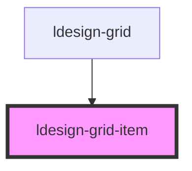

# ldesign-grid-item

<!-- Auto Generated Below -->

## Overview

Grid 子项
- 通过 span 指定跨越列数
- 根据父容器的 cols 自动限制最大跨度

## Properties

| Property | Attribute | Description | Type     | Default |
| -------- | --------- | ----------- | -------- | ------- |
| `span`   | `span`    | 占用的列数       | `number` | `1`     |

## Dependencies

### Used by

 - [ldesign-grid](../grid)

### Graph

----------------------------------------------

*Built with [StencilJS](https://stenciljs.com/)*
