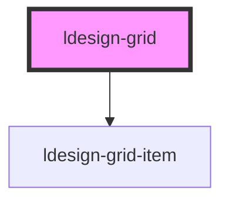

# ldesign-grid

<!-- Auto Generated Below -->

## Overview

Grid 容器（grid -> grid-item 用法）
- 在内部通过计算为每个 grid-item 设置明确的行/列位置与跨度
- 支持设置每行列数与横纵间距

## Properties

| Property      | Attribute       | Description                            | Type               | Default     |
| ------------- | --------------- | -------------------------------------- | ------------------ | ----------- |
| `cols`        | `cols`          | 固定列数（可选）。若不设置，则根据 minColWidth 自动计算最佳列数 | `number`           | `undefined` |
| `defaultRows` | `default-rows`  | 折叠时默认显示的行数；0 或未设置表示显示全部                | `number`           | `undefined` |
| `dense`       | `dense`         | 是否使用密集填充（尽量填补空位）；显式定位下仅作类名标识           | `boolean`          | `false`     |
| `gap`         | `gap`           | 同时设置横纵间距（数字按 px）                       | `number \| string` | `undefined` |
| `minColWidth` | `min-col-width` | 每列的最小宽度，用于自适应计算列数；数字为 px；默认 240        | `number \| string` | `240`       |
| `toggleSpan`  | `toggle-span`   | 展开按钮所在列宽（span）                         | `number`           | `8`         |
| `xGap`        | `x-gap`         | 横向列间距                                  | `number \| string` | `undefined` |
| `yGap`        | `y-gap`         | 纵向行间距                                  | `number \| string` | `undefined` |

## Dependencies

### Depends on

- [ldesign-grid-item](../grid-item)

### Graph

----------------------------------------------

*Built with [StencilJS](https://stenciljs.com/)*
