# ldesign-icon

基于 Lucide 图标库的高性能 Web Component 图标组件，提供丰富的视觉效果和交互功能。

## ✨ 特性

- 🎨 **1000+ 高质量图标** - 基于 Lucide 图标库
- 🚀 **高性能加载** - 智能缓存和按需加载机制  
- 🎭 **丰富的动画效果** - spin、pulse、bounce、flash、shake
- 🌈 **渐变色支持** - 可自定义渐变色方案
- 🔄 **变换效果** - 支持旋转、翻转等变换
- 📝 **自定义 SVG** - 可使用自定义 SVG 内容
- ♿ **无障碍支持** - 完整的 ARIA 属性
- 🌙 **主题适配** - 支持暗色主题和响应式设计
- 📦 **TypeScript** - 完整的类型定义

## 🔨 快速使用

### 基础用法

```html
<ldesign-icon name="home"></ldesign-icon>
<ldesign-icon name="user" size="large" color="#1890ff"></ldesign-icon>
```

### 动画效果

```html
<ldesign-icon name="loader" animation="spin"></ldesign-icon>
<ldesign-icon name="heart" animation="pulse" color="#ff0000"></ldesign-icon>
```

### 渐变色

```html
<ldesign-icon 
  name="rocket" 
  gradient="true" 
  gradient-colors='["#667eea", "#764ba2"]'
></ldesign-icon>
```

<!-- Auto Generated Below -->


## Overview

Icon 图标组件
基于 Lucide 图标库

## Properties

| Property            | Attribute            | Description   | Type                                                            | Default        |
| ------------------- | -------------------- | ------------- | --------------------------------------------------------------- | -------------- |
| `animation`         | `animation`          | 动画类型          | `"bounce" \| "flash" \| "none" \| "pulse" \| "shake" \| "spin"` | `'none'`       |
| `color`             | `color`              | 图标颜色          | `string`                                                        | `undefined`    |
| `customSvg`         | `custom-svg`         | 自定义SVG内容      | `string`                                                        | `undefined`    |
| `decorative`        | `decorative`         | 是否为装饰性图标（无语义） | `boolean`                                                       | `false`        |
| `flip`              | `flip`               | 翻转方向          | `"both" \| "horizontal" \| "vertical"`                          | `undefined`    |
| `gradient`          | `gradient`           | 是否使用渐变色       | `boolean`                                                       | `false`        |
| `gradientColors`    | `gradient-colors`    | 渐变色数组         | `string \| string[]`                                            | `undefined`    |
| `gradientDirection` | `gradient-direction` | 渐变方向          | `"diagonal" \| "horizontal" \| "vertical"`                      | `'horizontal'` |
| `label`             | `label`              | 无障碍标签         | `string`                                                        | `undefined`    |
| `name` _(required)_ | `name`               | 图标名称          | `string`                                                        | `undefined`    |
| `rotate`            | `rotate`             | 旋转角度          | `number`                                                        | `undefined`    |
| `size`              | `size`               | 图标尺寸          | `"large" \| "medium" \| "middle" \| "small" \| number`          | `'medium'`     |
| `spin`              | `spin`               | 是否旋转（兼容旧版）    | `boolean`                                                       | `false`        |
| `strokeWidth`       | `stroke-width`       | 描边宽度          | `number`                                                        | `2`            |


## Methods

### `preloadIcons(iconNames: string[]) => Promise<void>`

预加载图标（公开方法）

#### Parameters

| Name        | Type       | Description |
| ----------- | ---------- | ----------- |
| `iconNames` | `string[]` |             |

#### Returns

Type: `Promise<void>`


### `searchIcons(keyword: string) => Promise<string[]>`

搜索图标（公开方法）

#### Parameters

| Name      | Type     | Description |
| --------- | -------- | ----------- |
| `keyword` | `string` |             |

#### Returns

Type: `Promise<string[]>`


## Dependencies

### Used by

 - [ldesign-alert](../alert)
 - [ldesign-avatar](../avatar)
 - [ldesign-backtop](../backtop)
 - [ldesign-button](../button)
 - [ldesign-calendar](../calendar)
 - [ldesign-cascader](../cascader)
 - [ldesign-checkbox](../checkbox)
 - [ldesign-collapse-panel](../collapse)
 - [ldesign-date-picker](../datepicker)
 - [ldesign-dropdown](../dropdown)
 - [ldesign-ellipsis](../ellipsis)
 - [ldesign-image](../image)
 - [ldesign-image-viewer](../image-viewer)
 - [ldesign-input](../input)
 - [ldesign-input-number](../input-number)
 - [ldesign-mention](../mention)
 - [ldesign-menu](../menu)
 - [ldesign-message](../message)
 - [ldesign-notification](../notification)
 - [ldesign-pagination](../pagination)
 - [ldesign-popconfirm](../popconfirm)
 - [ldesign-progress](../progress)
 - [ldesign-rate](../rate)
 - [ldesign-select](../select)
 - [ldesign-switch](../switch)
 - [ldesign-tag](../tag)
 - [ldesign-time-picker](../time-picker)
 - [ldesign-transfer](../transfer)
 - [ldesign-tree](../tree)

### Graph

```mermaid
graph TD;
  ldesign-alert --> ldesign-icon
  ldesign-avatar --> ldesign-icon
  ldesign-backtop --> ldesign-icon
  ldesign-button --> ldesign-icon
  ldesign-calendar --> ldesign-icon
  ldesign-cascader --> ldesign-icon
  ldesign-checkbox --> ldesign-icon
  ldesign-collapse-panel --> ldesign-icon
  ldesign-date-picker --> ldesign-icon
  ldesign-dropdown --> ldesign-icon
  ldesign-ellipsis --> ldesign-icon
  ldesign-image --> ldesign-icon
  ldesign-image-viewer --> ldesign-icon
  ldesign-input --> ldesign-icon
  ldesign-input-number --> ldesign-icon
  ldesign-mention --> ldesign-icon
  ldesign-menu --> ldesign-icon
  ldesign-message --> ldesign-icon
  ldesign-notification --> ldesign-icon
  ldesign-pagination --> ldesign-icon
  ldesign-popconfirm --> ldesign-icon
  ldesign-progress --> ldesign-icon
  ldesign-rate --> ldesign-icon
  ldesign-select --> ldesign-icon
  ldesign-switch --> ldesign-icon
  ldesign-tag --> ldesign-icon
  ldesign-time-picker --> ldesign-icon
  ldesign-transfer --> ldesign-icon
  ldesign-tree --> ldesign-icon
  style ldesign-icon fill:#f9f,stroke:#333,stroke-width:4px
```


----------------------------------------------

*Built with [StencilJS](https://stenciljs.com/)*
