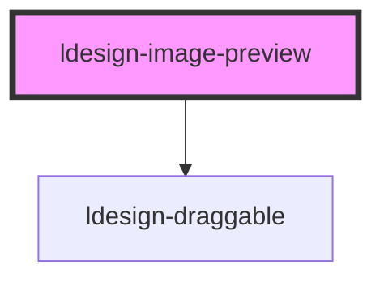

# ldesign-image-preview

<!-- Auto Generated Below -->

## Overview

ldesign-image-preview
图片预览组件，支持缩放、拖拽、旋转等交互

用法：
1) 编程式调用：
   const preview = document.querySelector('ldesign-image-preview');
   preview.show('https://example.com/image.jpg');

2) 作为图片组件的预览功能：
   <ldesign-image src="..." preview></ldesign-image>

## Properties

| Property             | Attribute             | Description | Type       | Default |
| -------------------- | --------------------- | ----------- | ---------- | ------- |
| `currentIndex`       | `current-index`       | 当前显示的图片索引   | `number`   | `0`     |
| `enableRotate`       | `enable-rotate`       | 是否启用旋转      | `boolean`  | `true`  |
| `images`             | --                    | 当前预览的图片列表   | `string[]` | `[]`    |
| `initialScale`       | `initial-scale`       | 初始缩放比例      | `number`   | `1`     |
| `keyboard`           | `keyboard`            | 是否启用键盘操作    | `boolean`  | `true`  |
| `loop`               | `loop`                | 是否循环切换      | `boolean`  | `true`  |
| `maskClosable`       | `mask-closable`       | 是否在点击遮罩时关闭  | `boolean`  | `true`  |
| `maxScale`           | `max-scale`           | 最大缩放比例      | `number`   | `4`     |
| `minScale`           | `min-scale`           | 最小缩放比例      | `number`   | `0.25`  |
| `showCloseBtn`       | `show-close-btn`      | 是否显示关闭按钮    | `boolean`  | `true`  |
| `showIndex`          | `show-index`          | 是否显示图片索引    | `boolean`  | `true`  |
| `showToolbar`        | `show-toolbar`        | 是否显示工具栏     | `boolean`  | `true`  |
| `transitionDuration` | `transition-duration` | 动画过渡时长 (ms) | `number`   | `300`   |
| `visible`            | `visible`             | 是否显示预览      | `boolean`  | `false` |

## Events

| Event                  | Description | Type                                                |
| ---------------------- | ----------- | --------------------------------------------------- |
| `ldesignPreviewChange` |             | `CustomEvent<{ index: number; image: string; }>`    |
| `ldesignPreviewClose`  |             | `CustomEvent<void>`                                 |
| `ldesignPreviewError`  |             | `CustomEvent<{ index: number; image: string; }>`    |
| `ldesignPreviewOpen`   |             | `CustomEvent<{ images: string[]; index: number; }>` |

## Methods

### `hide() => Promise<void>`

#### Returns

Type: `Promise<void>`

### `next() => Promise<void>`

#### Returns

Type: `Promise<void>`

### `prev() => Promise<void>`

#### Returns

Type: `Promise<void>`

### `reset() => Promise<void>`

#### Returns

Type: `Promise<void>`

### `rotateLeft() => Promise<void>`

#### Returns

Type: `Promise<void>`

### `rotateRight() => Promise<void>`

#### Returns

Type: `Promise<void>`

### `show(images?: string | string[], index?: number) => Promise<void>`

#### Parameters

| Name     | Type                 | Description |
| -------- | -------------------- | ----------- |
| `images` | `string \| string[]` |             |
| `index`  | `number`             |             |

#### Returns

Type: `Promise<void>`

### `zoomIn(step?: number) => Promise<void>`

#### Parameters

| Name   | Type     | Description |
| ------ | -------- | ----------- |
| `step` | `number` |             |

#### Returns

Type: `Promise<void>`

### `zoomOut(step?: number) => Promise<void>`

#### Parameters

| Name   | Type     | Description |
| ------ | -------- | ----------- |
| `step` | `number` |             |

#### Returns

Type: `Promise<void>`

## Dependencies

### Depends on

- [ldesign-draggable](../draggable)

### Graph

----------------------------------------------

*Built with [StencilJS](https://stenciljs.com/)*
