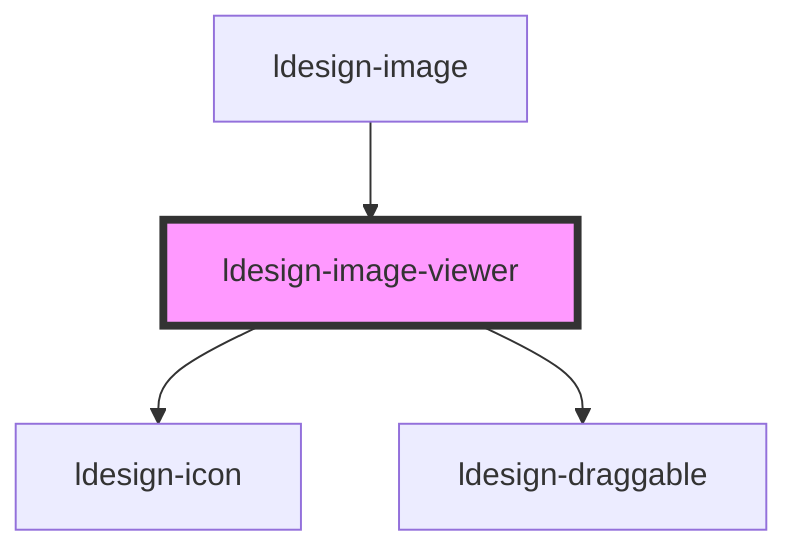

# ldesign-image-viewer

<!-- Auto Generated Below -->

## Overview

ImageViewer 图片预览器
- 支持多图预览、左右切换、循环
- 支持缩放（滚轮/按钮/双击）、拖拽平移、旋转、重置
- 支持顶部缩略图快速切换
- 支持键盘操作（Esc 关闭、←/→ 切换、+/- 缩放、0 重置）

## Properties

| Property              | Attribute             | Description                                                    | Type                                                                      | Default                               |
| --------------------- | --------------------- | -------------------------------------------------------------- | ------------------------------------------------------------------------- | ------------------------------------- |
| `backdrop`            | `backdrop`            | 主题：暗色/亮色遮罩                                                     | `"dark" \| "light"`                                                       | `'dark'`                              |
| `captionAlign`        | `caption-align`       | 标题与描述的对齐方式：left 左对齐；center 居中；right 右对齐                        | `"center" \| "left" \| "right"`                                           | `'center'`                            |
| `captionPosition`     | `caption-position`    | 标题与描述的显示位置：bottom 底部（工具栏上方）；top 顶部（缩略图下方）                      | `"bottom" \| "top"`                                                       | `'bottom'`                            |
| `closeAnimation`      | `close-animation`     | 关闭动画效果（不设置则使用 openAnimation）                                   | `"fade" \| "fade-zoom" \| "none" \| "slide-down" \| "slide-up" \| "zoom"` | `undefined`                           |
| `closeDuration`       | `close-duration`      | 关闭动画时长（ms，不设置则使用 openDuration 或 transitionDuration）            | `number`                                                                  | `undefined`                           |
| `images` _(required)_ | `images`              | 图片列表（数组或 JSON 字符串）                                             | `(string \| ImageViewerItem)[] \| string`                                 | `undefined`                           |
| `keyboard`            | `keyboard`            | 是否启用键盘快捷键                                                      | `boolean`                                                                 | `true`                                |
| `loop`                | `loop`                | 是否循环播放                                                         | `boolean`                                                                 | `true`                                |
| `maskClosable`        | `mask-closable`       | 点击遮罩是否可关闭                                                      | `boolean`                                                                 | `true`                                |
| `maxScale`            | `max-scale`           |                                                                | `number`                                                                  | `4`                                   |
| `minScale`            | `min-scale`           | 最小/最大缩放                                                        | `number`                                                                  | `0.25`                                |
| `openAnimation`       | `open-animation`      | 打开/关闭动画效果：fade 淡入淡出；zoom 缩放；slide-up 上滑；slide-down 下滑；none 无动画 | `"fade" \| "fade-zoom" \| "none" \| "slide-down" \| "slide-up" \| "zoom"` | `'fade-zoom'`                         |
| `openDuration`        | `open-duration`       | 打开动画时长（ms，不设置则使用 transitionDuration）                           | `number`                                                                  | `undefined`                           |
| `panelDraggable`      | `panel-draggable`     | 小窗拖拽方式：title 标题栏拖拽；anywhere 全面板可拖拽                             | `"anywhere" \| "title"`                                                   | `'title'`                             |
| `panelHeight`         | `panel-height`        |                                                                | `number \| string`                                                        | `undefined`                           |
| `panelWidth`          | `panel-width`         | 小窗宽高（viewerMode=modal 时生效）                                     | `number \| string`                                                        | `undefined`                           |
| `showCaption`         | `show-caption`        | 是否显示标题与描述                                                      | `boolean`                                                                 | `true`                                |
| `showThumbnails`      | `show-thumbnails`     | 是否展示顶部缩略图                                                      | `boolean`                                                                 | `true`                                |
| `startIndex`          | `start-index`         | 初始索引                                                           | `number`                                                                  | `0`                                   |
| `transition`          | `transition`          | 图片切换过渡类型                                                       | `"fade" \| "fade-zoom"`                                                   | `'fade-zoom'`                         |
| `transitionDuration`  | `transition-duration` | 过渡时长（ms）                                                       | `number`                                                                  | `240`                                 |
| `transitionEasing`    | `transition-easing`   | 过渡缓动函数                                                         | `string`                                                                  | `'cubic-bezier(0.22, 0.61, 0.36, 1)'` |
| `viewerMode`          | `viewer-mode`         | 查看窗口模式：overlay 全屏；modal 小窗                                     | `"embedded" \| "modal" \| "overlay"`                                      | `'overlay'`                           |
| `viewerTitle`         | `viewer-title`        | 小窗标题（modal模式顶部标题栏）                                             | `string`                                                                  | `undefined`                           |
| `visible`             | `visible`             | 是否显示                                                           | `boolean`                                                                 | `false`                               |
| `wheelZoom`           | `wheel-zoom`          | 是否启用滚轮缩放                                                       | `boolean`                                                                 | `true`                                |
| `zIndex`              | `z-index`             | z-index                                                        | `number`                                                                  | `1000`                                |
| `zoomStep`            | `zoom-step`           | 缩放步进                                                           | `number`                                                                  | `0.1`                                 |

## Events

| Event                  | Description | Type                              |
| ---------------------- | ----------- | --------------------------------- |
| `ldesignChange`        |             | `CustomEvent<{ index: number; }>` |
| `ldesignClose`         |             | `CustomEvent<void>`               |
| `ldesignOpen`          |             | `CustomEvent<void>`               |
| `ldesignVisibleChange` |             | `CustomEvent<boolean>`            |

## Dependencies

### Used by

 - [ldesign-image](../image)

### Depends on

- [ldesign-icon](../icon)
- [ldesign-draggable](../draggable)

### Graph

----------------------------------------------

*Built with [StencilJS](https://stenciljs.com/)*
