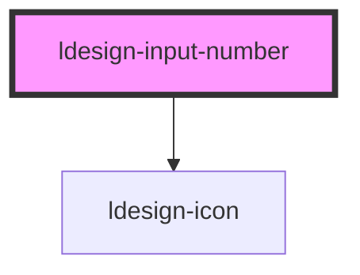

# ldesign-input-number

<!-- Auto Generated Below -->

## Overview

InputNumber 数字输入框
- 支持步进按钮、键盘操作（可关闭）、最小/最大值限制、精度控制
- 提供 formatter / parser 以实现显示格式化与解析

## Properties

| Property      | Attribute     | Description                | Type                                         | Default     |
| ------------- | ------------- | -------------------------- | -------------------------------------------- | ----------- |
| `disabled`    | `disabled`    | 是否禁用                       | `boolean`                                    | `false`     |
| `formatter`   | --            | 自定义显示格式化                   | `(value: number) => string`                  | `undefined` |
| `keyboard`    | `keyboard`    | 是否启用键盘增减（方向键/页键）           | `boolean`                                    | `true`      |
| `max`         | `max`         | 最大值（可不设）                   | `number`                                     | `undefined` |
| `min`         | `min`         | 最小值（可不设）                   | `number`                                     | `undefined` |
| `mouseWheel`  | `mouse-wheel` | 是否允许鼠标滚轮调整                 | `boolean`                                    | `false`     |
| `parser`      | --            | 自定义解析（将输入字符串转成数值）          | `(input: string) => number`                  | `undefined` |
| `placeholder` | `placeholder` | 占位符                        | `string`                                     | `undefined` |
| `precision`   | `precision`   | 精度（小数位数）。不设则按 step 与输入自动推断 | `number`                                     | `undefined` |
| `readonly`    | `readonly`    | 是否只读（可选，禁用输入但可复制）          | `boolean`                                    | `false`     |
| `size`        | `size`        | 尺寸                         | `"large" \| "medium" \| "middle" \| "small"` | `'medium'`  |
| `status`      | `status`      | 状态样式                       | `"error" \| "success" \| "warning"`          | `undefined` |
| `step`        | `step`        | 步长（增减用，不强制对齐输入）            | `number`                                     | `1`         |
| `value`       | `value`       | 当前值（受控，支持双向）               | `number`                                     | `0`         |

## Events

| Event           | Description       | Type                      |
| --------------- | ----------------- | ------------------------- |
| `ldesignBlur`   |                   | `CustomEvent<FocusEvent>` |
| `ldesignChange` | 提交时触发（失焦、回车、点击步进） | `CustomEvent<number>`     |
| `ldesignFocus`  | 聚焦/失焦事件           | `CustomEvent<FocusEvent>` |
| `ldesignInput`  | 输入时触发（值变化实时）      | `CustomEvent<number>`     |

## Dependencies

### Depends on

- [ldesign-icon](../icon)

### Graph

----------------------------------------------

*Built with [StencilJS](https://stenciljs.com/)*
