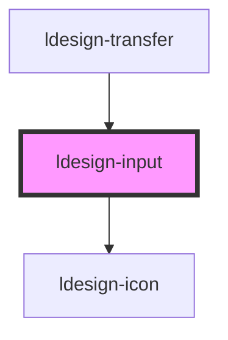

# ldesign-input

<!-- Auto Generated Below -->

## Overview

Input 输入框组件
通过鼠标或键盘输入内容，是最基础的表单域的包装

## Properties

| Property       | Attribute       | Description             | Type                                                                          | Default     |
| -------------- | --------------- | ----------------------- | ----------------------------------------------------------------------------- | ----------- |
| `allowInput`   | `allow-input`   | 输入限制，只允许输入指定字符          | `((value: string) => boolean) \| RegExp`                                      | `undefined` |
| `autosize`     | `autosize`      | 自适应内容高度（仅对 textarea 有效） | `boolean \| { minRows?: number; maxRows?: number; }`                          | `false`     |
| `clearable`    | `clearable`     | 是否可清空                   | `boolean`                                                                     | `false`     |
| `controlled`   | `controlled`    | 是否受控组件                  | `boolean`                                                                     | `false`     |
| `disabled`     | `disabled`      | 是否禁用                    | `boolean`                                                                     | `false`     |
| `maxlength`    | `maxlength`     | 最大输入长度                  | `number`                                                                      | `undefined` |
| `minlength`    | `minlength`     | 最小输入长度                  | `number`                                                                      | `undefined` |
| `placeholder`  | `placeholder`   | 输入框占位文本                 | `string`                                                                      | `undefined` |
| `prefixIcon`   | `prefix-icon`   | 输入框头部图标                 | `string`                                                                      | `undefined` |
| `readonly`     | `readonly`      | 是否只读                    | `boolean`                                                                     | `false`     |
| `rows`         | `rows`          | 输入框行数（仅对 textarea 有效）   | `number`                                                                      | `2`         |
| `showCount`    | `show-count`    | 是否显示输入数量统计              | `boolean`                                                                     | `false`     |
| `showPassword` | `show-password` | 是否显示切换密码图标              | `boolean`                                                                     | `false`     |
| `size`         | `size`          | 输入框尺寸                   | `"large" \| "medium" \| "middle" \| "small"`                                  | `'medium'`  |
| `status`       | `status`        | 输入框的状态                  | `"error" \| "success" \| "warning"`                                           | `undefined` |
| `suffixIcon`   | `suffix-icon`   | 输入框尾部图标                 | `string`                                                                      | `undefined` |
| `type`         | `type`          | 输入框类型                   | `"email" \| "number" \| "password" \| "tel" \| "text" \| "textarea" \| "url"` | `'text'`    |
| `value`        | `value`         | 输入框的值                   | `string`                                                                      | `''`        |

## Events

| Event           | Description | Type                      |
| --------------- | ----------- | ------------------------- |
| `ldesignBlur`   | 失去焦点时触发     | `CustomEvent<FocusEvent>` |
| `ldesignChange` | 值改变时触发      | `CustomEvent<string>`     |
| `ldesignClear`  | 点击清空按钮时触发   | `CustomEvent<void>`       |
| `ldesignFocus`  | 获得焦点时触发     | `CustomEvent<FocusEvent>` |
| `ldesignInput`  | 输入时触发       | `CustomEvent<string>`     |

## Dependencies

### Used by

 - [ldesign-transfer](../transfer)

### Depends on

- [ldesign-icon](../icon)

### Graph

----------------------------------------------

*Built with [StencilJS](https://stenciljs.com/)*
