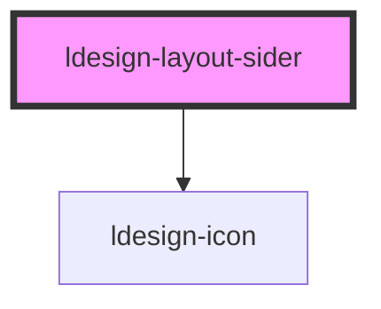

# ldesign-layout-sider

<!-- Auto Generated Below -->

## Overview

Layout Sider

## Properties

| Property         | Attribute         | Description | Type      | Default   |
| ---------------- | ----------------- | ----------- | --------- | --------- |
| `collapsed`      | `collapsed`       | 是否已折叠       | `boolean` | `false`   |
| `collapsedWidth` | `collapsed-width` | 折叠后的宽度      | `string`  | `'80px'`  |
| `collapsible`    | `collapsible`     | 是否可折叠       | `boolean` | `false`   |
| `width`          | `width`           | 宽度          | `string`  | `'200px'` |

## Dependencies

### Depends on

- [ldesign-icon](../icon)

### Graph

----------------------------------------------

*Built with [StencilJS](https://stenciljs.com/)*
