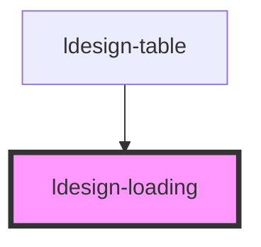

# ldesign-loading

<!-- Auto Generated Below -->

## Overview

Loading 加载组件
轻量的加载指示器，支持两种形态：spinner | dots

## Properties

| Property     | Attribute     | Description     | Type                                         | Default     |
| ------------ | ------------- | --------------- | -------------------------------------------- | ----------- |
| `fullscreen` | `fullscreen`  | 全屏模式（覆盖整个视口）    | `boolean`                                    | `false`     |
| `lockScroll` | `lock-scroll` | 全屏时是否锁定页面滚动     | `boolean`                                    | `true`      |
| `mask`       | `mask`        | 全屏时是否显示遮罩背景     | `boolean`                                    | `true`      |
| `size`       | `size`        | 尺寸              | `"large" \| "medium" \| "middle" \| "small"` | `'medium'`  |
| `spinning`   | `spinning`    | 是否处于加载中         | `boolean`                                    | `true`      |
| `tip`        | `tip`         | 说明文字            | `string`                                     | `undefined` |
| `type`       | `type`        | 加载指示类型          | `"dots" \| "spinner"`                        | `'spinner'` |
| `vertical`   | `vertical`    | 垂直布局（图标在上、文字在下） | `boolean`                                    | `false`     |
| `zIndex`     | `z-index`     | 全屏时的层级（可选）      | `number`                                     | `undefined` |

## Dependencies

### Used by

 - [ldesign-table](../table)

### Graph

----------------------------------------------

*Built with [StencilJS](https://stenciljs.com/)*
