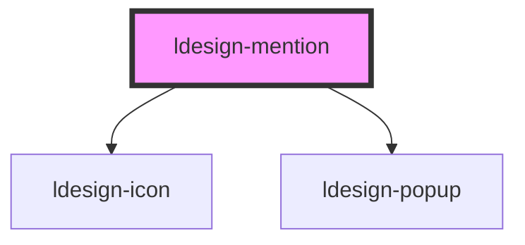

# ldesign-mention

<!-- Auto Generated Below -->

## Overview

ldesign-mention 提及组件（contenteditable 版本）
- 使用可编辑 div 实现富文本输入，支持在文本中高亮渲染提及 token
- 候选浮层定位于光标位置（通过隐藏锚点 + ldesign-popup 定位）

## Properties

| Property         | Attribute         | Description                                | Type                                                                     | Default     |
| ---------------- | ----------------- | ------------------------------------------ | ------------------------------------------------------------------------ | ----------- |
| `appendTo`       | `append-to`       | 浮层挂载到：self\|body\|closest-popup（透传给 popup） | `"body" \| "closest-popup" \| "self"`                                    | `'body'`    |
| `autofocus`      | `autofocus`       | 自动聚焦                                       | `boolean`                                                                | `false`     |
| `closable`       | `closable`        | token 是否默认可关闭                              | `boolean`                                                                | `true`      |
| `controlled`     | `controlled`      | 受控模式（为 true 时不在内部修改 value）                 | `boolean`                                                                | `false`     |
| `defaultValue`   | `default-value`   | 默认值（非受控）                                   | `string`                                                                 | `undefined` |
| `disabled`       | `disabled`        | 是否禁用                                       | `boolean`                                                                | `false`     |
| `filterOption`   | `filter-option`   | 自定义过滤函数（返回 true 表示保留）                      | `(input: string, option: MentionItem) => boolean`                        | `undefined` |
| `loading`        | `loading`         | 加载中（用于异步搜索）                                | `boolean`                                                                | `false`     |
| `maxHeight`      | `max-height`      | 列表最大高度                                     | `number`                                                                 | `240`       |
| `maxRows`        | `max-rows`        | 最大可见行数（超过后出现滚动条）；不设置则不限制                   | `number`                                                                 | `undefined` |
| `model`          | `model`           | 结构化初始化（分段）                                 | `MentionSegment[] \| string`                                             | `undefined` |
| `multiline`      | `multiline`       | 是否多行模式。多行模式下允许回车换行，并可按 rows/maxRows 控制显示高度 | `boolean`                                                                | `false`     |
| `options`        | `options`         | 候选项（数组或 JSON 字符串）                          | `MentionItem[] \| string`                                                | `[]`        |
| `parseOnInit`    | `parse-on-init`   | 是否在加载时将文本中的                                | `boolean`                                                                | `undefined` |
| `parseStrategy`  | `parse-strategy`  | 解析策略：label（直接转换）/options（仅命中候选时转换）         | `"label" \| "options"`                                                   | `'label'`   |
| `placeholder`    | `placeholder`     | 占位文本                                       | `string`                                                                 | `undefined` |
| `readonly`       | `readonly`        | 是否只读                                       | `boolean`                                                                | `false`     |
| `resizable`      | `resizable`       | 是否允许用户手动拖拽调整高度（vertical）                   | `boolean`                                                                | `true`      |
| `rows`           | `rows`            | 初始可见行数（用于计算最小高度）                           | `number`                                                                 | `3`         |
| `size`           | `size`            | 尺寸（影响样式）                                   | `"large" \| "medium" \| "middle" \| "small"`                             | `'medium'`  |
| `tokenType`      | `token-type`      | 默认 token 外观                                | `"danger" \| "default" \| "info" \| "primary" \| "success" \| "warning"` | `'primary'` |
| `trigger`        | `trigger`         | 触发字符（如 @ 或 #），兼容旧属性                        | `string`                                                                 | `'@'`       |
| `triggerConfigs` | `trigger-configs` | 触发符个性化配置（JS 对象或 JSON 字符串）                  | `MentionTriggerConfig[] \| string`                                       | `undefined` |
| `triggers`       | `triggers`        | 多个触发字符                                     | `string \| string[]`                                                     | `undefined` |
| `value`          | `value`           | 当前值（受控，文本值，包含渲染后的                          | `string`                                                                 | `''`        |
| `valueFormat`    | `value-format`    | 事件/受控值格式（默认 model）                         | `"model" \| "segments" \| "text"`                                        | `'model'`   |
| `valueModel`     | `value-model`     | 结构化初始化（模型）                                 | `MentionModel \| string`                                                 | `undefined` |

## Events

| Event                | Description                           | Type                                                                                 |
| -------------------- | ------------------------------------- | ------------------------------------------------------------------------------------ |
| `ldesignBlur`        |                                       | `CustomEvent<FocusEvent>`                                                            |
| `ldesignChange`      | 内容变化事件（返回纯文本值：等同于 editable.innerText） | `CustomEvent<string>`                                                                |
| `ldesignFocus`       | 获得/失去焦点                               | `CustomEvent<FocusEvent>`                                                            |
| `ldesignRemove`      | 标签移除事件                                | `CustomEvent<{ value: string \| number; label: string; trigger: string; }>`          |
| `ldesignSearch`      | 搜索事件（每次触发字符后的输入变化都会触发）                | `CustomEvent<{ value: string; trigger: string; }>`                                   |
| `ldesignSelect`      | 选择事件（选中候选项时触发）                        | `CustomEvent<{ value: MentionItem; trigger: string; }>`                              |
| `ldesignValueChange` | 结构化值变化事件                              | `CustomEvent<{ text: string; mentions: MentionEntity[]; model: MentionSegment[]; }>` |

## Methods

### `setOptions(options: MentionItem[]) => Promise<void>`

#### Parameters

| Name      | Type            | Description |
| --------- | --------------- | ----------- |
| `options` | `MentionItem[]` |             |

#### Returns

Type: `Promise<void>`

## Dependencies

### Depends on

- [ldesign-icon](../icon)
- [ldesign-popup](../popup)

### Graph

----------------------------------------------

*Built with [StencilJS](https://stenciljs.com/)*
