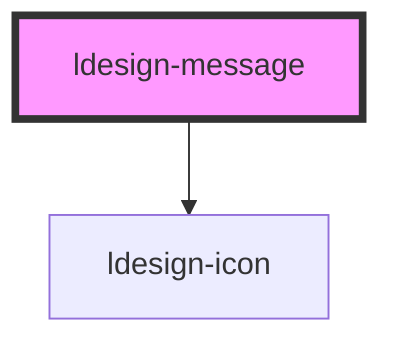

# ldesign-message

<!-- Auto Generated Below -->

## Overview

Message 全局提示
高性能轻量级的全局反馈组件

特性：
- 支持多种消息类型
- GPU 加速动画
- 内存优化与对象池
- 响应式设计
- 暗黑模式支持
- 无障碍访问

## Properties

| Property       | Attribute        | Description             | Type                                                                                            | Default     |
| -------------- | ---------------- | ----------------------- | ----------------------------------------------------------------------------------------------- | ----------- |
| `closable`     | `closable`       | 是否显示关闭按钮                | `boolean`                                                                                       | `false`     |
| `customClass`  | `custom-class`   | 自定义类名                   | `string`                                                                                        | `undefined` |
| `duration`     | `duration`       | 自动关闭的时长（毫秒）；设为 0 则不自动关闭 | `number`                                                                                        | `3000`      |
| `html`         | `html`           | 是否支持HTML内容              | `boolean`                                                                                       | `false`     |
| `maxWidth`     | `max-width`      | 最大宽度                    | `string`                                                                                        | `undefined` |
| `message`      | `message`        | 简单文本内容（也可使用 slot 自定义内容） | `string`                                                                                        | `undefined` |
| `messageTitle` | `message-title`  | 标题内容                    | `string`                                                                                        | `undefined` |
| `pauseOnHover` | `pause-on-hover` | 消息内容                    | `boolean`                                                                                       | `true`      |
| `placement`    | `placement`      | 出现位置                    | `"bottom" \| "bottom-left" \| "bottom-right" \| "center" \| "top" \| "top-left" \| "top-right"` | `'top'`     |
| `showIcon`     | `show-icon`      | 是否显示图标                  | `boolean`                                                                                       | `true`      |
| `type`         | `type`           | 提示类型                    | `"error" \| "info" \| "loading" \| "success" \| "warning"`                                      | `'info'`    |

## Events

| Event          | Description | Type                |
| -------------- | ----------- | ------------------- |
| `ldesignClick` | 点击事件        | `CustomEvent<void>` |
| `ldesignClose` | 关闭事件        | `CustomEvent<void>` |

## Methods

### `close() => Promise<void>`

手动关闭（带高度收起动画，带动后续消息平滑上移）

#### Returns

Type: `Promise<void>`

## Dependencies

### Depends on

- [ldesign-icon](../icon)

### Graph

----------------------------------------------

*Built with [StencilJS](https://stenciljs.com/)*
