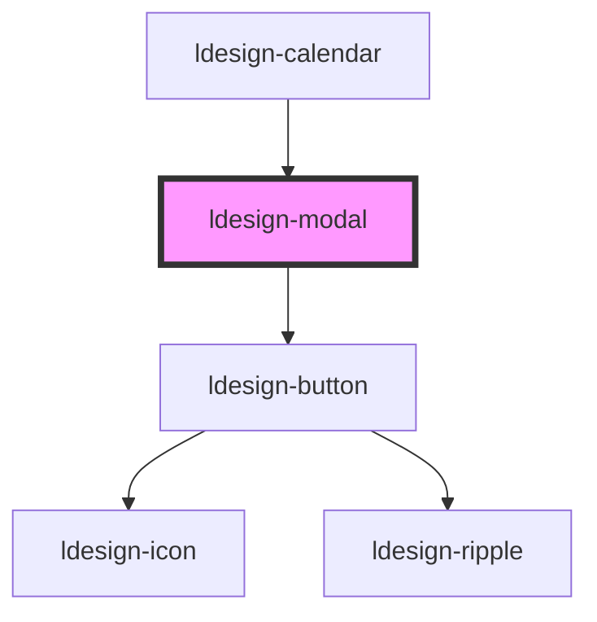

# ldesign-modal

<!-- Auto Generated Below -->

## Overview

Modal 模态框组件

## Properties

| Property                 | Attribute                   | Description                                    | Type                                                                                                                                                                    | Default       |
| ------------------------ | --------------------------- | ---------------------------------------------- | ----------------------------------------------------------------------------------------------------------------------------------------------------------------------- | ------------- |
| `animEase`               | `anim-ease`                 |                                                | `string`                                                                                                                                                                | `undefined`   |
| `animation`              | `animation`                 | 动画效果类型                                         | `"blur" \| "bounce" \| "elastic" \| "fade" \| "flip" \| "rotate" \| "slide-down" \| "slide-left" \| "slide-right" \| "slide-up" \| "wobble" \| "zoom" \| "zoom-origin"` | `'zoom'`      |
| `animationEnabled`       | `animation-enabled`         | 新增：是否显示动画效果                                    | `boolean`                                                                                                                                                               | `true`        |
| `autoDetectDarkMode`     | `auto-detect-dark-mode`     | 新增：自动检测系统深色模式                                  | `boolean`                                                                                                                                                               | `true`        |
| `avoidKeyboard`          | `avoid-keyboard`            | 软键盘（移动端）避让                                     | `boolean`                                                                                                                                                               | `true`        |
| `beforeClose`            | --                          | 关闭/确认前拦截钩子（函数属性，需 JS 赋值）                       | `(reason: "mask" \| "close" \| "api" \| "ok" \| "esc") => boolean \| Promise<boolean>`                                                                                  | `undefined`   |
| `beforeStepChange`       | --                          | 向导步进前置钩子：返回 false 阻止切换                         | `(from: number, to: number) => boolean \| Promise<boolean>`                                                                                                             | `undefined`   |
| `blurAmount`             | `blur-amount`               | 新增：模糊程度                                        | `number`                                                                                                                                                                | `10`          |
| `blurBackground`         | `blur-background`           | 新增：模糊背景                                        | `boolean`                                                                                                                                                               | `false`       |
| `bodyPadding`            | `body-padding`              | 新增：内容内边距                                       | `number \| string`                                                                                                                                                      | `undefined`   |
| `breakpoints`            | --                          |                                                | `{ xs: number; sm: number; md: number; lg: number; }`                                                                                                                   | `undefined`   |
| `cancelText`             | `cancel-text`               |                                                | `string`                                                                                                                                                                | `'取消'`        |
| `cancelType`             | `cancel-type`               |                                                | `"danger" \| "dashed" \| "default" \| "gradient" \| "link" \| "outline" \| "primary" \| "secondary" \| "success" \| "text" \| "warning"`                                | `'secondary'` |
| `centered`               | `centered`                  | 是否居中显示                                         | `boolean`                                                                                                                                                               | `false`       |
| `closable`               | `closable`                  | 是否显示关闭按钮                                       | `boolean`                                                                                                                                                               | `true`        |
| `closeAnimation`         | `close-animation`           | 新增：是否显示关闭动画                                    | `boolean`                                                                                                                                                               | `true`        |
| `closeIcon`              | `close-icon`                | 图标可配置                                          | `string`                                                                                                                                                                | `'close'`     |
| `currentStep`            | `current-step`              | 当前步骤（0-based，可受控）                              | `number`                                                                                                                                                                | `0`           |
| `customButtons`          | --                          | 新增：自定义按钮                                       | `{ text: string; type?: ButtonType; loading?: boolean; disabled?: boolean; onClick?: () => void \| Promise<void>; }[]`                                                  | `undefined`   |
| `customClass`            | `custom-class`              | 新增：自定义类名                                       | `string`                                                                                                                                                                | `undefined`   |
| `darkMode`               | `dark-mode`                 | 新增：深色模式                                        | `boolean`                                                                                                                                                               | `false`       |
| `dblclickMaximize`       | `dblclick-maximize`         | 新增：是否允许双击标题栏最大化                                | `boolean`                                                                                                                                                               | `true`        |
| `destroyOnClose`         | `destroy-on-close`          | 是否销毁子元素                                        | `boolean`                                                                                                                                                               | `false`       |
| `disableTransition`      | `disable-transition`        | 新增：是否禁用过渡效果                                    | `boolean`                                                                                                                                                               | `false`       |
| `drawerCloseThreshold`   | `drawer-close-threshold`    | Drawer 滑动关闭阈值（距离）：默认 '30%'（以抽屉宽度为基准）           | `number \| string`                                                                                                                                                      | `undefined`   |
| `drawerSwipeToClose`     | `drawer-swipe-to-close`     | Drawer 边缘滑动关闭                                  | `boolean`                                                                                                                                                               | `true`        |
| `duration`               | `duration`                  | 动画参数（也可通过 CSS 变量覆盖）：duration(ms)、ease、animEase | `number`                                                                                                                                                                | `undefined`   |
| `ease`                   | `ease`                      |                                                | `string`                                                                                                                                                                | `undefined`   |
| `edgeSwipeWidth`         | `edge-swipe-width`          | 边缘感应宽度（px）                                     | `number`                                                                                                                                                                | `24`          |
| `enableGestures`         | `enable-gestures`           | 新增：是否启用手势操作                                    | `boolean`                                                                                                                                                               | `true`        |
| `enablePictureInPicture` | `enable-picture-in-picture` | 新增：是否支持画中画模式                                   | `boolean`                                                                                                                                                               | `false`       |
| `footerAlign`            | `footer-align`              | 新增：底部按钮对齐                                      | `"center" \| "left" \| "right" \| "space-between"`                                                                                                                      | `'right'`     |
| `fullscreen`             | `fullscreen`                | 新增：是否默认满屏                                      | `boolean`                                                                                                                                                               | `false`       |
| `getContainer`           | `get-container`             | 容器（选择器或元素）：若提供，则在加载时把组件节点移动到该容器下               | `HTMLElement \| string`                                                                                                                                                 | `undefined`   |
| `headerConfig`           | --                          | 新增：头部配置                                        | `ModalHeaderConfig`                                                                                                                                                     | `undefined`   |
| `height`                 | `height`                    | 自定义高度                                          | `number \| string`                                                                                                                                                      | `undefined`   |
| `initialFocus`           | `initial-focus`             |                                                | `string`                                                                                                                                                                | `undefined`   |
| `isDraggable`            | `is-draggable`              | 是否可拖拽                                          | `boolean`                                                                                                                                                               | `false`       |
| `keyboard`               | `keyboard`                  | 按ESC键是否关闭                                      | `boolean`                                                                                                                                                               | `true`        |
| `loading`                | `loading`                   | 新增：是否展示加载状态                                    | `boolean`                                                                                                                                                               | `false`       |
| `loadingText`            | `loading-text`              | 新增：加载文字                                        | `string`                                                                                                                                                                | `'加载中...'`    |
| `mask`                   | `mask`                      | 是否显示遮罩层                                        | `boolean`                                                                                                                                                               | `true`        |
| `maskClosable`           | `mask-closable`             | 点击遮罩层是否关闭                                      | `boolean`                                                                                                                                                               | `true`        |
| `maxHeight`              | `max-height`                |                                                | `number`                                                                                                                                                                | `undefined`   |
| `maxWidth`               | `max-width`                 |                                                | `number`                                                                                                                                                                | `undefined`   |
| `maximizable`            | `maximizable`               | 是否可最大化                                         | `boolean`                                                                                                                                                               | `false`       |
| `maximizeIcon`           | `maximize-icon`             |                                                | `string`                                                                                                                                                                | `'maximize'`  |
| `minHeight`              | `min-height`                |                                                | `number`                                                                                                                                                                | `undefined`   |
| `minWidth`               | `min-width`                 | 调整大小边界                                         | `number`                                                                                                                                                                | `undefined`   |
| `modalTitle`             | `modal-title`               | 模态框标题                                          | `string`                                                                                                                                                                | `undefined`   |
| `okDisabled`             | `ok-disabled`               |                                                | `boolean`                                                                                                                                                               | `false`       |
| `okLoading`              | `ok-loading`                | OK 按钮状态                                        | `boolean`                                                                                                                                                               | `false`       |
| `okText`                 | `ok-text`                   | 底部按钮文案和类型控制（仅在未自定义 footer 时生效）                 | `string`                                                                                                                                                                | `'确定'`        |
| `okType`                 | `ok-type`                   |                                                | `"danger" \| "dashed" \| "default" \| "gradient" \| "link" \| "outline" \| "primary" \| "secondary" \| "success" \| "text" \| "warning"`                                | `'primary'`   |
| `openOnEdgeSwipe`        | `open-on-edge-swipe`        | 屏幕边缘滑动打开抽屉（需 destroyOnClose=false 以便组件常驻）      | `boolean`                                                                                                                                                               | `false`       |
| `preOk`                  | --                          |                                                | `() => boolean \| Promise<boolean>`                                                                                                                                     | `undefined`   |
| `progress`               | `progress`                  | 新增：当前进度（0-100）                                 | `number`                                                                                                                                                                | `0`           |
| `resizable`              | `resizable`                 | 是否可调整大小                                        | `boolean`                                                                                                                                                               | `false`       |
| `restoreIcon`            | `restore-icon`              |                                                | `string`                                                                                                                                                                | `'restore'`   |
| `showCancelButton`       | `show-cancel-button`        | 新增：是否显示取消按钮                                    | `boolean`                                                                                                                                                               | `true`        |
| `showFooterDivider`      | `show-footer-divider`       | 新增：是否显示底部分割线                                   | `boolean`                                                                                                                                                               | `true`        |
| `showFullscreenButton`   | `show-fullscreen-button`    | 新增：是否显示满屏按钮                                    | `boolean`                                                                                                                                                               | `false`       |
| `showHeaderDivider`      | `show-header-divider`       | 新增：是否显示头部分割线                                   | `boolean`                                                                                                                                                               | `true`        |
| `showOkButton`           | `show-ok-button`            | 新增：是否显示确认按钮                                    | `boolean`                                                                                                                                                               | `true`        |
| `showProgress`           | `show-progress`             | 新增：是否显示进度指示器                                   | `boolean`                                                                                                                                                               | `false`       |
| `showShadow`             | `show-shadow`               | 新增：是否显示阴影                                      | `boolean`                                                                                                                                                               | `true`        |
| `size`                   | `size`                      | 模态框尺寸                                          | `"auto" \| "full" \| "large" \| "medium" \| "small"`                                                                                                                    | `'medium'`    |
| `steps`                  | --                          | 步骤标题（JS 赋值）                                    | `string[]`                                                                                                                                                              | `undefined`   |
| `theme`                  | `theme`                     | 新增：主题                                          | `"dark" \| "glass" \| "gradient" \| "light" \| "neumorphism"`                                                                                                           | `'light'`     |
| `top`                    | `top`                       | 距离顶部的距离                                        | `number \| string`                                                                                                                                                      | `undefined`   |
| `trapFocus`              | `trap-focus`                | 焦点与可访问性                                        | `boolean`                                                                                                                                                               | `true`        |
| `variant`                | `variant`                   | 变体：抽屉/底部弹层等                                    | `"bottom-sheet" \| "drawer-left" \| "drawer-right" \| "modal"`                                                                                                          | `'modal'`     |
| `variantAt`              | --                          | 响应式变体：根据断点自动切换                                 | `{ xs?: ModalVariant; sm?: ModalVariant; md?: ModalVariant; lg?: ModalVariant; }`                                                                                       | `undefined`   |
| `virtualScroll`          | `virtual-scroll`            | 新增：支持虚拟化滚动                                     | `boolean`                                                                                                                                                               | `false`       |
| `visible`                | `visible`                   | 是否显示模态框                                        | `boolean`                                                                                                                                                               | `false`       |
| `width`                  | `width`                     | 自定义宽度                                          | `number \| string`                                                                                                                                                      | `undefined`   |
| `wizard`                 | `wizard`                    | 向导模式                                           | `boolean`                                                                                                                                                               | `false`       |
| `zIndex`                 | `z-index`                   | z-index                                        | `number`                                                                                                                                                                | `1000`        |

## Events

| Event                  | Description | Type                   |
| ---------------------- | ----------- | ---------------------- |
| `ldesignClose`         | 关闭事件        | `CustomEvent<void>`    |
| `ldesignOk`            | 确认事件        | `CustomEvent<void>`    |
| `ldesignStepChange`    |             | `CustomEvent<number>`  |
| `ldesignVisibleChange` | 显示状态变化事件    | `CustomEvent<boolean>` |

## Methods

### `close() => Promise<void>`

关闭模态框

#### Returns

Type: `Promise<void>`

### `hide() => Promise<void>`

隐藏模态框

#### Returns

Type: `Promise<void>`

### `maximize() => Promise<void>`

最大化模态框

#### Returns

Type: `Promise<void>`

### `restore() => Promise<void>`

恢复模态框

#### Returns

Type: `Promise<void>`

### `show() => Promise<void>`

显示模态框

#### Returns

Type: `Promise<void>`

### `toggleMaximize() => Promise<void>`

切换最大化状态

#### Returns

Type: `Promise<void>`

## Dependencies

### Used by

 - [ldesign-calendar](../calendar)

### Depends on

- [ldesign-button](../button)

### Graph

----------------------------------------------

*Built with [StencilJS](https://stenciljs.com/)*
