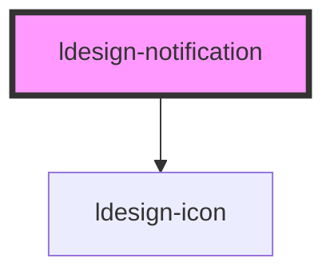

# ldesign-notification

<!-- Auto Generated Below -->

## Overview

Notification 通知提醒
位于页面角落的全局通知，支持标题、描述、操作区与自动关闭。

## Properties

| Property            | Attribute            | Description             | Type                                                           | Default       |
| ------------------- | -------------------- | ----------------------- | -------------------------------------------------------------- | ------------- |
| `closable`          | `closable`           | 是否显示关闭按钮                | `boolean`                                                      | `true`        |
| `description`       | `description`        | 描述文案（也可使用默认 slot 自定义内容） | `string`                                                       | `undefined`   |
| `duration`          | `duration`           | 自动关闭的时长（毫秒）；设为 0 则不自动关闭 | `number`                                                       | `4500`        |
| `notificationTitle` | `notification-title` | 标题                      | `string`                                                       | `undefined`   |
| `pauseOnHover`      | `pause-on-hover`     | 悬浮时是否暂停计时               | `boolean`                                                      | `true`        |
| `placement`         | `placement`          | 出现位置                    | `"bottom-left" \| "bottom-right" \| "top-left" \| "top-right"` | `'top-right'` |
| `showIcon`          | `show-icon`          | 是否显示图标                  | `boolean`                                                      | `true`        |
| `type`              | `type`               | 通知类型                    | `"error" \| "info" \| "success" \| "warning"`                  | `'info'`      |

## Events

| Event          | Description | Type                |
| -------------- | ----------- | ------------------- |
| `ldesignClose` | 关闭事件        | `CustomEvent<void>` |

## Methods

### `close() => Promise<void>`

手动关闭（带高度收起动画，带动后续通知平滑归位）

#### Returns

Type: `Promise<void>`

## Dependencies

### Depends on

- [ldesign-icon](../icon)

### Graph

----------------------------------------------

*Built with [StencilJS](https://stenciljs.com/)*
