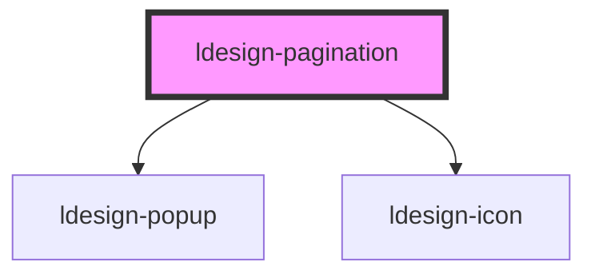

# ldesign-pagination

## 使用说明

- 支持受控/非受控：
  - 受控：通过 `current`、`page-size` 联动外部状态，仅监听 `ldesignChange`/`ldesignPageSizeChange` 同步。
  - 非受控：使用 `default-current`、`default-page-size` 初始化，内部自行管理。

- 基础示例
```html
<ldesign-pagination total="125"></ldesign-pagination>
```

- 带页大小切换与快速跳转
```html
<ldesign-pagination total="308" show-size-changer page-size-options="[10,20,50,100]" show-quick-jumper></ldesign-pagination>
```

> 下方为自动生成的属性与事件文档，构建后会自动更新。

<!-- Auto Generated Below -->


## Overview

Pagination 分页组件
用于数据分页，提供页码切换、页大小切换与快速跳转

## Properties

| Property           | Attribute             | Description                               | Type                                         | Default                     |
| ------------------ | --------------------- | ----------------------------------------- | -------------------------------------------- | --------------------------- |
| `boundaryCount`    | `boundary-count`      | 页码省略边界数（两端保留）                             | `number`                                     | `1`                         |
| `current`          | `current`             | 当前页（受控）                                   | `number`                                     | `undefined`                 |
| `defaultCurrent`   | `default-current`     | 默认当前页（非受控）                                | `number`                                     | `1`                         |
| `defaultPageSize`  | `default-page-size`   | 默认每页条数（非受控）                               | `number`                                     | `10`                        |
| `disabled`         | `disabled`            | 组件禁用                                      | `boolean`                                    | `false`                     |
| `hideOnSinglePage` | `hide-on-single-page` | 仅一页时是否隐藏                                  | `boolean`                                    | `false`                     |
| `pageSize`         | `page-size`           | 每页条数（受控）                                  | `number`                                     | `undefined`                 |
| `pageSizeOptions`  | `page-size-options`   | 页大小选项（可传数组或逗号分隔字符串）                       | `number[] \| string`                         | `[10, 20, 50, 100]`         |
| `pageSizeText`     | `page-size-text`      | 下拉展示文案模板，仅在 dropdown 模式下生效，支持 {size}      | `string`                                     | `'{size} 条/页'`              |
| `pageText`         | `page-text`           | 页信息文案模板，支持 {current}、{pageCount}          | `string`                                     | `'{current}/{pageCount} 页'` |
| `showFirstLast`    | `show-first-last`     | 是否显示首页/末页                                 | `boolean`                                    | `false`                     |
| `showQuickJumper`  | `show-quick-jumper`   | 是否显示快速跳转输入框                               | `boolean`                                    | `false`                     |
| `showSizeChanger`  | `show-size-changer`   | 是否显示每页条数切换器                               | `boolean`                                    | `false`                     |
| `showTotal`        | `show-total`          | 是否显示总数文案                                  | `boolean`                                    | `false`                     |
| `siblingCount`     | `sibling-count`       | 当前页两侧展示的邻接页数                              | `number`                                     | `1`                         |
| `simple`           | `simple`              | 简洁模式（仅上一页/下一页 + 页码输入）                     | `boolean`                                    | `false`                     |
| `size`             | `size`                | 组件尺寸                                      | `"large" \| "medium" \| "middle" \| "small"` | `'medium'`                  |
| `sizeChangerType`  | `size-changer-type`   | 切换器类型：native 原生下拉；dropdown 使用组件弹层         | `"dropdown" \| "native"`                     | `'dropdown'`                |
| `total`            | `total`               | 总条目数                                      | `number`                                     | `0`                         |
| `totalText`        | `total-text`          | 总数文案模板，支持 {total}、{rangeStart}、{rangeEnd} | `string`                                     | `'共 {total} 条'`             |


## Events

| Event                   | Description | Type                                               |
| ----------------------- | ----------- | -------------------------------------------------- |
| `ldesignChange`         | 页码变化事件      | `CustomEvent<{ page: number; pageSize: number; }>` |
| `ldesignPageSizeChange` | 每页条数变化事件    | `CustomEvent<{ pageSize: number; page: number; }>` |


## Dependencies

### Depends on

- [ldesign-popup](../popup)
- [ldesign-icon](../icon)

### Graph


----------------------------------------------

*Built with [StencilJS](https://stenciljs.com/)*
