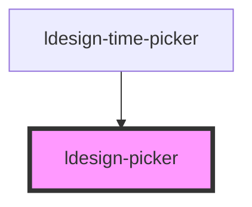

# ldesign-picker

一个高性能、功能丰富的滚轮选择器组件，支持多种交互方式和丰富的配置选项。

## ✨ 新增特性

- **🔍 搜索和筛选**：支持实时搜索、模糊匹配、键盘快速跳转
- **🎨 主题定制**：内置明暗主题，支持CSS变量自定义
- **♿️ 无障碍访问**：完整的ARIA支持，增强的键盘导航
- **📳 触觉反馈**：移动端支持振动反馈
- **🔊 音效支持**：可配置的滚动音效
- **🎮 3D效果**：可选的3D透视效果
- **🌊 渐变遮罩**：美观的顶部/底部渐变效果
- **⚡ 性能优化**：节流/防抖、减少重渲染

## 示例

### 基础使用

```html
<ldesign-picker
  options='[{"value":"apple","label":"🍎 Apple"},{"value":"banana","label":"🍌 Banana"},{"value":"orange","label":"🍊 Orange"}]'
  value="apple"
></ldesign-picker>
```

### 搜索功能

```html
<ldesign-picker
  searchable
  search-placeholder="搜索水果..."
  highlight-match
  keyboard-quick-jump
  options='[{"value":"apple","label":"🍎 Apple"},{"value":"apricot","label":"🍑 Apricot"},{"value":"avocado","label":"🥑 Avocado"},{"value":"banana","label":"🍌 Banana"},{"value":"blueberry","label":"🍇 Blueberry"},{"value":"cherry","label":"🍒 Cherry"},{"value":"coconut","label":"🥥 Coconut"},{"value":"grape","label":"🍇 Grape"},{"value":"kiwi","label":"🥝 Kiwi"},{"value":"lemon","label":"🍋 Lemon"},{"value":"mango","label":"🥭 Mango"},{"value":"melon","label":"🍈 Melon"},{"value":"orange","label":"🍊 Orange"},{"value":"peach","label":"🍑 Peach"},{"value":"pear","label":"🍐 Pear"},{"value":"pineapple","label":"🍍 Pineapple"},{"value":"strawberry","label":"🍓 Strawberry"},{"value":"watermelon","label":"🍉 Watermelon"}]'
></ldesign-picker>

<script>
  // 输入字母可快速跳转到对应项
  // 例如：输入 "m" 跳转到 Mango，输入 "me" 跳转到 Melon
</script>
```

### 主题定制

```html
<!-- 暗黑主题 -->
<ldesign-picker
  theme="dark"
  enable3d
  show-mask
  options='[{"value":"1","label":"Option 1"},{"value":"2","label":"Option 2"}]'
></ldesign-picker>

<!-- 自定义主题颜色 -->
<ldesign-picker
  style="
    --ldesign-picker-active-color: #10b981;
    --ldesign-picker-active-bg: rgba(16, 185, 129, 0.1);
    --ldesign-picker-border-radius: 12px;
  "
  options='[{"value":"1","label":"Option 1"},{"value":"2","label":"Option 2"}]'
></ldesign-picker>
```

### 体验增强

```html
<!-- 启用触觉反馈和音效 -->
<ldesign-picker
  haptic-feedback
  haptic-intensity="15"
  sound-effects
  sound-volume="0.3"
  enable3d
  show-mask
  options='[{"value":"1","label":"Option 1"},{"value":"2","label":"Option 2"}]'
></ldesign-picker>
```

### 键盘导航

```html
<ldesign-picker
  id="keyboard-example"
  options='[{"value":"1","label":"Item 1"},{"value":"2","label":"Item 2"},{"value":"3","label":"Item 3"},{"value":"4","label":"Item 4"},{"value":"5","label":"Item 5"}]'
></ldesign-picker>

<div>
  键盘操作：
  <ul>
    <li>↑/↓ - 上下移动</li>
    <li>Home/End - 跳转到首/末</li>
    <li>PageUp/PageDown - 翻页</li>
    <li>Enter/Space - 确认选择</li>
    <li>输入字母 - 快速跳转</li>
    <li>Escape - 退出搜索</li>
  </ul>
</div>
```

### 外部改变选中值并观察滚动动画

从外部改变 `value` 时，组件会平滑滚动到新位置而不是瞬间跳变。你也可以通过公开方法 `scrollToValue` 控制是否启用动画以及是否静默（不触发变更事件）。

示例（可直接在文档中试用）：

```html
<!-- 左：ldesign-picker；右：原生 select，选择右侧会同步左侧 -->
<div style="display:flex; gap:16px; align-items:flex-start;">
  <ldesign-picker
    id="pk-external"
    size="medium"
    visible-items="5"
    options='[{"value":"a","label":"A"},{"value":"b","label":"B"},{"value":"c","label":"C"},{"value":"d","label":"D"},{"value":"e","label":"E"}]'
    value="c"
  ></ldesign-picker>

  <select id="pk-external-select" style="width:120px;">
    <option value="a">A</option>
    <option value="b">B</option>
    <option value="c" selected>C</option>
    <option value="d">D</option>
    <option value="e">E</option>
  </select>
</div>

<div style="margin-top:12px; display:flex; gap:8px; flex-wrap:wrap; align-items:center;">
  <button id="btn-attr-prev">属性 value 上一个</button>
  <button id="btn-attr-next">属性 value 下一个</button>
  <button id="btn-method-prev">方法 scrollToValue 上一个</button>
  <button id="btn-method-next">方法 scrollToValue 下一个</button>
  <label style="margin-left:12px;">
    <input type="checkbox" id="toggle-animate" checked /> animate
  </label>
  <label>
    <input type="checkbox" id="toggle-silent" /> silent
  </label>
</div>

<script type="module">
  const el = document.getElementById('pk-external');
  const selectEl = document.getElementById('pk-external-select');

  const values = ['a','b','c','d','e'];
  const idxOf = v => values.indexOf(v);
  const nextOf = v => values[Math.min(values.length - 1, idxOf(v) + 1)] ?? values[values.length - 1];
  const prevOf = v => values[Math.max(0, idxOf(v) - 1)] ?? values[0];

  function getAnimate() { return document.getElementById('toggle-animate').checked; }
  function getSilent() { return document.getElementById('toggle-silent').checked; }

  // 右侧 select -> 左侧 picker
  selectEl.addEventListener('change', () => {
    el.value = selectEl.value;
  });

  // 方式A：外部修改 value 属性（会触发平滑滚动，内部为静默，不触发 ldesignChange）
  document.getElementById('btn-attr-prev').addEventListener('click', () => {
    const v = el.value ?? values[0];
    const nv = prevOf(v);
    el.value = nv; // 设置属性 value，即受控用法
    selectEl.value = nv; // 同步右侧
  });
  document.getElementById('btn-attr-next').addEventListener('click', () => {
    const v = el.value ?? values[0];
    const nv = nextOf(v);
    el.value = nv;
    selectEl.value = nv; // 同步右侧
  });

  // 方式B：调用公开方法 scrollToValue，可自定义动画与是否静默
  document.getElementById('btn-method-prev').addEventListener('click', async () => {
    const v = el.value ?? values[0];
    const nv = prevOf(v);
    await el.scrollToValue(nv, { animate: getAnimate(), silent: getSilent(), trigger: 'program' });
    selectEl.value = nv; // 同步右侧
  });
  document.getElementById('btn-method-next').addEventListener('click', async () => {
    const v = el.value ?? values[0];
    const nv = nextOf(v);
    await el.scrollToValue(nv, { animate: getAnimate(), silent: getSilent(), trigger: 'program' });
    selectEl.value = nv; // 同步右侧
  });

  // 可选：观察事件
  el.addEventListener('ldesignChange', e => console.log('ldesignChange', e.detail));
  el.addEventListener('ldesignPick', e => console.log('ldesignPick', e.detail));
</script>
```

提示
- 修改 `value` 属性：默认静默（不触发 `ldesignChange`），用于受控场景以避免双向循环。
- 调用 `scrollToValue(value, { animate, silent })`：可按需开启/关闭动画与静默。
- 通过 `snap-duration` 与 `snap-duration-wheel` 可调整滚动吸附动画时长。

## CSS 变量

可通过以下 CSS 变量自定义组件样式：

```css
:host {
  /* 主色调 */
  --ldesign-picker-bg: #fff;
  --ldesign-picker-border: #e5e7eb;
  --ldesign-picker-text: #111827;
  --ldesign-picker-text-secondary: #9ca3af;
  
  /* 激活状态 */
  --ldesign-picker-active-color: #1d4ed8;
  --ldesign-picker-active-bg: rgba(29, 78, 216, 0.06);
  
  /* 搜索框 */
  --ldesign-picker-search-bg: #f9fafb;
  --ldesign-picker-search-border: #e5e7eb;
  
  /* 高亮 */
  --ldesign-picker-highlight-bg: #fef3c7;
  --ldesign-picker-highlight-color: #92400e;
  
  /* 圆角和动画 */
  --ldesign-picker-border-radius: 6px;
  --ldesign-picker-transition: 200ms cubic-bezier(0.22,0.61,0.36,1);
  
  /* 遮罩渐变 */
  --ldesign-picker-mask-gradient-top: linear-gradient(to bottom, rgba(255,255,255,0.9), transparent);
  --ldesign-picker-mask-gradient-bottom: linear-gradient(to top, rgba(255,255,255,0.9), transparent);
  
  /* 3D 效果 */
  --ldesign-picker-3d-perspective: 500px;
  --ldesign-picker-3d-rotate: 25deg;
}
```

## 最佳实践

### 性能优化

1. **大数据量优化**
   ```html
   <!-- 对于超过 100 个选项，建议启用搜索功能 -->
   <ldesign-picker
     searchable
     search-debounce="500"
     options='[/* 大量数据 */]'
   ></ldesign-picker>
   ```

2. **减少重渲染**
   ```html
   <!-- 调整节流和防抖参数 -->
   <ldesign-picker
     drag-smoothing="100"
     friction="0.95"
     options='[/* ... */]'
   ></ldesign-picker>
   ```

### 无障碍访问

1. **键盘导航**
   - 确保组件可以通过 Tab 键获得焦点
   - 支持全部键盘快捷键
   - 提供视觉反馈

2. **屏幕阅读器**
   ```html
   <ldesign-picker
     role="listbox"
     aria-label="选择项目"
     options='[/* ... */]'
   ></ldesign-picker>
   ```

### 移动端优化

1. **触摸体验**
   ```html
   <ldesign-picker
     haptic-feedback
     haptic-intensity="20"
     drag-follow="0.9"
     momentum
     friction="0.92"
     options='[/* ... */]'
   ></ldesign-picker>
   ```

2. **响应式设计**
   ```css
   @media (max-width: 768px) {
     ldesign-picker {
       width: 100%;
       --ld-pk-item-height: 44px; /* 移动端更大的触摸区域 */
     }
   }
   ```

### 事件处理

```javascript
// 监听选中变化
const picker = document.querySelector('ldesign-picker');

picker.addEventListener('ldesignChange', (e) => {
  console.log('选中值变化:', e.detail.value);
  console.log('选中项:', e.detail.option);
});

// 监听实时选择过程
picker.addEventListener('ldesignPick', (e) => {
  console.log('正在选择:', e.detail.value);
  console.log('触发方式:', e.detail.context.trigger);
});

// 程序控制
async function programControl() {
  // 滚动到指定值
  await picker.scrollToValue('apple', { 
    animate: true, 
    silent: false 
  });
  
  // 滚动到指定索引
  await picker.scrollToIndex(3, { 
    animate: true 
  });
  
  // 中心定位到当前值
  await picker.centerToCurrent(true);
}
```

<!-- Auto Generated Below -->


## Overview

ldesign-picker
通用滚轮选择器（单列）
- PC：鼠标滚轮按“行”步进，按速度取整步数
- 移动端：手势滑动（Pointer Events）+ 惯性 + 吸附到最近项
- 支持配置容器高度与每项高度；容器通常为 itemHeight 的奇数倍（3/5/7...）
- 正中间指示器高度与子项一致

## Properties

| Property             | Attribute              | Description                                              | Type                             | Default     |
| -------------------- | ---------------------- | -------------------------------------------------------- | -------------------------------- | ----------- |
| `cylinderRadius`     | `cylinder-radius`      | 3D圆柱半径（像素）                                               | `number`                         | `undefined` |
| `defaultValue`       | `default-value`        | 默认值（非受控）                                                 | `string`                         | `undefined` |
| `disabled`           | `disabled`             | 是否禁用                                                     | `boolean`                        | `false`     |
| `dragFollow`         | `drag-follow`          | 手势拖拽跟随比例（0-1），1 表示 1:1 跟手，越小阻力越大，默认 1                    | `number`                         | `1`         |
| `dragSmoothing`      | `drag-smoothing`       | 手势拖拽平滑时间常数（毫秒），>0 时使用一阶平滑使位移逐步接近手指，营造"越来越慢"的阻力感，默认 0（关闭） | `number`                         | `undefined` |
| `enable3d`           | `enable-3d`            | 是否启用 3D 效果                                               | `boolean`                        | `false`     |
| `friction`           | `friction`             | 惯性摩擦 0-1（越小减速越快）                                         | `number`                         | `0.92`      |
| `hapticFeedback`     | `haptic-feedback`      | 是否启用触觉反馈（需要浏览器支持 Vibration API）                          | `boolean`                        | `true`      |
| `hapticIntensity`    | `haptic-intensity`     | 触觉反馈强度（毫秒）                                               | `number`                         | `5`         |
| `highlightMatch`     | `highlight-match`      | 搜索时是否高亮匹配文本                                              | `boolean`                        | `true`      |
| `itemHeight`         | `item-height`          | 行高（自动根据 size 推导，亦可显式覆盖）                                  | `number`                         | `undefined` |
| `keyboardQuickJump`  | `keyboard-quick-jump`  | 键盘快捷定位是否启用（输入字母快速定位）                                     | `boolean`                        | `true`      |
| `maxOverscroll`      | `max-overscroll`       | 最大橡皮筋越界（像素）。优先级高于比例                                      | `number`                         | `undefined` |
| `maxOverscrollRatio` | `max-overscroll-ratio` | 最大橡皮筋越界比例（相对于容器高度 0-1）。当未提供像素值时生效；未设置则默认 0.5（即容器高度的一半）   | `number`                         | `undefined` |
| `momentum`           | `momentum`             | 是否启用惯性                                                   | `boolean`                        | `true`      |
| `options`            | `options`              | 选项列表（数组或 JSON 字符串）                                       | `PickerOption[] \| string`       | `[]`        |
| `panelHeight`        | `panel-height`         | 可视高度（优先），未设置时使用 visibleItems * itemHeight                | `number`                         | `undefined` |
| `resistance`         | `resistance`           | 边界阻力系数 0-1（越小阻力越大）                                       | `number`                         | `0.3`       |
| `rotateStep`         | `rotate-step`          | 3D旋转步长（度）                                                | `number`                         | `undefined` |
| `searchDebounce`     | `search-debounce`      | 搜索防抖延迟（毫秒）                                               | `number`                         | `300`       |
| `searchIgnoreCase`   | `search-ignore-case`   | 是否在搜索时大小写不敏感                                             | `boolean`                        | `true`      |
| `searchPlaceholder`  | `search-placeholder`   | 搜索框占位符                                                   | `string`                         | `'搜索选项...'` |
| `searchable`         | `searchable`           | 是否显示搜索框                                                  | `boolean`                        | `false`     |
| `showMask`           | `show-mask`            | 是否显示渐变遮罩                                                 | `boolean`                        | `true`      |
| `size`               | `size`                 | 尺寸，影响每行高度                                                | `"large" \| "medium" \| "small"` | `'medium'`  |
| `snapDuration`       | `snap-duration`        | 吸附/回弹动画时长（毫秒，适用于触摸/键盘/滚动吸附），未设置默认 300ms                  | `number`                         | `undefined` |
| `snapDurationWheel`  | `snap-duration-wheel`  | 滚轮专用吸附动画时长（毫秒），未设置默认 150ms                               | `number`                         | `undefined` |
| `soundEffects`       | `sound-effects`        | 是否启用音效                                                   | `boolean`                        | `false`     |
| `soundUrl`           | `sound-url`            | 自定义音效 URL                                                | `string`                         | `undefined` |
| `soundVolume`        | `sound-volume`         | 音效音量 (0-1)                                               | `number`                         | `0.3`       |
| `springBackDuration` | `spring-back-duration` | 回弹动画基础时长（毫秒），未设置默认 bounce: 500ms, ease: 600ms            | `number`                         | `undefined` |
| `springBackMode`     | `spring-back-mode`     | 边界回弹模式：'bounce' 弹簧回弹（默认） \| 'ease' 缓慢恢复                  | `"bounce" \| "ease"`             | `'bounce'`  |
| `theme`              | `theme`                | 主题模式                                                     | `"auto" \| "dark" \| "light"`    | `'light'`   |
| `value`              | `value`                | 当前值（受控）                                                  | `string`                         | `undefined` |
| `visibleItems`       | `visible-items`        | 可视条目数（未显式 panelHeight 时生效，建议奇数：3/5/7）                    | `number`                         | `5`         |
| `visibleRange`       | `visible-range`        | 3D可视角度范围（度）                                              | `number`                         | `undefined` |


## Events

| Event           | Description        | Type                                                                                                                                     |
| --------------- | ------------------ | ---------------------------------------------------------------------------------------------------------------------------------------- |
| `ldesignChange` | 选中项变化（最终吸附后触发）     | `CustomEvent<{ value: string; option?: PickerOption; }>`                                                                                 |
| `ldesignPick`   | 选择过程事件（滚动/拖拽中也会触发） | `CustomEvent<{ value: string; option?: PickerOption; context: { trigger: "click" \| "scroll" \| "wheel" \| "keyboard" \| "touch"; }; }>` |


## Methods

### `centerToCurrent(smooth?: boolean) => Promise<void>`


#### Parameters

| Name     | Type      | Description |
| -------- | --------- | ----------- |
| `smooth` | `boolean` |             |

#### Returns

Type: `Promise<void>`


### `scrollToIndex(index: number, opts?: { trigger?: "program" | "click" | "scroll" | "wheel" | "keyboard" | "touch"; animate?: boolean; silent?: boolean; }) => Promise<void>`


#### Parameters

| Name    | Type                                                                                                                       | Description |
| ------- | -------------------------------------------------------------------------------------------------------------------------- | ----------- |
| `index` | `number`                                                                                                                   |             |
| `opts`  | `{ trigger?: "click" \| "scroll" \| "wheel" \| "keyboard" \| "touch" \| "program"; animate?: boolean; silent?: boolean; }` |             |

#### Returns

Type: `Promise<void>`


### `scrollToValue(value: string, opts?: { trigger?: "program" | "click" | "scroll" | "wheel" | "keyboard" | "touch"; animate?: boolean; silent?: boolean; }) => Promise<void>`


#### Parameters

| Name    | Type                                                                                                                       | Description |
| ------- | -------------------------------------------------------------------------------------------------------------------------- | ----------- |
| `value` | `string`                                                                                                                   |             |
| `opts`  | `{ trigger?: "click" \| "scroll" \| "wheel" \| "keyboard" \| "touch" \| "program"; animate?: boolean; silent?: boolean; }` |             |

#### Returns

Type: `Promise<void>`


## Dependencies

### Used by

 - [ldesign-time-picker](../time-picker)

### Graph


----------------------------------------------

*Built with [StencilJS](https://stenciljs.com/)*
