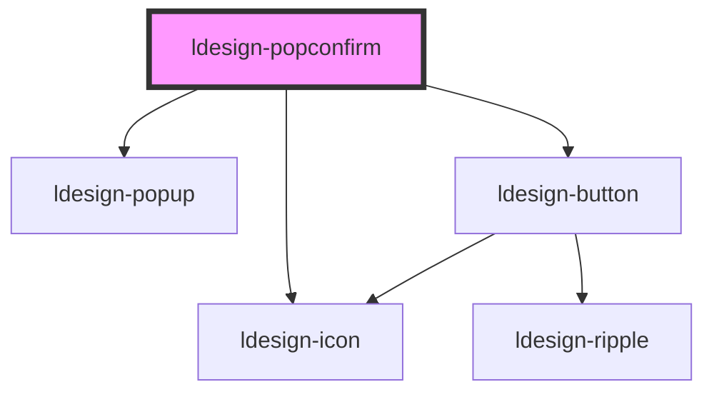

# ldesign-popconfirm

基于 Popup 的二次封装，用于在操作前进行二次确认。通常与“删除”“退出”“危险操作”等按钮配合使用。

## 使用示例

- 基本用法（点击触发）
```html path=null start=null
<ldesign-popconfirm popconfirm-title="确定删除该条记录吗？" description="删除后无法恢复">
  <ldesign-button slot="trigger" type="danger">删除</ldesign-button>
</ldesign-popconfirm>
```

- 自定义图标/按钮文案
```html path=null start=null
<ldesign-popconfirm popconfirm-title="发布到线上？" icon="send" ok-text="发布" cancel-text="稍后">
  <ldesign-button slot="trigger" type="primary">发布</ldesign-button>
</ldesign-popconfirm>
```

- 受控显示（trigger="manual"）
```html path=null start=null
<ldesign-popconfirm id="pc" trigger="manual" visible>
  <ldesign-button slot="trigger">打开</ldesign-button>
  <span slot="title">危险操作</span>
  真的要这么做吗？
</ldesign-popconfirm>
<script>
  const pc = document.getElementById('pc');
  // 关闭
  pc.addEventListener('ldesignConfirm', () => pc.visible = false);
  pc.addEventListener('ldesignCancel', () => pc.visible = false);
</script>
```

> 下方为自动生成的属性与事件文档，构建后会自动更新。

<!-- Auto Generated Below -->


## Overview

Popconfirm 气泡确认框
基于最新 Popup 进行封装，提供确认/取消操作
支持动画、主题、尺寸等特性

## Properties

| Property          | Attribute          | Description                      | Type                                                                                                                                                                 | Default        |
| ----------------- | ------------------ | -------------------------------- | -------------------------------------------------------------------------------------------------------------------------------------------------------------------- | -------------- |
| `animation`       | `animation`        | 动画类型（继承自 popup）                  | `"fade" \| "scale" \| "slide"`                                                                                                                                       | `'scale'`      |
| `arrow`           | `arrow`            | 箭头（默认显示），透传给 Popup               | `boolean`                                                                                                                                                            | `true`         |
| `autoCloseDelay`  | `auto-close-delay` | 自动关闭延迟（毫秒），0 表示不自动关闭             | `number`                                                                                                                                                             | `0`            |
| `cancelText`      | `cancel-text`      |                                  | `string`                                                                                                                                                             | `'取消'`         |
| `cancelType`      | `cancel-type`      | 取消按钮类型（默认使用次要/描边样式）              | `"danger" \| "outline" \| "primary" \| "secondary" \| "text"`                                                                                                        | `'outline'`    |
| `closeOnOutside`  | `close-on-outside` | 点击外部是否关闭（仅点击触发较常用）               | `boolean`                                                                                                                                                            | `true`         |
| `confirmLoading`  | `confirm-loading`  | 确认按钮加载状态                         | `boolean`                                                                                                                                                            | `false`        |
| `description`     | `description`      | 辅助说明（可选，支持默认 slot 覆盖）            | `string`                                                                                                                                                             | `undefined`    |
| `hideDelay`       | `hide-delay`       |                                  | `number`                                                                                                                                                             | `0`            |
| `icon`            | `icon`             | 图标类型/名称                          | `string`                                                                                                                                                             | `'question'`   |
| `loading`         | `loading`          | 是否显示加载状态                         | `boolean`                                                                                                                                                            | `false`        |
| `offsetDistance`  | `offset-distance`  | 与触发元素的距离                         | `number`                                                                                                                                                             | `8`            |
| `okText`          | `ok-text`          | 确认/取消按钮文本                        | `string`                                                                                                                                                             | `'确定'`         |
| `okType`          | `ok-type`          | 确认按钮类型（影响颜色）                     | `"danger" \| "outline" \| "primary" \| "secondary" \| "text"`                                                                                                        | `'primary'`    |
| `placement`       | `placement`        | 出现位置（透传给 Popup）                  | `"bottom" \| "bottom-end" \| "bottom-start" \| "left" \| "left-end" \| "left-start" \| "right" \| "right-end" \| "right-start" \| "top" \| "top-end" \| "top-start"` | `'top'`        |
| `popconfirmTitle` | `popconfirm-title` | 确认标题（支持 slot=title 覆盖）           | `string`                                                                                                                                                             | `'确定要执行该操作吗？'` |
| `showDelay`       | `show-delay`       | 延迟显示/隐藏（毫秒），透传给 Popup            | `number`                                                                                                                                                             | `0`            |
| `showIcon`        | `show-icon`        | 是否显示图标                           | `boolean`                                                                                                                                                            | `true`         |
| `size`            | `size`             | 尺寸（影响内容区域大小）                     | `"large" \| "medium" \| "small"`                                                                                                                                     | `'medium'`     |
| `theme`           | `theme`            | 主题（浅色/深色），透传给 Popup              | `"dark" \| "light"`                                                                                                                                                  | `'light'`      |
| `trigger`         | `trigger`          | 触发方式（默认点击）                       | `"click" \| "contextmenu" \| "focus" \| "hover" \| "manual"`                                                                                                         | `'click'`      |
| `visible`         | `visible`          | 外部受控可见性（仅在 trigger='manual' 时生效） | `boolean`                                                                                                                                                            | `false`        |


## Events

| Event                  | Description  | Type                   |
| ---------------------- | ------------ | ---------------------- |
| `ldesignCancel`        | 事件：取消        | `CustomEvent<void>`    |
| `ldesignConfirm`       | 事件：确认        | `CustomEvent<void>`    |
| `ldesignVisibleChange` | 事件：对外转发可见性变化 | `CustomEvent<boolean>` |


## Dependencies

### Depends on

- [ldesign-popup](../popup)
- [ldesign-icon](../icon)
- [ldesign-button](../button)

### Graph


----------------------------------------------

*Built with [StencilJS](https://stenciljs.com/)*
