# ldesign-popup

Popup 弹出层组件（不覆盖触发元素）

- 默认不会遮挡触发元素。
- 通过 `offset-distance` 设置“触发元素到箭头尖端”的距离（默认 8px）。
- 可选 `lock-on-scroll`：点击打开后滚动页面时，弹层保持打开时的视口位置，不随触发元素移动。

## 不遮挡触发元素与距离设置

- 本组件基于 `@floating-ui/dom` 进行定位，使用 `offset-distance` 作为触发元素与弹层之间的间距。
- `offset-distance` 表示触发元素与弹层之间的距离，floating-ui 会自动处理箭头位置和间距。

示例：

- 带箭头，距离 12px：

```html
<ldesign-popup placement="top" offset-distance="12" content="这是一个弹出层">
  <button slot="trigger">悬停显示</button>
</ldesign-popup>
```

- 不带箭头，仍保持 12px 间距：

```html
<ldesign-popup placement="top" arrow="false" offset-distance="12" content="这是一个弹出层">
  <button slot="trigger">悬停显示</button>
</ldesign-popup>
```

- 复杂滚动/裁剪容器，建议将弹层渲染到 `body`，避免被裁剪：

```html
<ldesign-popup append-to="body" placement="bottom" offset-distance="8" content="放到 body 下渲染">
  <button slot="trigger">触发</button>
</ldesign-popup>
```

> 提示：属性在模板中使用短横线写法（`offset-distance`），在 JS/TS 中对应为 `offsetDistance`。

<!-- Auto Generated Below -->


## Overview

ldesign-popup（重写版）
目标：
- 结构清晰：属性/状态/引用/工具/事件/定位/渲染分层
- 在所有方向上保持一致的 offset 语义：
   arrow=true 时，offsetDistance = 触发元素到箭头尖端的可见距离
   arrow=false 时，offsetDistance = 触发元素到面板边缘的可见距离
- 支持 hover/click/focus/manual/contextmenu，支持 appendTo(self/body/closest-popup)
- 稳健的外部点击与 ESC 关闭，右键通过虚拟参考在鼠标处弹出

## Properties

| Property         | Attribute          | Description                        | Type                                                                                                                                                                 | Default     |
| ---------------- | ------------------ | ---------------------------------- | -------------------------------------------------------------------------------------------------------------------------------------------------------------------- | ----------- |
| `animation`      | `animation`        | 动画类型                               | `"fade" \| "scale" \| "slide"`                                                                                                                                       | `'scale'`   |
| `appendTo`       | `append-to`        |                                    | `"body" \| "closest-popup" \| "self"`                                                                                                                                | `'self'`    |
| `arrow`          | `arrow`            |                                    | `boolean`                                                                                                                                                            | `true`      |
| `autoCloseDelay` | `auto-close-delay` | 自动关闭延迟（ms），0表示不自动关闭                | `number`                                                                                                                                                             | `0`         |
| `closable`       | `closable`         | 是否显示关闭按钮                           | `boolean`                                                                                                                                                            | `false`     |
| `closeOnEsc`     | `close-on-esc`     |                                    | `boolean`                                                                                                                                                            | `true`      |
| `closeOnOutside` | `close-on-outside` |                                    | `boolean`                                                                                                                                                            | `true`      |
| `content`        | `content`          |                                    | `string`                                                                                                                                                             | `undefined` |
| `debug`          | `debug`            |                                    | `boolean`                                                                                                                                                            | `false`     |
| `disabled`       | `disabled`         |                                    | `boolean`                                                                                                                                                            | `false`     |
| `hideDelay`      | `hide-delay`       |                                    | `number`                                                                                                                                                             | `0`         |
| `interactive`    | `interactive`      |                                    | `boolean`                                                                                                                                                            | `true`      |
| `loading`        | `loading`          | 加载状态                               | `boolean`                                                                                                                                                            | `false`     |
| `lockOnScroll`   | `lock-on-scroll`   |                                    | `boolean`                                                                                                                                                            | `false`     |
| `maxWidth`       | `max-width`        |                                    | `number \| string`                                                                                                                                                   | `undefined` |
| `motionDistance` | `motion-distance`  | 动画位移距离（px），用于"朝触发器靠近"的起始位移         | `number`                                                                                                                                                             | `10`        |
| `motionDuration` | `motion-duration`  | 动画时长（ms）                           | `number`                                                                                                                                                             | `200`       |
| `motionEnabled`  | `motion-enabled`   | 是否开启动画（基于 data-placement 的定向靠近/离开） | `boolean`                                                                                                                                                            | `true`      |
| `offsetDistance` | `offset-distance`  | 与触发元素的距离：参见组件注释中的语义说明              | `number \| string`                                                                                                                                                   | `8`         |
| `placement`      | `placement`        |                                    | `"bottom" \| "bottom-end" \| "bottom-start" \| "left" \| "left-end" \| "left-start" \| "right" \| "right-end" \| "right-start" \| "top" \| "top-end" \| "top-start"` | `'bottom'`  |
| `popupClass`     | `popup-class`      | 自定义弹层类名                            | `string`                                                                                                                                                             | `undefined` |
| `popupRole`      | `popup-role`       |                                    | `string`                                                                                                                                                             | `'dialog'`  |
| `popupTitle`     | `popup-title`      |                                    | `string`                                                                                                                                                             | `undefined` |
| `showDelay`      | `show-delay`       |                                    | `number`                                                                                                                                                             | `0`         |
| `size`           | `size`             | 预设尺寸                               | `"large" \| "medium" \| "small"`                                                                                                                                     | `undefined` |
| `strategy`       | `strategy`         |                                    | `"absolute" \| "auto" \| "fixed"`                                                                                                                                    | `'auto'`    |
| `theme`          | `theme`            |                                    | `"dark" \| "light"`                                                                                                                                                  | `'light'`   |
| `trigger`        | `trigger`          |                                    | `"click" \| "contextmenu" \| "focus" \| "hover" \| "manual"`                                                                                                         | `'hover'`   |
| `visible`        | `visible`          |                                    | `boolean`                                                                                                                                                            | `false`     |
| `width`          | `width`            |                                    | `number \| string`                                                                                                                                                   | `undefined` |


## Events

| Event                  | Description | Type                   |
| ---------------------- | ----------- | ---------------------- |
| `ldesignVisibleChange` |             | `CustomEvent<boolean>` |


## Dependencies

### Used by

 - [ldesign-calendar](../calendar)
 - [ldesign-cascader](../cascader)
 - [ldesign-color-input](../color-input)
 - [ldesign-color-picker](../color-picker)
 - [ldesign-date-picker](../datepicker)
 - [ldesign-dropdown](../dropdown)
 - [ldesign-mention](../mention)
 - [ldesign-pagination](../pagination)
 - [ldesign-popconfirm](../popconfirm)
 - [ldesign-select](../select)
 - [ldesign-tag-group](../tag-group)
 - [ldesign-time-picker](../time-picker)
 - [ldesign-tooltip](../tooltip)

### Graph

```mermaid
graph TD;
  ldesign-calendar --> ldesign-popup
  ldesign-cascader --> ldesign-popup
  ldesign-color-input --> ldesign-popup
  ldesign-color-picker --> ldesign-popup
  ldesign-date-picker --> ldesign-popup
  ldesign-dropdown --> ldesign-popup
  ldesign-mention --> ldesign-popup
  ldesign-pagination --> ldesign-popup
  ldesign-popconfirm --> ldesign-popup
  ldesign-select --> ldesign-popup
  ldesign-tag-group --> ldesign-popup
  ldesign-time-picker --> ldesign-popup
  ldesign-tooltip --> ldesign-popup
  style ldesign-popup fill:#f9f,stroke:#333,stroke-width:4px
```


----------------------------------------------

*Built with [StencilJS](https://stenciljs.com/)*
