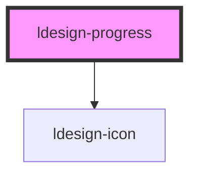

# ldesign-progress

<!-- Auto Generated Below -->

## Overview

Progress 进度�?
支持：线形、环形、仪表盘、步骤条，多尺寸/状�?文本/自定义颜色等

## Properties

| Property              | Attribute                | Description                                                               | Type                                                                                 | Default                                   |
| --------------------- | ------------------------ | ------------------------------------------------------------------------- | ------------------------------------------------------------------------------------ | ----------------------------------------- |
| `animated`            | `animated`               | 启用百分比过渡动�?                                                                | `boolean`                                                                            | `false`                                   |
| `circleStepGapDegree` | `circle-step-gap-degree` | 圆形分段之间的间隔角度（度数�?                                                          | `number`                                                                             | `2`                                       |
| `circleSteps`         | `circle-steps`           | 圆形分段步数（用于环形步进样式）                                                          | `number`                                                                             | `undefined`                               |
| `dashboardVariant`    | `dashboard-variant`      | 仪表盘变体（仅dashboard类型）：standard \| bottom \| left \| right \| fan            | `"bottom" \| "fan" \| "left" \| "right" \| "standard"`                               | `'standard'`                              |
| `effect3d`            | `effect-3d`              | 3D效果（仅line类型�?                                                            | `boolean`                                                                            | `false`                                   |
| `format`              | `format`                 | 文本格式化，使用 {percent} 占位符，例如�?{percent} / 100"                               | `string`                                                                             | `'{percent}%'`                            |
| `gapDegree`           | `gap-degree`             | 仪表盘缺口角度（0-360，仅 circle/dashboard�?                                        | `number`                                                                             | `undefined`                               |
| `gapPosition`         | `gap-position`           | 缺口位置（top/right/bottom/left，仅 circle/dashboard�?                           | `"bottom" \| "left" \| "right" \| "top"`                                             | `'top'`                                   |
| `glow`                | `glow`                   | 发光效果                                                                      | `boolean`                                                                            | `false`                                   |
| `gradientDirection`   | `gradient-direction`     | 渐变方向：horizontal \| vertical \| diagonal                                   | `"diagonal" \| "horizontal" \| "vertical"`                                           | `'horizontal'`                            |
| `gradientFrom`        | `gradient-from`          | 环形渐变（可选，�?circle/dashboard）：起止�?                                          | `string`                                                                             | `undefined`                               |
| `gradientSegments`    | `gradient-segments`      | 渐变分段（创建分段渐变效果）                                                            | `{ offset: number; color: string; }[]`                                               | `undefined`                               |
| `gradientTo`          | `gradient-to`            |                                                                           | `string`                                                                             | `undefined`                               |
| `indeterminate`       | `indeterminate`          | 不确定状态（显示循环动画，忽�?percent�?                                                 | `boolean`                                                                            | `false`                                   |
| `infoPosition`        | `info-position`          | 线形文本位置                                                                    | `"bottom" \| "inside" \| "left" \| "right"`                                          | `'right'`                                 |
| `layers`              | `layers`                 | 多层进度（用于显示多个数据）                                                            | `{ percent: number; color: string; label?: string; }[]`                              | `undefined`                               |
| `markers`             | `markers`                | 动态标记点                                                                     | `{ position: number; color?: string; label?: string; }[]`                            | `undefined`                               |
| `percent`             | `percent`                | 百分�?0-100                                                                 | `number`                                                                             | `0`                                       |
| `pulse`               | `pulse`                  | 脉冲动画                                                                      | `boolean`                                                                            | `false`                                   |
| `semiPosition`        | `semi-position`          | 半圆位置（type=semicircle），top 表示显示上半圆，bottom 表示下半�?                           | `"bottom" \| "top"`                                                                  | `'top'`                                   |
| `shadow`              | `shadow`                 | 进度条阴�?                                                                    | `boolean`                                                                            | `false`                                   |
| `showInfo`            | `show-info`              | 是否显示信息文本（line：默认右侧；circle/dashboard：内部）                                   | `boolean`                                                                            | `true`                                    |
| `size`                | `size`                   | 组件尺寸                                                                      | `"large" \| "medium" \| "middle" \| "small"`                                         | `'medium'`                                |
| `status`              | `status`                 | 状态：normal \| active \| success \| exception                               | `"active" \| "exception" \| "normal" \| "success"`                                   | `'normal'`                                |
| `steps`               | `steps`                  | 步骤数（type=steps 或设�?steps>0 都渲染步骤条�?                                       | `number`                                                                             | `undefined`                               |
| `stepsGap`            | `steps-gap`              | 步骤间隙 px（仅 steps�?                                                         | `number`                                                                             | `2`                                       |
| `stepsRadius`         | `steps-radius`           | 步骤条的块圆�?                                                                  | `number`                                                                             | `100`                                     |
| `striped`             | `striped`                | 条纹动画（active 状态下默认开启）                                                      | `boolean`                                                                            | `true`                                    |
| `strokeColor`         | `stroke-color`           | 进度颜色（可为任�?css 颜色�?                                                        | `string`                                                                             | `undefined`                               |
| `strokeLinecap`       | `stroke-linecap`         | 端点样式：round \| square \| butt（仅 circle 有效，line 以圆角呈�?round�?               | `"butt" \| "round" \| "square"`                                                      | `'round'`                                 |
| `strokeWidth`         | `stroke-width`           | 线宽（line 为高度，circle 为描边宽度）                                                 | `number`                                                                             | `undefined`                               |
| `successColor`        | `success-color`          | 成功颜色                                                                      | `string`                                                                             | `'var(--ldesign-success-color, #42bd42)'` |
| `successPercent`      | `success-percent`        | 成功进度（用于分段显示成功部分）0-100                                                     | `number`                                                                             | `undefined`                               |
| `theme`               | `theme`                  | 视觉主题：default \| neon \| gradient3d \| candy \| water \| glass \| metallic | `"candy" \| "default" \| "glass" \| "gradient3d" \| "metallic" \| "neon" \| "water"` | `'default'`                               |
| `trailColor`          | `trail-color`            | 未完成轨道颜�?                                                                  | `string`                                                                             | `undefined`                               |
| `type`                | `type`                   | 类型：line（默认）\| circle \| dashboard \| steps \| semicircle                  | `"circle" \| "dashboard" \| "line" \| "semicircle" \| "steps"`                       | `'line'`                                  |
| `wave`                | `wave`                   | 波浪动画（仅line类型�?                                                            | `boolean`                                                                            | `false`                                   |
| `width`               | `width`                  | 外径宽度（仅 circle/dashboard），单位 px                                            | `number`                                                                             | `120`                                     |

## Events

| Event           | Description | Type                  |
| --------------- | ----------- | --------------------- |
| `complete`      | 进度完成时触�?    | `CustomEvent<void>`   |
| `percentChange` | 百分比变化时触发    | `CustomEvent<number>` |

## Dependencies

### Depends on

- [ldesign-icon](../icon)

### Graph

----------------------------------------------

*Built with [StencilJS](https://stenciljs.com/)*
