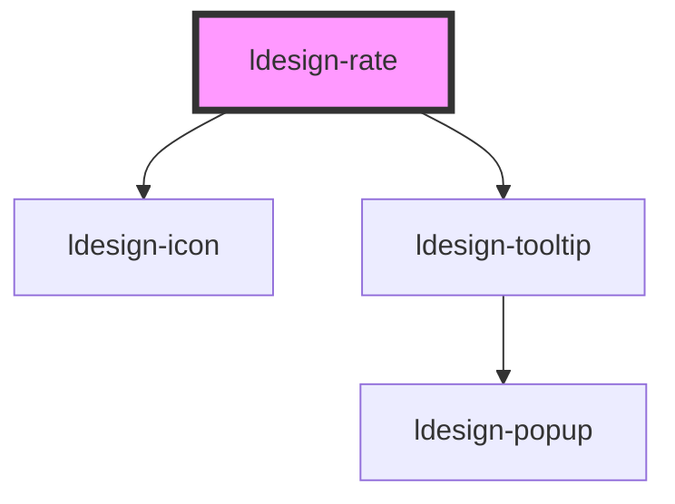

# ldesign-rate

<!-- Auto Generated Below -->

## Overview

Rate 评分组件
- 支持半星、清空、只读、禁用、键盘可访问
- 支持自定义图标（基于 ldesign-icon），或通过 slot=character 自定义字符

## Properties

| Property     | Attribute     | Description                                 | Type                                         | Default     |
| ------------ | ------------- | ------------------------------------------- | -------------------------------------------- | ----------- |
| `allowClear` | `allow-clear` | 再次点击清空（值相同则清零）                              | `boolean`                                    | `true`      |
| `allowHalf`  | `allow-half`  | 允许半星                                        | `boolean`                                    | `false`     |
| `color`      | `color`       | 选中颜色（支持 CSS 变量覆盖）                           | `string`                                     | `undefined` |
| `controlled` | `controlled`  | 受控模式：为 true 时组件不主动修改 value，仅触发事件            | `boolean`                                    | `false`     |
| `count`      | `count`       | 总星数                                         | `number`                                     | `5`         |
| `disabled`   | `disabled`    | 禁用交互                                        | `boolean`                                    | `false`     |
| `icon`       | `icon`        | 图标名称（默认 star）                               | `string`                                     | `'star'`    |
| `readonly`   | `readonly`    | 只读（展示，不可交互）                                 | `boolean`                                    | `false`     |
| `size`       | `size`        | 尺寸（影响图标大小与间距）                               | `"large" \| "medium" \| "middle" \| "small"` | `'medium'`  |
| `tooltips`   | `tooltips`    | 提示文案（数组），hover 时显示。可传属性为 JSON 字符串或以属性方式传递数组 | `string \| string[]`                         | `undefined` |
| `value`      | `value`       | 当前分值（支持受控）                                  | `number`                                     | `0`         |
| `voidColor`  | `void-color`  | 未选中颜色（支持 CSS 变量覆盖）                          | `string`                                     | `undefined` |

## Events

| Event                | Description       | Type                  |
| -------------------- | ----------------- | --------------------- |
| `ldesignChange`      | 值变化事件（返回新值）       | `CustomEvent<number>` |
| `ldesignHoverChange` | hover 变化事件（返回悬浮值） | `CustomEvent<number>` |

## Dependencies

### Depends on

- [ldesign-icon](../icon)
- [ldesign-tooltip](../tooltip)

### Graph

----------------------------------------------

*Built with [StencilJS](https://stenciljs.com/)*
