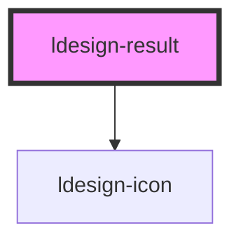

# ldesign-result

<!-- Auto Generated Below -->

## Overview

Result 结果页组件
用于反馈操作结果

## Properties

| Property   | Attribute   | Description | Type                                                                     | Default     |
| ---------- | ----------- | ----------- | ------------------------------------------------------------------------ | ----------- |
| `icon`     | `icon`      | 自定义图标       | `string`                                                                 | `undefined` |
| `status`   | `status`    | 结果状态        | `"403" \| "404" \| "500" \| "error" \| "info" \| "success" \| "warning"` | `'info'`    |
| `subTitle` | `sub-title` | 副标题/描述      | `string`                                                                 | `undefined` |
| `title`    | `title`     | 标题          | `string`                                                                 | `undefined` |

## Dependencies

### Depends on

- [ldesign-icon](../icon)

### Graph

----------------------------------------------

*Built with [StencilJS](https://stenciljs.com/)*
