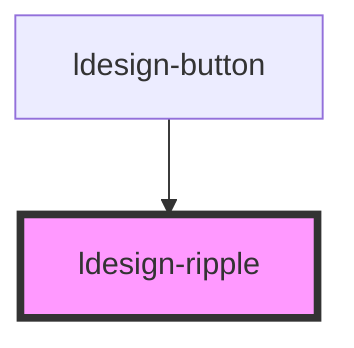

# ldesign-ripple

<!-- Auto Generated Below -->

## Overview

Ripple 水波纹效果
用法：把 <ldesign-ripple /> 放入任意元素内部（建议放最后），即可在该元素上获得点击水波纹效果。
例如：
<button class="btn">按钮<ldesign-ripple /></button>

## Properties

| Property          | Attribute           | Description            | Type                                                        | Default                          |
| ----------------- | ------------------- | ---------------------- | ----------------------------------------------------------- | -------------------------------- |
| `centered`        | `centered`          | 是否居中触发                 | `boolean`                                                   | `false`                          |
| `color`           | `color`             | 波纹颜色，默认 currentColor   | `string`                                                    | `undefined`                      |
| `customClass`     | `custom-class`      | 自定义类名                  | `string`                                                    | `undefined`                      |
| `direction`       | `direction`         | 波纹方向                   | `"both" \| "inward" \| "outward"`                           | `'outward'`                      |
| `disabled`        | `disabled`          | 禁用                     | `boolean`                                                   | `false`                          |
| `duration`        | `duration`          | 膨胀动画时长(ms)             | `number`                                                    | `600`                            |
| `easing`          | `easing`            | 缓动函数                   | `string`                                                    | `'cubic-bezier(0.4, 0, 0.2, 1)'` |
| `fadeOutDuration` | `fade-out-duration` | 淡出时长(ms)               | `number`                                                    | `300`                            |
| `glow`            | `glow`              | 是否启用发光效果               | `boolean`                                                   | `false`                          |
| `glowIntensity`   | `glow-intensity`    | 发光强度                   | `number`                                                    | `0.5`                            |
| `haptic`          | `haptic`            | 是否启用振动反馈 (需要浏览器支持)     | `boolean`                                                   | `false`                          |
| `hapticIntensity` | `haptic-intensity`  | 振动强度 (1-10)            | `number`                                                    | `5`                              |
| `keyboardEnabled` | `keyboard-enabled`  | 是否启用键盘触发 (Enter/Space) | `boolean`                                                   | `true`                           |
| `layerDelay`      | `layer-delay`       | 多层波纹延迟 (ms)            | `number`                                                    | `120`                            |
| `maxRipples`      | `max-ripples`       | 同时存在的最大波纹数量            | `number`                                                    | `8`                              |
| `multiLayer`      | `multi-layer`       | 是否启用多层波纹               | `boolean`                                                   | `false`                          |
| `opacity`         | `opacity`           | 波纹不透明度                 | `number`                                                    | `0.24`                           |
| `radius`          | `radius`            | 半径：auto 或固定像素          | `"auto" \| number`                                          | `'auto'`                         |
| `rippleSize`      | `ripple-size`       | 波纹大小模式                 | `"extra-large" \| "large" \| "medium" \| "small"`           | `'medium'`                       |
| `sound`           | `sound`             | 是否启用声音反馈               | `boolean`                                                   | `false`                          |
| `soundVolume`     | `sound-volume`      | 声音音量 (0-1)             | `number`                                                    | `0.1`                            |
| `throttle`        | `throttle`          | 最小触发间隔 (ms)            | `number`                                                    | `0`                              |
| `touchEnabled`    | `touch-enabled`     | 是否允许触摸设备               | `boolean`                                                   | `true`                           |
| `trigger`         | `trigger`           | 触发方式                   | `"click" \| "mousedown" \| "pointerdown"`                   | `'pointerdown'`                  |
| `unbounded`       | `unbounded`         | 是否不裁剪边界                | `boolean`                                                   | `false`                          |
| `variant`         | `variant`           | 波纹效果类型                 | `"default" \| "gradient" \| "light" \| "pulse" \| "strong"` | `'default'`                      |

## Dependencies

### Used by

 - [ldesign-button](../button)

### Graph

----------------------------------------------

*Built with [StencilJS](https://stenciljs.com/)*
