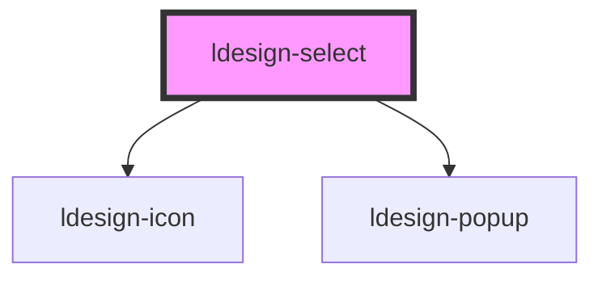

# ldesign-select

Select 选择器组件，基于 [ldesign-popup](../popup) 实现，支持单选与多选。

<!-- Auto Generated Below -->

## Overview

Select 选择器
基于 <ldesign-popup> 实现，支持单选/多选。

## Properties

| Property        | Attribute         | Description                      | Type                                                                                                                                                                 | Default          |
| --------------- | ----------------- | -------------------------------- | -------------------------------------------------------------------------------------------------------------------------------------------------------------------- | ---------------- |
| `arrow`         | `arrow`           | 是否显示箭头（默认不显示）                    | `boolean`                                                                                                                                                            | `false`          |
| `clearable`     | `clearable`       | 可清空                              | `boolean`                                                                                                                                                            | `false`          |
| `closeOnSelect` | `close-on-select` | 选中项后是否自动关闭（默认：单选 true，多选 false）  | `boolean`                                                                                                                                                            | `undefined`      |
| `defaultValue`  | `default-value`   | 默认值（非受控）                         | `string \| string[]`                                                                                                                                                 | `undefined`      |
| `disabled`      | `disabled`        | 是否禁用                             | `boolean`                                                                                                                                                            | `false`          |
| `maxHeight`     | `max-height`      | 列表最大高度（px）                       | `number`                                                                                                                                                             | `240`            |
| `maxTagCount`   | `max-tag-count`   | 多选时最多展示的标签数量，超过后折叠为 +N           | `number`                                                                                                                                                             | `undefined`      |
| `multiple`      | `multiple`        | 是否多选                             | `boolean`                                                                                                                                                            | `false`          |
| `options`       | `options`         | 选项列表（可传数组或 JSON 字符串）             | `SelectOption[] \| string`                                                                                                                                           | `[]`             |
| `placeholder`   | `placeholder`     | 占位文案（无选中项时）                      | `string`                                                                                                                                                             | `'请选择'`          |
| `placement`     | `placement`       | 出现位置（默认 bottom-start）            | `"bottom" \| "bottom-end" \| "bottom-start" \| "left" \| "left-end" \| "left-start" \| "right" \| "right-end" \| "right-start" \| "top" \| "top-end" \| "top-start"` | `'bottom-start'` |
| `theme`         | `theme`           | 主题（浅色/深色），透传给 Popup              | `"dark" \| "light"`                                                                                                                                                  | `'light'`        |
| `trigger`       | `trigger`         | 触发方式（Select 多数使用 click 或 manual） | `"click" \| "focus" \| "manual"`                                                                                                                                     | `'click'`        |
| `value`         | `value`           | 值（受控）。单选时为 string，多选时为 string[]  | `string \| string[]`                                                                                                                                                 | `undefined`      |
| `visible`       | `visible`         | 外部受控可见性（仅 trigger = 'manual' 生效） | `boolean`                                                                                                                                                            | `false`          |
| `width`         | `width`           | 列表宽度（可选）                         | `number \| string`                                                                                                                                                   | `undefined`      |

## Events

| Event                  | Description | Type                                                                   |
| ---------------------- | ----------- | ---------------------------------------------------------------------- |
| `ldesignChange`        | 选中变化事件      | `CustomEvent<{ value: string \| string[]; options: SelectOption[]; }>` |
| `ldesignVisibleChange` | 对外转发可见性变化   | `CustomEvent<boolean>`                                                 |

## Dependencies

### Depends on

- [ldesign-icon](../icon)
- [ldesign-popup](../popup)

### Graph

----------------------------------------------

*Built with [StencilJS](https://stenciljs.com/)*
