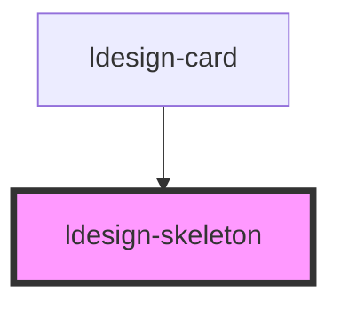

# ldesign-skeleton

<!-- Auto Generated Below -->

## Overview

Skeleton 骨架屏组件
用于内容加载时的占位效果

## Properties

| Property       | Attribute       | Description | Type                                      | Default     |
| -------------- | --------------- | ----------- | ----------------------------------------- | ----------- |
| `animated`     | `animated`      | 是否显示动画      | `boolean`                                 | `true`      |
| `avatar`       | `avatar`        | 是否显示头像      | `boolean`                                 | `false`     |
| `avatarShape`  | `avatar-shape`  | 头像形状        | `"circle" \| "square"`                    | `'circle'`  |
| `avatarSize`   | `avatar-size`   | 头像大小        | `"large" \| "medium" \| "small"`          | `'medium'`  |
| `borderRadius` | `border-radius` | 圆角          | `number \| string`                        | `undefined` |
| `height`       | `height`        | 高度          | `number \| string`                        | `undefined` |
| `loading`      | `loading`       | 是否加载中       | `boolean`                                 | `true`      |
| `paragraph`    | `paragraph`     | 段落配置        | `boolean`                                 | `true`      |
| `rows`         | `rows`          | 渲染行数        | `number`                                  | `3`         |
| `title`        | `title`         | 是否显示标题      | `boolean`                                 | `true`      |
| `type`         | `type`          | 骨架屏类型       | `"circle" \| "image" \| "rect" \| "text"` | `'text'`    |
| `width`        | `width`         | 宽度          | `number \| string`                        | `undefined` |

## Dependencies

### Used by

 - [ldesign-card](../card)

### Graph

----------------------------------------------

*Built with [StencilJS](https://stenciljs.com/)*
