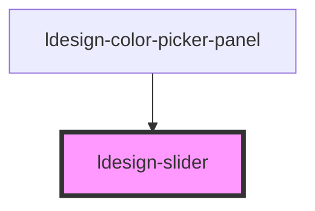

# ldesign-slider

<!-- Auto Generated Below -->

## Overview

Slider 滑块组件
通过拖动滑块在一定数值区间内进行选择

## Properties

| Property      | Attribute      | Description | Type                                         | Default    |
| ------------- | -------------- | ----------- | -------------------------------------------- | ---------- |
| `disabled`    | `disabled`     | 是否禁用        | `boolean`                                    | `false`    |
| `max`         | `max`          | 最大值         | `number`                                     | `100`      |
| `min`         | `min`          | 最小值         | `number`                                     | `0`        |
| `showTooltip` | `show-tooltip` | 是否显示当前值提示   | `boolean`                                    | `false`    |
| `size`        | `size`         | 尺寸          | `"large" \| "medium" \| "middle" \| "small"` | `'medium'` |
| `step`        | `step`         | 步长（> 0）     | `number`                                     | `1`        |
| `value`       | `value`        | 当前值         | `number`                                     | `0`        |
| `vertical`    | `vertical`     | 是否垂直方向      | `boolean`                                    | `false`    |

## Events

| Event           | Description       | Type                  |
| --------------- | ----------------- | --------------------- |
| `ldesignChange` | 值改变后触发（释放拖动或点击轨道） | `CustomEvent<number>` |
| `ldesignInput`  | 拖动时实时触发           | `CustomEvent<number>` |

## Dependencies

### Used by

 - [ldesign-color-picker-panel](../color-picker-panel)

### Graph

----------------------------------------------

*Built with [StencilJS](https://stenciljs.com/)*
