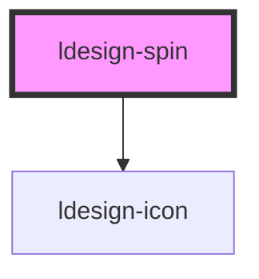

# ldesign-spin

<!-- Auto Generated Below -->

## Overview

Spin 加载指示器组件

## Properties

| Property   | Attribute  | Description     | Type                             | Default     |
| ---------- | ---------- | --------------- | -------------------------------- | ----------- |
| `delay`    | `delay`    | 延迟显示加载效果的时间（毫秒） | `number`                         | `0`         |
| `icon`     | `icon`     | 自定义图标           | `string`                         | `undefined` |
| `size`     | `size`     | 尺寸              | `"large" \| "medium" \| "small"` | `'medium'`  |
| `spinning` | `spinning` | 是否加载中           | `boolean`                        | `true`      |
| `tip`      | `tip`      | 提示文字            | `string`                         | `undefined` |

## Dependencies

### Depends on

- [ldesign-icon](../icon)

### Graph

----------------------------------------------

*Built with [StencilJS](https://stenciljs.com/)*
