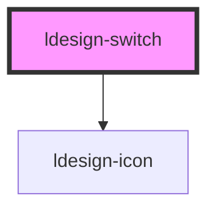

# ldesign-switch

<!-- Auto Generated Below -->

## Overview

Switch 开关组件
表示两种相互对立的状态间的切换，多用于触发「开/关」

## Properties

| Property         | Attribute         | Description                                             | Type                                                        | Default     |
| ---------------- | ----------------- | ------------------------------------------------------- | ----------------------------------------------------------- | ----------- |
| `checked`        | `checked`         | 是否选中                                                    | `boolean`                                                   | `false`     |
| `checkedIcon`    | `checked-icon`    | 选中时的图标                                                  | `string`                                                    | `undefined` |
| `checkedText`    | `checked-text`    | 选中时的文本                                                  | `string`                                                    | `undefined` |
| `checkedValue`   | `checked-value`   | 选中时的值                                                   | `boolean \| number \| string`                               | `true`      |
| `color`          | `color`           | 颜色风格 可选：brand \| success \| warning \| error \| neutral | `"brand" \| "error" \| "neutral" \| "success" \| "warning"` | `'brand'`   |
| `disabled`       | `disabled`        | 是否禁用                                                    | `boolean`                                                   | `false`     |
| `loading`        | `loading`         | 是否加载中                                                   | `boolean`                                                   | `false`     |
| `shape`          | `shape`           | 形状 可选：pill（胶囊）\| rounded（圆角）\| square（直角）               | `"pill" \| "rounded" \| "square"`                           | `'pill'`    |
| `size`           | `size`            | 开关尺寸                                                    | `"large" \| "medium" \| "middle" \| "small"`                | `'medium'`  |
| `uncheckedIcon`  | `unchecked-icon`  | 未选中时的图标                                                 | `string`                                                    | `undefined` |
| `uncheckedText`  | `unchecked-text`  | 未选中时的文本                                                 | `string`                                                    | `undefined` |
| `uncheckedValue` | `unchecked-value` | 未选中时的值                                                  | `boolean \| number \| string`                               | `false`     |
| `variant`        | `variant`         | 外观样式 可选：solid \| soft \| outline \| ghost               | `"ghost" \| "outline" \| "soft" \| "solid"`                 | `'solid'`   |

## Events

| Event           | Description  | Type                                       |
| --------------- | ------------ | ------------------------------------------ |
| `ldesignChange` | 当绑定值变化时触发的事件 | `CustomEvent<boolean \| number \| string>` |

## Dependencies

### Depends on

- [ldesign-icon](../icon)

### Graph

----------------------------------------------

*Built with [StencilJS](https://stenciljs.com/)*
