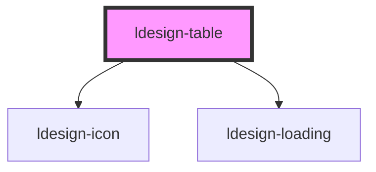

# ldesign-table

<!-- Auto Generated Below -->

## Overview

Table 高性能数据表格组件
支持虚拟滚动、排序、筛选、固定列/表头

## Properties

| Property     | Attribute     | Description       | Type                             | Default     |
| ------------ | ------------- | ----------------- | -------------------------------- | ----------- |
| `bordered`   | `bordered`    | 是否显示边框            | `boolean`                        | `false`     |
| `columns`    | `columns`     | 表格列配置             | `TableColumn[] \| string`        | `[]`        |
| `dataSource` | `data-source` | 表格数据              | `any[] \| string`                | `[]`        |
| `emptyText`  | `empty-text`  | 空数据提示文字           | `string`                         | `'暂无数据'`    |
| `height`     | `height`      | 表格高度（启用虚拟滚动时必须指定） | `number \| string`               | `undefined` |
| `hoverable`  | `hoverable`   | 是否允许hover高亮       | `boolean`                        | `true`      |
| `loading`    | `loading`     | 是否加载中             | `boolean`                        | `false`     |
| `rowHeight`  | `row-height`  | 行高（用于虚拟滚动）        | `number`                         | `48`        |
| `rowKey`     | `row-key`     | 行键值字段             | `string`                         | `'id'`      |
| `showHeader` | `show-header` | 是否显示表头            | `boolean`                        | `true`      |
| `size`       | `size`        | 表格大小              | `"large" \| "medium" \| "small"` | `'medium'`  |
| `striped`    | `striped`     | 是否显示斑马纹           | `boolean`                        | `false`     |
| `virtual`    | `virtual`     | 是否启用虚拟滚动          | `boolean`                        | `false`     |

## Events

| Event             | Description | Type                                        |
| ----------------- | ----------- | ------------------------------------------- |
| `ldesignRowClick` | 行点击事件       | `CustomEvent<{ row: any; index: number; }>` |
| `ldesignSort`     | 排序变化事件      | `CustomEvent<TableSort>`                    |

## Dependencies

### Depends on

- [ldesign-icon](../icon)
- [ldesign-loading](../loading)

### Graph

----------------------------------------------

*Built with [StencilJS](https://stenciljs.com/)*
