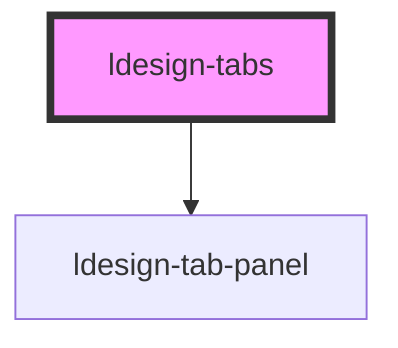

# ldesign-tabs

## 使用示例

- 基础用法
```html
<ldesign-tabs default-value="profile">
  <ldesign-tab-panel name="home" label="首页">首页内容</ldesign-tab-panel>
  <ldesign-tab-panel name="profile" label="资料">资料内容</ldesign-tab-panel>
  <ldesign-tab-panel name="settings" label="设置">设置内容</ldesign-tab-panel>
</ldesign-tabs>
```

- 受控用法
```html
<ldesign-tabs id="tabs1" value="a"></ldesign-tabs>
<script>
  const tabs = document.getElementById('tabs1');
  tabs.innerHTML = `
    <ldesign-tab-panel name="a" label="A">A Content</ldesign-tab-panel>
    <ldesign-tab-panel name="b" label="B">B Content</ldesign-tab-panel>
  `;
  tabs.addEventListener('ldesignChange', (e) => {
    // 外部接收并可重新写回
    tabs.value = e.detail;
  });
</script>
```

- 位置与类型
```html
<ldesign-tabs placement="left" type="card" default-value="doc">
  <ldesign-tab-panel name="doc" label="文档">文档内容</ldesign-tab-panel>
  <ldesign-tab-panel name="api" label="API">API 内容</ldesign-tab-panel>
</ldesign-tabs>
```

> 下方为自动生成的属性与事件文档，构建后会自动更新。

<!-- Auto Generated Below -->


## Overview

Tabs 选项卡组件
- 通过水平或垂直的标签页切换展示内容

## Properties

| Property            | Attribute            | Description            | Type                                                                    | Default     |
| ------------------- | -------------------- | ---------------------- | ----------------------------------------------------------------------- | ----------- |
| `addable`           | `addable`            | 是否显示新增按钮               | `boolean`                                                               | `false`     |
| `animationDuration` | `animation-duration` | 动画过渡时长（毫秒）             | `number`                                                                | `300`       |
| `defaultValue`      | `default-value`      | 默认激活的标签（非受控）           | `string`                                                                | `undefined` |
| `placement`         | `placement`          | 选项卡位置                  | `"bottom" \| "left" \| "right" \| "top"`                                | `'top'`     |
| `responsive`        | `responsive`         | 是否自动适应响应式布局            | `boolean`                                                               | `true`      |
| `size`              | `size`               | 尺寸                     | `"large" \| "medium" \| "middle" \| "small"`                            | `'medium'`  |
| `sortable`          | `sortable`           | 是否可拖拽排序                | `boolean`                                                               | `false`     |
| `swipeable`         | `swipeable`          | 是否启用触摸滑动切换             | `boolean`                                                               | `false`     |
| `type`              | `type`               | 选项卡外观类型                | `"card" \| "gradient" \| "line" \| "minimal" \| "pills" \| "segmented"` | `'line'`    |
| `useDropdown`       | `use-dropdown`       | 是否隐藏超出部分的标签页（使用更多下拉菜单） | `boolean`                                                               | `false`     |
| `value`             | `value`              | 当前激活的标签（受控）            | `string`                                                                | `undefined` |


## Events

| Event            | Description      | Type                                 |
| ---------------- | ---------------- | ------------------------------------ |
| `ldesignAdd`     | 点击新增按钮           | `CustomEvent<void>`                  |
| `ldesignChange`  | 切换事件（返回激活的 name） | `CustomEvent<string>`                |
| `ldesignRemove`  | 点击关闭某个面板         | `CustomEvent<{ name: string; }>`     |
| `ldesignReorder` | 拖拽排序             | `CustomEvent<{ items: TabMeta[]; }>` |


## Methods

### `addTab(options: { name: string; label: string; icon?: string; closable?: boolean; }) => Promise<HTMLLdesignTabPanelElement>`


#### Parameters

| Name      | Type                                                                  | Description |
| --------- | --------------------------------------------------------------------- | ----------- |
| `options` | `{ name: string; label: string; icon?: string; closable?: boolean; }` |             |

#### Returns

Type: `Promise<HTMLLdesignTabPanelElement>`


### `removeTab(name: string) => Promise<void>`


#### Parameters

| Name   | Type     | Description |
| ------ | -------- | ----------- |
| `name` | `string` |             |

#### Returns

Type: `Promise<void>`


### `selectTab(name: string) => Promise<void>`


#### Parameters

| Name   | Type     | Description |
| ------ | -------- | ----------- |
| `name` | `string` |             |

#### Returns

Type: `Promise<void>`


## Dependencies

### Depends on

- [ldesign-tab-panel](.)

### Graph


----------------------------------------------

*Built with [StencilJS](https://stenciljs.com/)*
