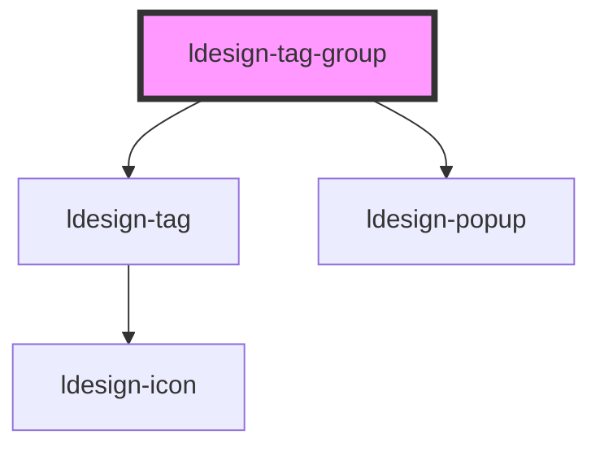

# ldesign-tag-group

<!-- Auto Generated Below -->

## Overview

TagGroup 标签组
- 支持拖拽排序
- 支持动态添加标签
- overflow="scroll" 提供横向滚动和可选箭头
- overflow="more" 根据 maxVisible 折叠为 +N

## Properties

| Property           | Attribute           | Description                    | Type                                                                   | Default     |
| ------------------ | ------------------- | ------------------------------ | ---------------------------------------------------------------------- | ----------- |
| `addText`          | `add-text`          | 添加按钮文本                         | `string`                                                               | `'+ 添加标签'`  |
| `addable`          | `addable`           | 是否显示添加按钮                       | `boolean`                                                              | `false`     |
| `defaultColor`     | `default-color`     | 新标签默认颜色                        | `"danger" \| "default" \| "primary" \| "success" \| "warning"`         | `'default'` |
| `defaultVariant`   | `default-variant`   | 新标签默认样式                        | `"dashed" \| "elevated" \| "ghost" \| "light" \| "outline" \| "solid"` | `'light'`   |
| `disabled`         | `disabled`          | 是否禁用                           | `boolean`                                                              | `false`     |
| `enableDrag`       | `enable-drag`       | 是否启用拖拽排序                       | `boolean`                                                              | `false`     |
| `inputPlaceholder` | `input-placeholder` | 输入框占位符                         | `string`                                                               | `'请输入标签名'`  |
| `maxVisible`       | `max-visible`       | more 模式下最多展示的项数（超出将折叠）         | `number`                                                               | `5`         |
| `morePrefix`       | `more-prefix`       | more 展示文本前缀，例如 "+"             | `string`                                                               | `'+'`       |
| `overflow`         | `overflow`          | 溢出策略：wrap（自动换行） \| more（+N 收纳） | `"more" \| "wrap"`                                                     | `'wrap'`    |
| `tags`             | `tags`              | 标签数据（受控模式）                     | `TagData[]`                                                            | `[]`        |

## Events

| Event           | Description | Type                                            |
| --------------- | ----------- | ----------------------------------------------- |
| `ldesignAdd`    | 标签添加事件      | `CustomEvent<{ label: string; id: string; }>`   |
| `ldesignChange` | 标签顺序改变事件    | `CustomEvent<TagData[]>`                        |
| `ldesignRemove` | 标签删除事件      | `CustomEvent<{ tag: TagData; index: number; }>` |

## Dependencies

### Depends on

- [ldesign-tag](../tag)
- [ldesign-popup](../popup)

### Graph

----------------------------------------------

*Built with [StencilJS](https://stenciljs.com/)*
