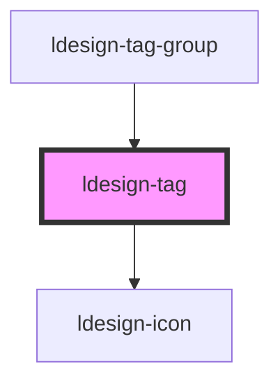

# ldesign-tag

精致美观的标签组件，支持丰富的样式变体和交互效果。

## 特性亮点

- 🎨 **6种外观风格**: light, solid, outline, ghost, dashed, elevated
- 🌈 **精致渐变**: 支持品牌色渐变和自定义色渐变效果
- ✨ **多种特效**: 渐变、霞光、毛玻璃、边框动画
- 🔔 **角标系统**: 支持数字角标、小圆点、脉动效果
- 💪 **微交互**: 优雅的悬停、点击、选中效果
- ♿️ **无障碍**: 完整的键盘支持和ARIA属性

## 使用示例

### 基础用法
```html
<ldesign-tag>默认标签</ldesign-tag>
<ldesign-tag color="primary">Primary</ldesign-tag>
<ldesign-tag color="success">Success</ldesign-tag>
<ldesign-tag color="warning">Warning</ldesign-tag>
<ldesign-tag color="danger">Danger</ldesign-tag>
```

- 外观（variant）
```html
<ldesign-tag color="primary" variant="light">Light</ldesign-tag>
<ldesign-tag color="primary" variant="solid">Solid</ldesign-tag>
<ldesign-tag color="primary" variant="outline">Outline</ldesign-tag>
<ldesign-tag color="primary" variant="ghost">Ghost</ldesign-tag>
<ldesign-tag color="primary" variant="dashed">Dashed</ldesign-tag>
<ldesign-tag color="primary" variant="elevated">Elevated</ldesign-tag>
```

- 可关闭
```html
<ldesign-tag color="primary" closable>可关闭</ldesign-tag>
```

- 可点击 / 可选中
```html
<!-- clickable: 作为按钮使用 -->
<ldesign-tag color="success" clickable>点击我</ldesign-tag>

<!-- checkable: 可切换选中状态 -->
<ldesign-tag color="primary" checkable>可选标签</ldesign-tag>
<ldesign-tag color="danger" checkable selected>默认选中</ldesign-tag>
```

- 加载中
```html
<ldesign-tag color="warning" loading>加载中...</ldesign-tag>
```

- 尺寸与形状
```html
<ldesign-tag size="small">Small</ldesign-tag>
<ldesign-tag size="middle">Middle</ldesign-tag>
<ldesign-tag size="large">Large</ldesign-tag>

<ldesign-tag shape="round">圆角</ldesign-tag>
<ldesign-tag shape="pill">胶囊</ldesign-tag>
<ldesign-tag shape="rectangle">直角</ldesign-tag>
```

- 插槽（前后缀）与图标 + 角标/小圆点
```html
<ldesign-tag badge="3">
  <span slot="prefix">🏷️</span>
  默认标签
</ldesign-tag>

<ldesign-tag dot color="danger">警告</ldesign-tag>

<ldesign-tag icon="check" color="success">
  完成
  <span slot="suffix">✓</span>
</ldesign-tag>
```

- 自定义颜色与视觉效果
```html
<ldesign-tag custom-color="#7C3AED" variant="solid" effect="neon">Neon 紫色</ldesign-tag>
<ldesign-tag custom-color="hsl(180,60%,42%)" variant="solid" effect="glass">Glass 青色</ldesign-tag>
<ldesign-tag color="primary" effect="gradient">品牌渐变</ldesign-tag>
```

- 边框动画与角标脉动
```html
<ldesign-tag clickable border-animation color="primary">悬停查看</ldesign-tag>
<ldesign-tag dot badge-pulse color="warning">脉动角标</ldesign-tag>
<ldesign-tag badge="NEW" badge-pulse color="danger">新消息</ldesign-tag>
```

- 无障碍与键盘
  - clickable: role="button"，Enter/Space 触发点击
  - checkable: role="checkbox"，Enter/Space 切换选中
  - close 按钮拥有清晰的 aria-label，可自定义为 `closeAriaLabel`

> 下方为自动生成的属性与事件文档，构建后会自动更新。

<!-- Auto Generated Below -->


## Overview

Tag 标签组件
用于标记和分类

## Properties

| Property          | Attribute          | Description                                                                                             | Type                                                                   | Default       |
| ----------------- | ------------------ | ------------------------------------------------------------------------------------------------------- | ---------------------------------------------------------------------- | ------------- |
| `badge`           | `badge`            | 右上角数字/文本角标                                                                                              | `number \| string`                                                     | `undefined`   |
| `badgePulse`      | `badge-pulse`      | 右上角角标脉动效果                                                                                               | `boolean`                                                              | `false`       |
| `borderAnimation` | `border-animation` | 是否显示边框动画（仅在 checkable 或 clickable 时有效）                                                                  | `boolean`                                                              | `false`       |
| `checkable`       | `checkable`        | 是否可选（切换选中态）                                                                                             | `boolean`                                                              | `false`       |
| `clickable`       | `clickable`        | 是否可点击（非选中态），用于标签作为动作的场景                                                                                 | `boolean`                                                              | `false`       |
| `closable`        | `closable`         | 是否可关闭                                                                                                   | `boolean`                                                              | `false`       |
| `closeAriaLabel`  | `close-aria-label` | 关闭按钮的无障碍文案                                                                                              | `string`                                                               | `'关闭标签'`      |
| `color`           | `color`            | 语义颜色                                                                                                    | `"danger" \| "default" \| "primary" \| "success" \| "warning"`         | `'default'`   |
| `customColor`     | `custom-color`     | 自定义主色（hex/rgb/hsl）。设置后将覆盖 color 的预设色                                                                    | `string`                                                               | `undefined`   |
| `disabled`        | `disabled`         | 是否禁用                                                                                                    | `boolean`                                                              | `false`       |
| `dot`             | `dot`              | 右上角小圆点                                                                                                  | `boolean`                                                              | `false`       |
| `effect`          | `effect`           | 效果风格：none（默认）、gradient（渐变）、glass（毛玻璃）、neon（霓虹）                                                          | `"glass" \| "gradient" \| "neon" \| "none"`                            | `'none'`      |
| `icon`            | `icon`             | 左侧图标                                                                                                    | `string`                                                               | `undefined`   |
| `loading`         | `loading`          | 加载状态                                                                                                    | `boolean`                                                              | `false`       |
| `selected`        | `selected`         | 选中状态（与 checkable 配合使用）                                                                                  | `boolean`                                                              | `false`       |
| `shape`           | `shape`            | 形状（rectangle：直角；round：全圆角；pill：胶囊）                                                                      | `"pill" \| "rectangle" \| "round"`                                     | `'rectangle'` |
| `size`            | `size`             | 尺寸（small/middle/large，兼容 medium）                                                                        | `"large" \| "medium" \| "middle" \| "small"`                           | `'middle'`    |
| `variant`         | `variant`          | 外观风格 - light: 浅色背景（默认） - solid: 实底 - outline: 描边 - ghost: 透明背景，悬停有轻微填充 - dashed: 虚线描边 - elevated: 浅色+阴影 | `"dashed" \| "elevated" \| "ghost" \| "light" \| "outline" \| "solid"` | `'light'`     |


## Events

| Event           | Description                       | Type                      |
| --------------- | --------------------------------- | ------------------------- |
| `ldesignChange` | 选中状态变化事件（仅当 checkable 为 true 时触发） | `CustomEvent<boolean>`    |
| `ldesignClose`  | 关闭事件                              | `CustomEvent<MouseEvent>` |


## Dependencies

### Used by

 - [ldesign-tag-group](../tag-group)

### Depends on

- [ldesign-icon](../icon)

### Graph


----------------------------------------------

*Built with [StencilJS](https://stenciljs.com/)*
