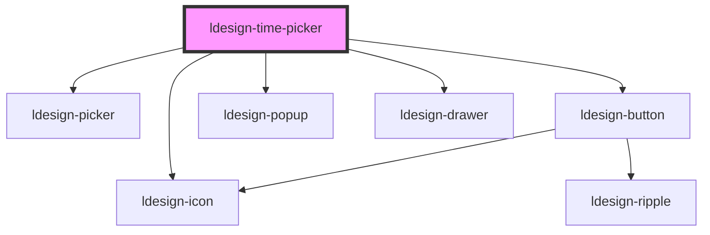

# ldesign-time-picker

<!-- Auto Generated Below -->

## Properties

| Property          | Attribute          | Description  | Type                                                                                                                                                                 | Default                       |
| ----------------- | ------------------ | ------------ | -------------------------------------------------------------------------------------------------------------------------------------------------------------------- | ----------------------------- |
| `breakpoints`     | --                 |              | `{ xs: number; sm: number; md: number; lg: number; }`                                                                                                                | `undefined`                   |
| `clearable`       | `clearable`        |              | `boolean`                                                                                                                                                            | `false`                       |
| `confirm`         | `confirm`          |              | `boolean`                                                                                                                                                            | `true`                        |
| `defaultValue`    | `default-value`    |              | `string`                                                                                                                                                             | `undefined`                   |
| `disabled`        | `disabled`         |              | `boolean`                                                                                                                                                            | `false`                       |
| `disabledHours`   | --                 |              | `number[]`                                                                                                                                                           | `undefined`                   |
| `disabledMinutes` | --                 |              | `number[]`                                                                                                                                                           | `undefined`                   |
| `disabledSeconds` | --                 |              | `number[]`                                                                                                                                                           | `undefined`                   |
| `drawerPlacement` | `drawer-placement` |              | `"bottom" \| "left" \| "right" \| "top"`                                                                                                                             | `'bottom'`                    |
| `drawerSize`      | `drawer-size`      |              | `number \| string`                                                                                                                                                   | `undefined`                   |
| `drawerTitle`     | `drawer-title`     |              | `string`                                                                                                                                                             | `undefined`                   |
| `endValue`        | `end-value`        |              | `string`                                                                                                                                                             | `undefined`                   |
| `hourStep`        | `hour-step`        |              | `number`                                                                                                                                                             | `1`                           |
| `inline`          | `inline`           |              | `boolean`                                                                                                                                                            | `false`                       |
| `loading`         | `loading`          |              | `boolean`                                                                                                                                                            | `false`                       |
| `locale`          | --                 |              | `TimePickerLocale`                                                                                                                                                   | `undefined`                   |
| `maxTime`         | `max-time`         |              | `string`                                                                                                                                                             | `undefined`                   |
| `minTime`         | `min-time`         |              | `string`                                                                                                                                                             | `undefined`                   |
| `minuteStep`      | `minute-step`      |              | `number`                                                                                                                                                             | `1`                           |
| `outputFormat`    | `output-format`    |              | `"12h" \| "24h"`                                                                                                                                                     | `'24h'`                       |
| `overlay`         | `overlay`          |              | `"auto" \| "drawer" \| "popup"`                                                                                                                                      | `'auto'`                      |
| `panelHeight`     | `panel-height`     |              | `number`                                                                                                                                                             | `undefined`                   |
| `placeholder`     | `placeholder`      |              | `string`                                                                                                                                                             | `'选择时间'`                      |
| `placement`       | `placement`        |              | `"bottom" \| "bottom-end" \| "bottom-start" \| "left" \| "left-end" \| "left-start" \| "right" \| "right-end" \| "right-start" \| "top" \| "top-end" \| "top-start"` | `'bottom-start' as Placement` |
| `presets`         | --                 |              | `TimePreset[]`                                                                                                                                                       | `undefined`                   |
| `range`           | `range`            |              | `boolean`                                                                                                                                                            | `false`                       |
| `readonly`        | `readonly`         |              | `boolean`                                                                                                                                                            | `false`                       |
| `secondStep`      | `second-step`      |              | `number`                                                                                                                                                             | `1`                           |
| `showNow`         | `show-now`         | 是否展示"此刻"快捷按钮 | `boolean`                                                                                                                                                            | `true`                        |
| `showSeconds`     | `show-seconds`     |              | `boolean`                                                                                                                                                            | `true`                        |
| `size`            | `size`             |              | `"large" \| "medium" \| "small"`                                                                                                                                     | `'medium'`                    |
| `startValue`      | `start-value`      |              | `string`                                                                                                                                                             | `undefined`                   |
| `steps`           | --                 |              | `number[]`                                                                                                                                                           | `[1, 1, 1]`                   |
| `trigger`         | `trigger`          |              | `"click" \| "focus" \| "manual"`                                                                                                                                     | `'click'`                     |
| `value`           | `value`            |              | `string`                                                                                                                                                             | `undefined`                   |
| `visible`         | `visible`          |              | `boolean`                                                                                                                                                            | `false`                       |
| `visibleItems`    | `visible-items`    |              | `number`                                                                                                                                                             | `5`                           |

## Events

| Event                  | Description | Type                                                                                                                                              |
| ---------------------- | ----------- | ------------------------------------------------------------------------------------------------------------------------------------------------- |
| `ldesignChange`        |             | `CustomEvent<string \| { start: string; end: string; }>`                                                                                          |
| `ldesignClose`         |             | `CustomEvent<void>`                                                                                                                               |
| `ldesignOpen`          |             | `CustomEvent<void>`                                                                                                                               |
| `ldesignPick`          |             | `CustomEvent<{ value: string; context: { trigger: "click" \| "scroll" \| "wheel" \| "keyboard" \| "touch" \| "now" \| "clear" \| "preset"; }; }>` |
| `ldesignVisibleChange` |             | `CustomEvent<boolean>`                                                                                                                            |

## Dependencies

### Depends on

- [ldesign-icon](../icon)
- [ldesign-picker](../picker)
- [ldesign-button](../button)
- [ldesign-popup](../popup)
- [ldesign-drawer](../drawer)

### Graph

----------------------------------------------

*Built with [StencilJS](https://stenciljs.com/)*
