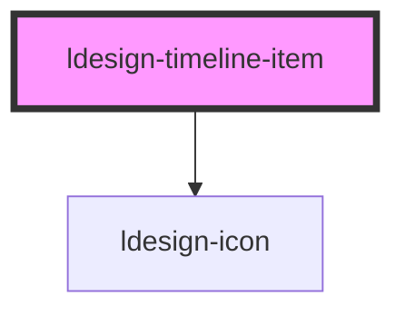

# ldesign-timeline-item

<!-- Auto Generated Below -->

## Overview

TimelineItem 时间轴项

## Properties

| Property    | Attribute   | Description | Type                                                       | Default     |
| ----------- | ----------- | ----------- | ---------------------------------------------------------- | ----------- |
| `color`     | `color`     | 节点颜色        | `"error" \| "gray" \| "primary" \| "success" \| "warning"` | `'primary'` |
| `icon`      | `icon`      | 自定义图标       | `string`                                                   | `undefined` |
| `label`     | `label`     | 标签文字        | `string`                                                   | `undefined` |
| `timestamp` | `timestamp` | 时间戳         | `string`                                                   | `undefined` |

## Dependencies

### Depends on

- [ldesign-icon](../icon)

### Graph

----------------------------------------------

*Built with [StencilJS](https://stenciljs.com/)*
