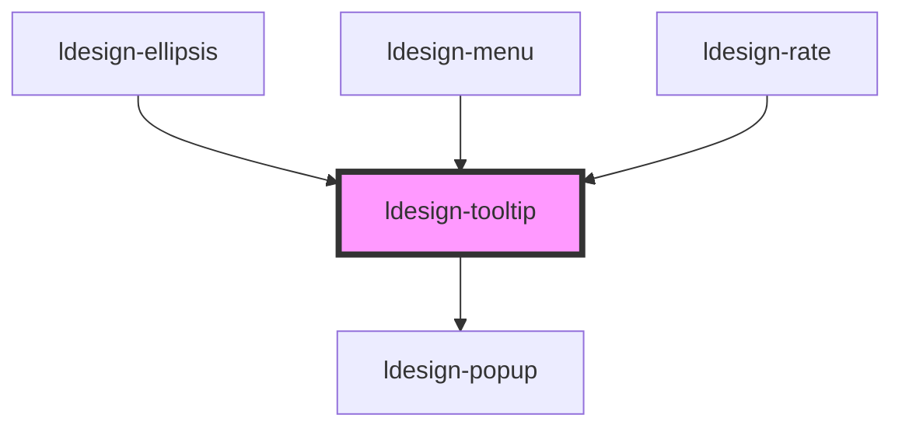

# ldesign-tooltip

<!-- Auto Generated Below -->

## Overview

Tooltip 工具提示组件
基于最新 Popup 的轻量封装，继承所有新特性

## Properties

| Property               | Attribute          | Description                | Type                                                                                                                                                                 | Default     |
| ---------------------- | ------------------ | -------------------------- | -------------------------------------------------------------------------------------------------------------------------------------------------------------------- | ----------- |
| `animation`            | `animation`        | 动画类型                       | `"fade" \| "scale" \| "slide"`                                                                                                                                       | `'scale'`   |
| `arrow`                | `arrow`            | 是否显示箭头                     | `boolean`                                                                                                                                                            | `true`      |
| `autoCloseDelay`       | `auto-close-delay` | 自动关闭延迟                     | `number`                                                                                                                                                             | `0`         |
| `closable`             | `closable`         | 是否显示关闭按钮（仅click触发时有效）      | `boolean`                                                                                                                                                            | `false`     |
| `content` _(required)_ | `content`          | 提示内容                       | `string`                                                                                                                                                             | `undefined` |
| `disabled`             | `disabled`         | 是否禁用                       | `boolean`                                                                                                                                                            | `false`     |
| `hideDelay`            | `hide-delay`       | 延迟隐藏时间（毫秒）                 | `number`                                                                                                                                                             | `100`       |
| `interactive`          | `interactive`      | 是否可交互（hover时鼠标可以移入tooltip） | `boolean`                                                                                                                                                            | `false`     |
| `lockOnScroll`         | `lock-on-scroll`   | 是否在滚动时锁定位置                 | `boolean`                                                                                                                                                            | `false`     |
| `maxWidth`             | `max-width`        | 最大宽度                       | `number \| string`                                                                                                                                                   | `250`       |
| `motionDistance`       | `motion-distance`  | 动画位移距离                     | `number`                                                                                                                                                             | `10`        |
| `motionDuration`       | `motion-duration`  | 动画时长                       | `number`                                                                                                                                                             | `200`       |
| `offsetDistance`       | `offset-distance`  | 与触发元素的间距                   | `number \| string`                                                                                                                                                   | `8`         |
| `placement`            | `placement`        | 提示位置                       | `"bottom" \| "bottom-end" \| "bottom-start" \| "left" \| "left-end" \| "left-start" \| "right" \| "right-end" \| "right-start" \| "top" \| "top-end" \| "top-start"` | `'top'`     |
| `showDelay`            | `show-delay`       | 延迟显示时间（毫秒）                 | `number`                                                                                                                                                             | `100`       |
| `size`                 | `size`             | 尺寸                         | `"large" \| "medium" \| "small"`                                                                                                                                     | `'medium'`  |
| `theme`                | `theme`            | 主题：深色/浅色（默认深色）             | `"dark" \| "light"`                                                                                                                                                  | `'dark'`    |
| `tooltipClass`         | `tooltip-class`    | 自定义类名                      | `string`                                                                                                                                                             | `undefined` |
| `tooltipTitle`         | `tooltip-title`    | 标题（可选）                     | `string`                                                                                                                                                             | `undefined` |
| `trigger`              | `trigger`          | 触发方式                       | `"click" \| "focus" \| "hover" \| "manual"`                                                                                                                          | `'hover'`   |
| `visible`              | `visible`          | 是否受控显示                     | `boolean`                                                                                                                                                            | `false`     |
| `width`                | `width`            | 宽度（覆盖maxWidth）             | `number \| string`                                                                                                                                                   | `undefined` |

## Dependencies

### Used by

 - [ldesign-ellipsis](../ellipsis)
 - [ldesign-menu](../menu)
 - [ldesign-rate](../rate)

### Depends on

- [ldesign-popup](../popup)

### Graph

----------------------------------------------

*Built with [StencilJS](https://stenciljs.com/)*
