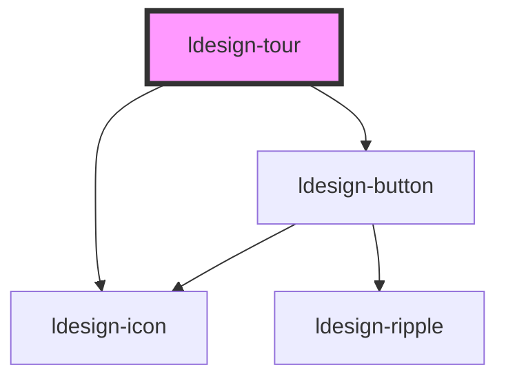

# ldesign-tour

<!-- Auto Generated Below -->

## Overview

Tour 漫游式引导组件

## Properties

| Property | Attribute | Description | Type                   | Default |
| -------- | --------- | ----------- | ---------------------- | ------- |
| `open`   | `open`    | 是否打开        | `boolean`              | `false` |
| `steps`  | `steps`   | 步骤配置        | `TourStep[] \| string` | `[]`    |

## Events

| Event               | Description | Type                  |
| ------------------- | ----------- | --------------------- |
| `ldesignClose`      | 关闭事件        | `CustomEvent<void>`   |
| `ldesignFinish`     | 完成事件        | `CustomEvent<void>`   |
| `ldesignStepChange` | 步骤变化事件      | `CustomEvent<number>` |

## Methods

### `close() => Promise<void>`

关闭引导

#### Returns

Type: `Promise<void>`

### `goTo(index: number) => Promise<void>`

跳到指定步骤

#### Parameters

| Name    | Type     | Description |
| ------- | -------- | ----------- |
| `index` | `number` |             |

#### Returns

Type: `Promise<void>`

### `next() => Promise<void>`

下一步

#### Returns

Type: `Promise<void>`

### `prev() => Promise<void>`

上一步

#### Returns

Type: `Promise<void>`

## Dependencies

### Depends on

- [ldesign-icon](../icon)
- [ldesign-button](../button)

### Graph

----------------------------------------------

*Built with [StencilJS](https://stenciljs.com/)*
